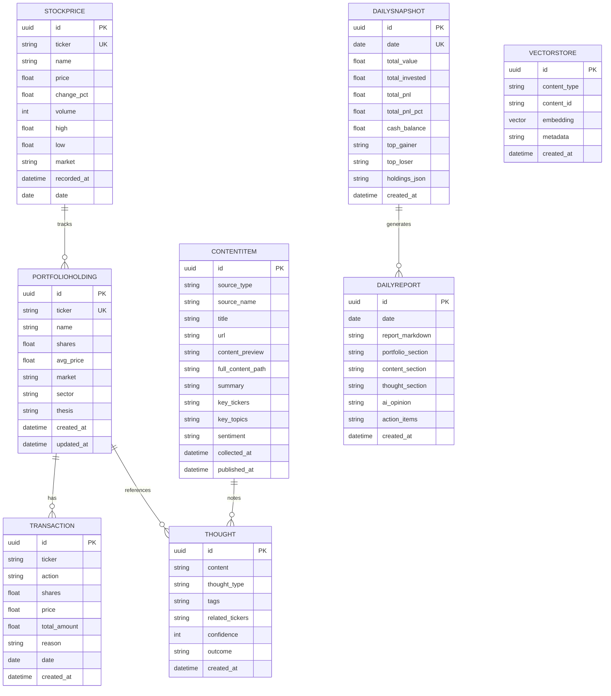
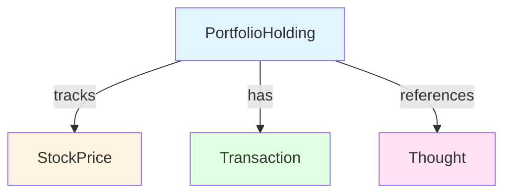
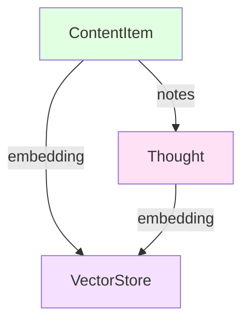
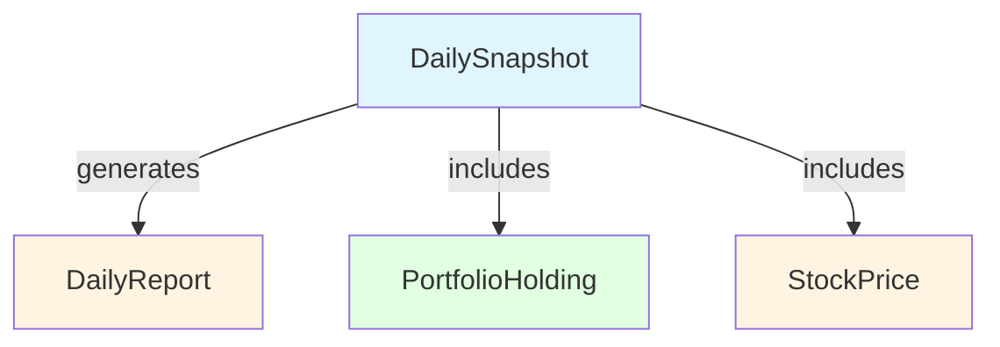

# 데이터베이스 스키마 (Database Schema)

이 문서는 Market Insight 시스템의 PostgreSQL 데이터베이스 스키마를 설명합니다.

---

## 목차

1. [스키마 개요](#스키마-개요)
2. [테이블 상세](#테이블-상세)
   - [StockPrice](#stockprice)
   - [PortfolioHolding](#portfolioholding)
   - [Transaction](#transaction)
   - [DailySnapshot](#dailysnapshot)
   - [ContentItem](#contentitem)
   - [Thought](#thought)
   - [DailyReport](#dailyreport)
   - [VectorStore](#vectorstore)
3. [ER 다이어그램](#er-다이어그램)
4. [인덱스](#인덱스)
5. [데이터 관계](#데이터-관계)

---

## 스키마 개요

### 테이블 목록

| 테이블 | 설명 | 주요 기능 |
|---------|------|----------|
| `stockprice` | 주식 가격 기록 | 가격 추적, 차트 데이터 |
| `portfolioholding` | 포트폴리오 보유 종목 | 현재 보유 종목 관리 |
| `transaction` | 매수/매도 기록 | 거래 내역 추적 |
| `dailysnapshot` | 일별 포트폴리오 스냅샷 | 일별 성과 추적 |
| `contentitem` | 수집된 콘텐츠 | YouTube, 블로그 등 콘텐츠 저장 |
| `thought` | 사용자 생각/메모 | 투자 생각 기록 |
| `dailyreport` | 일일 리포트 | AI 생성 리포트 |
| `vectorstore` | 벡터 임베딩 | 의미 기반 검색 (pgvector) |

---

## ER 다이어그램

### 전체 ER 다이어그램



---

## 테이블 상세

### StockPrice

주식 가격 기록 테이블

| 컬럼 | 타입 | 설명 | 제약조건 |
|-------|------|------|----------|
| `id` | uuid | 기본 키 | PK |
| `ticker` | string | 종목 코드 (예: 005930) | INDEXED |
| `name` | string | 종목명 | NULLABLE |
| `price` | float | 현재 가격 | NOT NULL |
| `change_pct` | float | 전일 대비 변동률 (%) | NOT NULL |
| `volume` | int | 거래량 | NULLABLE |
| `high` | float | 고가 | NULLABLE |
| `low` | float | 저가 | NULLABLE |
| `market` | string | 시장 (KR/US) | DEFAULT "KR" |
| `recorded_at` | datetime | 기록 시간 | DEFAULT NOW() |
| `date` | date | 기록 날짜 | INDEXED, DEFAULT TODAY() |

**인덱스:**
- `ticker` (B-tree)
- `date` (B-tree)

---

### PortfolioHolding

포트폴리오 보유 종목 테이블

| 컬럼 | 타입 | 설명 | 제약조건 |
|-------|------|------|----------|
| `id` | uuid | 기본 키 | PK |
| `ticker` | string | 종목 코드 | INDEXED |
| `name` | string | 종목명 | NOT NULL |
| `shares` | float | 보유 수량 | NOT NULL |
| `avg_price` | float | 평단가 | NOT NULL |
| `market` | string | 시장 (KR/US) | DEFAULT "KR" |
| `sector` | string | 섹터 | NULLABLE |
| `thesis` | string | 투자 논리 | NULLABLE |
| `created_at` | datetime | 생성 시간 | DEFAULT NOW() |
| `updated_at` | datetime | 수정 시간 | DEFAULT NOW() |

**인덱스:**
- `ticker` (B-tree)

---

### Transaction

매수/매도 기록 테이블

| 컬럼 | 타입 | 설명 | 제약조건 |
|-------|------|------|----------|
| `id` | uuid | 기본 키 | PK |
| `ticker` | string | 종목 코드 | NOT NULL |
| `action` | string | 액션 (BUY/SELL) | NOT NULL |
| `shares` | float | 거래 수량 | NOT NULL |
| `price` | float | 거래 가격 | NOT NULL |
| `total_amount` | float | 총 거래 금액 | NOT NULL |
| `reason` | string | 거래 사유 | NULLABLE |
| `date` | date | 거래 날짜 | NOT NULL |
| `created_at` | datetime | 기록 시간 | DEFAULT NOW() |

---

### DailySnapshot

일별 포트폴리오 스냅샷 테이블

| 컬럼 | 타입 | 설명 | 제약조건 |
|-------|------|------|----------|
| `id` | uuid | 기본 키 | PK |
| `date` | date | 스냅샷 날짜 | INDEXED, UNIQUE |
| `total_value` | float | 총 평가액 | NOT NULL |
| `total_invested` | float | 총 투자원금 | NOT NULL |
| `total_pnl` | float | 총 손익 | NOT NULL |
| `total_pnl_pct` | float | 총 수익률 (%) | NOT NULL |
| `cash_balance` | float | 예수금 | NOT NULL |
| `top_gainer` | string | 최고 수익 종목 | NULLABLE |
| `top_loser` | string | 최대 손실 종목 | NULLABLE |
| `holdings_json` | string | 종목별 상세 JSON | NULLABLE |
| `created_at` | datetime | 생성 시간 | DEFAULT NOW() |

**인덱스:**
- `date` (B-tree, UNIQUE)

---

### ContentItem

수집된 콘텐츠 테이블

| 컬럼 | 타입 | 설명 | 제약조건 |
|-------|------|------|----------|
| `id` | uuid | 기본 키 | PK |
| `source_type` | string | 소스 타입 | NOT NULL |
| `source_name` | string | 소스명 | NOT NULL |
| `title` | string | 제목 | NOT NULL |
| `url` | string | 원본 URL | NULLABLE |
| `content_preview` | string | 내용 미리보기 (200자) | NOT NULL |
| `full_content_path` | string | 전체 내용 파일 경로 | NULLABLE |
| `summary` | string | LLM 요약 | NULLABLE |
| `key_tickers` | string | 관련 종목 (JSON) | NULLABLE |
| `key_topics` | string | 핵심 토픽 (JSON) | NULLABLE |
| `sentiment` | string | 감성 분석 (bullish/bearish/neutral) | NULLABLE |
| `collected_at` | datetime | 수집 시간 | DEFAULT NOW() |
| `published_at` | datetime | 게시 시간 | NULLABLE |

---

### Thought

사용자 생각/메모 테이블

| 컬럼 | 타입 | 설명 | 제약조건 |
|-------|------|------|----------|
| `id` | uuid | 기본 키 | PK |
| `content` | string | 생각 내용 | NOT NULL |
| `thought_type` | string | 생각 타입 | NOT NULL |
| `tags` | string | 태그 (JSON array) | NULLABLE |
| `related_tickers` | string | 관련 종목 (JSON array) | NULLABLE |
| `confidence` | int | 확신도 (1-10) | NULLABLE |
| `outcome` | string | 결과 (나중에 회고 시) | NULLABLE |
| `created_at` | datetime | 생성 시간 | DEFAULT NOW() |

**생각 타입:**
- `market_view`: 시장 관점
- `stock_idea`: 종목 아이디어
- `risk_concern`: 리스크 우려
- `ai_insight`: AI 인사이트
- `content_note`: 콘텐츠 메모
- `general`: 일반 메모

---

### DailyReport

일일 리포트 테이블

| 컬럼 | 타입 | 설명 | 제약조건 |
|-------|------|------|----------|
| `id` | uuid | 기본 키 | PK |
| `date` | date | 리포트 날짜 | INDEXED |
| `report_markdown` | string | 리포트 전체 (Markdown) | NOT NULL |
| `portfolio_section` | string | 포트폴리오 섹션 | NULLABLE |
| `content_section` | string | 콘텐츠 섹션 | NULLABLE |
| `thought_section` | string | 생각 섹션 | NULLABLE |
| `ai_opinion` | string | AI 종합 의견 | NULLABLE |
| `action_items` | string | 확인해야 할 것들 | NULLABLE |
| `created_at` | datetime | 생성 시간 | DEFAULT NOW() |

**인덱스:**
- `date` (B-tree)

---

### VectorStore

벡터 임베딩 저장 테이블 (pgvector)

| 컬럼 | 타입 | 설명 | 제약조건 |
|-------|------|------|----------|
| `id` | uuid | 기본 키 | PK |
| `content_type` | string | 콘텐츠 타입 (thought/content) | NOT NULL |
| `content_id` | string | 콘텐츠 ID | NOT NULL |
| `embedding` | vector | 임베딩 벡터 (pgvector) | NOT NULL |
| `metadata` | string | 메타데이터 (JSON) | NULLABLE |
| `created_at` | datetime | 생성 시간 | DEFAULT NOW() |

---

## 인덱스

### StockPrice
- `idx_stockprice_ticker` ON `stockprice(ticker)`
- `idx_stockprice_date` ON `stockprice(date)`

### PortfolioHolding
- `idx_portfolioholding_ticker` ON `portfolioholding(ticker)`

### DailySnapshot
- `idx_dailysnapshot_date` ON `dailysnapshot(date)` (UNIQUE)

### DailyReport
- `idx_dailyreport_date` ON `dailyreport(date)`

---

## 데이터 관계

### 1. 포트폴리오 관련 관계



### 2. 콘텐츠 관련 관계



### 3. 리포트 관련 관계



---

## 쿼리 예제

### 포트폴리오 요약 조회

```sql
SELECT 
    ph.ticker,
    ph.name,
    ph.shares,
    ph.avg_price,
    sp.price as current_price,
    (ph.shares * sp.price) as current_value,
    (ph.shares * sp.price) - (ph.shares * ph.avg_price) as pnl,
    ((ph.shares * sp.price) - (ph.shares * ph.avg_price)) / (ph.shares * ph.avg_price) * 100 as pnl_pct
FROM portfolioholding ph
LEFT JOIN stockprice sp ON ph.ticker = sp.ticker 
    AND sp.date = (SELECT MAX(date) FROM stockprice WHERE ticker = ph.ticker)
WHERE ph.market = 'KR';
```

### 최근 생각 조회 (종목별)

```sql
SELECT 
    t.id,
    t.content,
    t.thought_type,
    t.created_at
FROM thought t
WHERE t.related_tickers::jsonb ? '005930'
ORDER BY t.created_at DESC
LIMIT 10;
```

### 의미 기반 검색 (pgvector)

```sql
SELECT 
    c.id,
    c.title,
    c.summary,
    1 - (v.embedding <=> '[...embedding_vector...]') as similarity
FROM vectorstore v
JOIN contentitem c ON v.content_id = c.id
WHERE v.content_type = 'content'
ORDER BY v.embedding <=> '[...embedding_vector...]'
LIMIT 10;
```

### 일별 포트폴리오 성과

```sql
SELECT 
    date,
    total_value,
    total_invested,
    total_pnl,
    total_pnl_pct,
    cash_balance
FROM dailysnapshot
ORDER BY date DESC
LIMIT 30;
```

---

## 데이터 마이그레이션

### 새 컬럼 추가 예시

```sql
-- PortfolioHolding에 sector 컬럼 추가 (이미 존재)
ALTER TABLE portfolioholding ADD COLUMN IF NOT EXISTS sector VARCHAR(100);

-- Thought에 outcome 컬럼 추가 (이미 존재)
ALTER TABLE thought ADD COLUMN IF NOT EXISTS outcome VARCHAR(500);
```

### 인덱스 추가 예시

```sql
-- ContentItem에 복합 인덱스 추가
CREATE INDEX IF NOT EXISTS idx_contentitem_source_collected 
ON contentitem(source_type, collected_at DESC);

-- Thought에 관련 종목 인덱스 추가
CREATE INDEX IF NOT EXISTS idx_thought_related_tickers 
ON thought USING GIN (related_tickers::jsonb);
```

---

## 성능 최적화

### 1. 파티셔닝 (대용량 데이터)

```sql
-- StockPrice를 날짜별로 파티셔닝
CREATE TABLE stockprice_partitioned (
    LIKE stockprice INCLUDING ALL
) PARTITION BY RANGE (date);

-- 월별 파티션 생성
CREATE TABLE stockprice_2024_01 PARTITION OF stockprice_partitioned
    FOR VALUES FROM ('2024-01-01') TO ('2024-02-01');
```

### 2. Materialized View

```sql
-- 포트폴리오 요약 Materialized View
CREATE MATERIALIZED VIEW portfolio_summary AS
SELECT 
    ph.ticker,
    ph.name,
    ph.shares,
    ph.avg_price,
    sp.price as current_price,
    (ph.shares * sp.price) as current_value
FROM portfolioholding ph
LEFT JOIN stockprice sp ON ph.ticker = sp.ticker
    AND sp.recorded_at = (
        SELECT MAX(recorded_at) 
        FROM stockprice 
        WHERE ticker = ph.ticker
    );

-- 주기적 새로고침
REFRESH MATERIALIZED VIEW portfolio_summary;
```

---

## 백업 및 복구

### 백업

```bash
# 전체 백업
pg_dump -U postgres -d market_insight > backup_$(date +%Y%m%d).sql

# 스키마만 백업
pg_dump -U postgres -d market_insight --schema-only > schema_backup.sql

# 데이터만 백업
pg_dump -U postgres -d market_insight --data-only > data_backup.sql
```

### 복구

```bash
# 전체 복구
psql -U postgres -d market_insight < backup_20240215.sql

# Docker 컨테이너에서 복구
docker exec -i market-insight-db-1 psql -U postgres -d market_insight < backup.sql
```

---

## 참고

- [PostgreSQL 문서](https://www.postgresql.org/docs/)
- [pgvector 문서](https://github.com/pgvector/pgvector)
- [SQLModel 문서](https://sqlmodel.tiangolo.com/)
