# 시퀀스 다이어그램 (Sequence Diagrams)

이 문서는 Market Insight 시스템의 주요 기능 흐름을 시퀀스 다이어그램으로 설명합니다.

## 시스템 아키텍처 개요

```
┌─────────────────────────────────────────────────────────────────────────┐
│                         Interface Layer                                 │
│  ┌──────────────┐  ┌──────────────┐  ┌──────────────┐  ┌─────────────┐│
│  │   CLI        │  │  Telegram    │  │   Web API    │  │  Dashboard  ││
│  │  (Click)     │  │     Bot      │  │  (FastAPI)   │  │   (Next.js) ││
│  └──────┬───────┘  └──────┬───────┘  └──────┬───────┘  └──────┬──────┘│
└─────────┼────────────────┼────────────────┼────────────────┼────────┘
          │                │                │                │
          └────────────────┼────────────────┼────────────────┘
                           │                │
┌──────────────────────────┼────────────────┼────────────────────────────┐
│                    Orchestration Layer                             │
│  ┌──────────────────────────────────────────────────────────────┐  │
│  │              Scheduler (APScheduler)                         │  │
│  │  - YouTube Collection (6h)                                   │  │
│  │  - Naver Blog Collection (12h)                               │  │
│  │  - Stock Tracking (1h during market hours)                  │  │
│  │  - Daily Report (8:00 AM)                                    │  │
│  │  - Weekly Report (9:00 AM Sunday)                            │  │
│  │  - Daily Snapshot (6:00 AM)                                  │  │
│  └──────────────────────────────────────────────────────────────┘  │
└────────────────────────────────────────────────────────────────────┘
                           │
           ┌───────────────┼───────────────┐
           │               │               │
┌──────────▼────────┐ ┌─────▼──────┐ ┌──────▼──────────────────────────┐
│   Collection     │ │  Storage   │ │       Analysis Engine          │
│      Layer       │ │   Layer    │ │                                │
├──────────────────┤ ├────────────┤ ├────────────────────────────────┤
│ • StockTracker   │ │ PostgreSQL │ │ • LLM Router (Ollama/Claude)   │
│ • YouTube        │ │   +        │ │ • Report Builder               │
│   Collector      │ │  pgvector  │ │ • Content Summarizer          │
│ • Naver Blog     │ │            │ │ • Insight Generator           │
│   Collector      │ │            │ │ • Entity Extractor            │
│ • Thought        │ │            │ │                                │
│   Logger         │ │            │ │                                │
└──────────────────┘ └────────────┘ └────────────────────────────────┘
                           │
┌──────────────────────────▼────────────────────────────────────────────┐
│                     Interface Layer (MCP)                             │
│  ┌──────────────┐  ┌──────────────┐  ┌──────────────┐                 │
│  │   Portfolio  │  │   Memory     │  │   Content    │                 │
│  │   MCP Server │  │   MCP Server │  │   MCP Server │                 │
│  └──────────────┘  └──────────────┘  └──────────────┘                 │
└────────────────────────────────────────────────────────────────────────┘
                           │
┌──────────────────────────▼────────────────────────────────────────────┐
│                   Claude Desktop Integration                          │
│  ┌──────────────────────────────────────────────────────────────┐  │
│  │                    Claude Desktop                             │  │
│  │  - Natural Language Interface                                │  │
│  │  - MCP Protocol Communication                                 │  │
│  └──────────────────────────────────────────────────────────────┘  │
└────────────────────────────────────────────────────────────────────────┘
```

---

## 1. 콘텐츠 수집 흐름 (Content Collection Flow)

### 1.1 YouTube 콘텐츠 수집

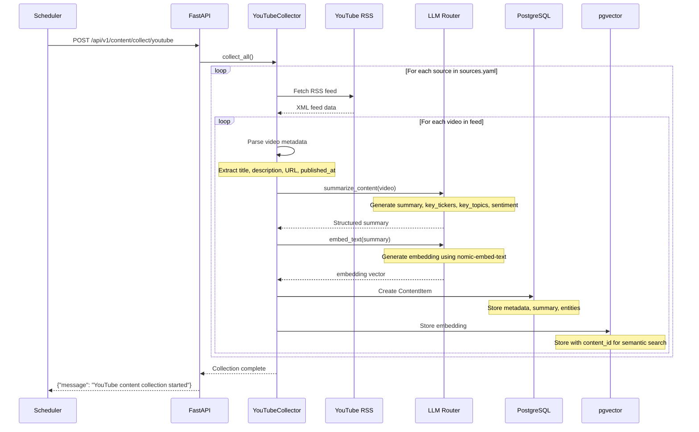

### 1.2 네이버 블로그 콘텐츠 수집

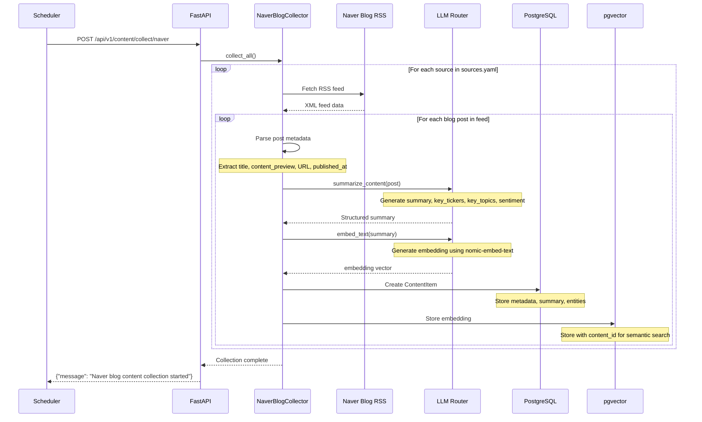

---

## 2. 리포트 생성 흐름 (Report Generation Flow)

### 2.1 일일 리포트 생성

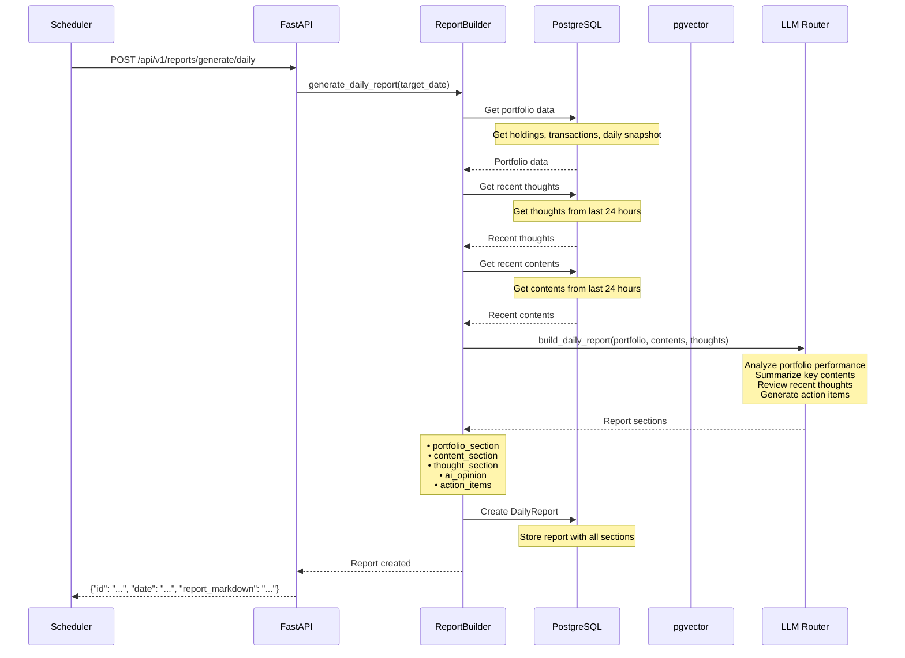

### 2.2 주간 리포트 생성

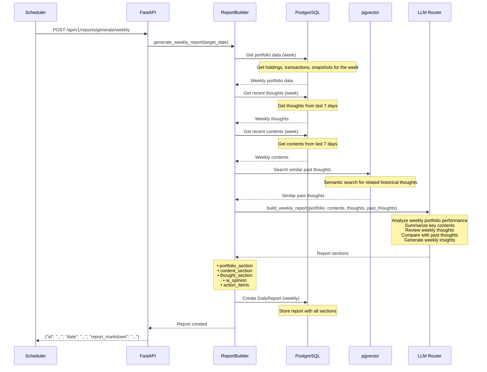

---

## 3. 생각 기록 흐름 (Thought Logging Flow)

### 3.1 CLI에서 생각 기록

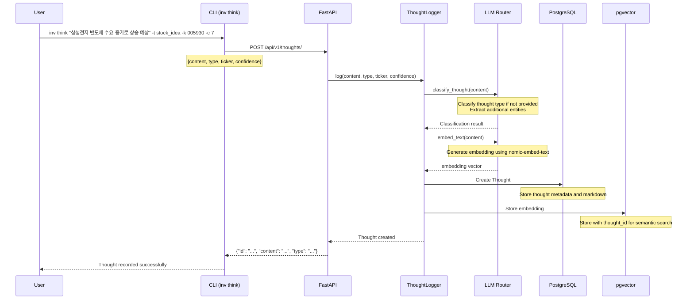

### 3.2 의미 기반 생각 검색

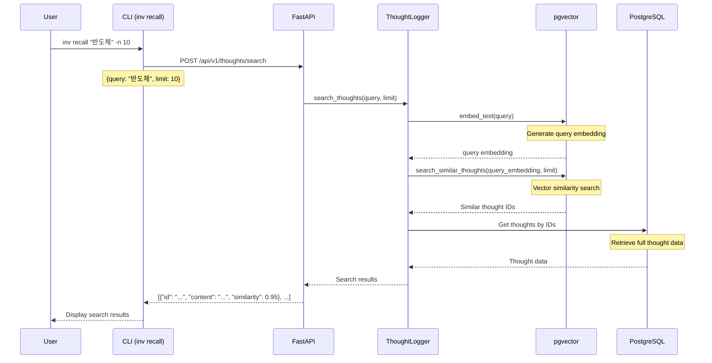

---

## 4. 주식 가격 추적 흐름 (Stock Tracking Flow)

### 4.1 포트폴리오 가격 추적

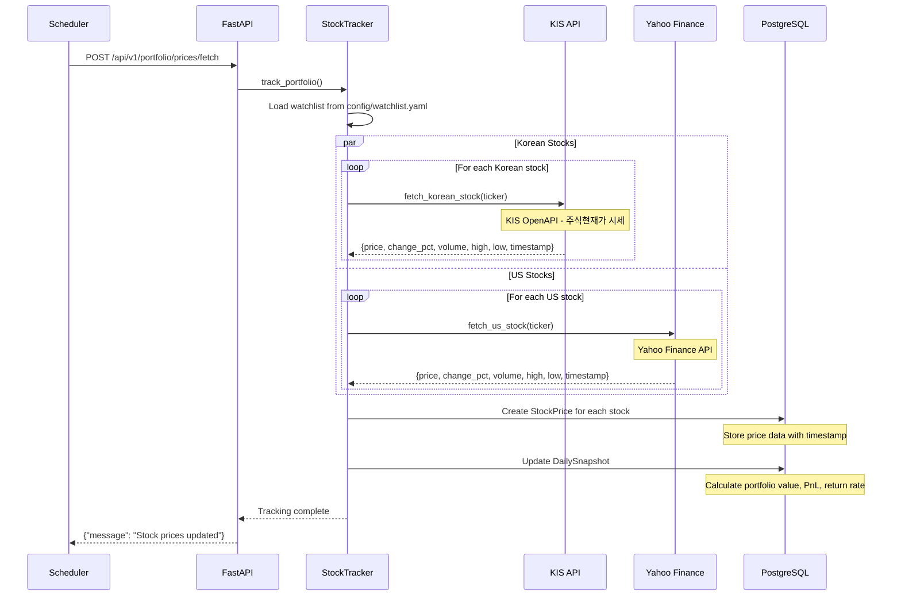

### 4.2 종목 가격 조회

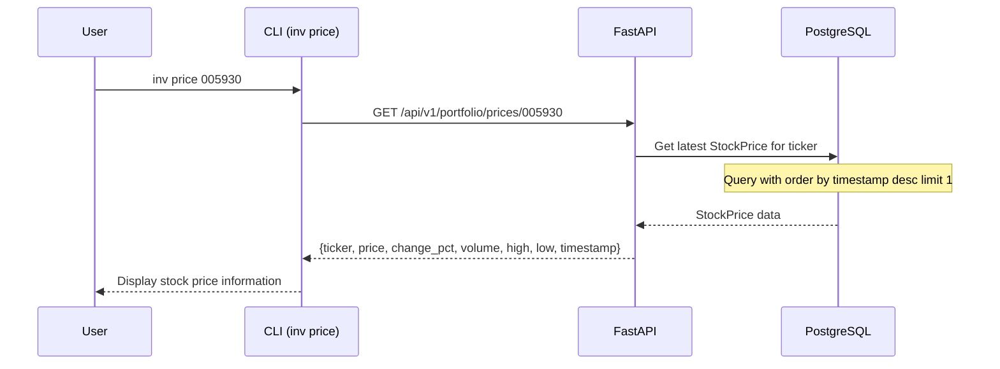

---

## 5. 포트폴리오 관리 흐름 (Portfolio Management Flow)

### 5.1 포트폴리오 요약 조회

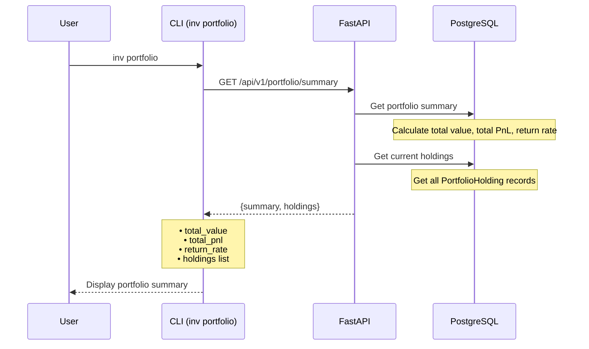

### 5.2 매수/매도 기록

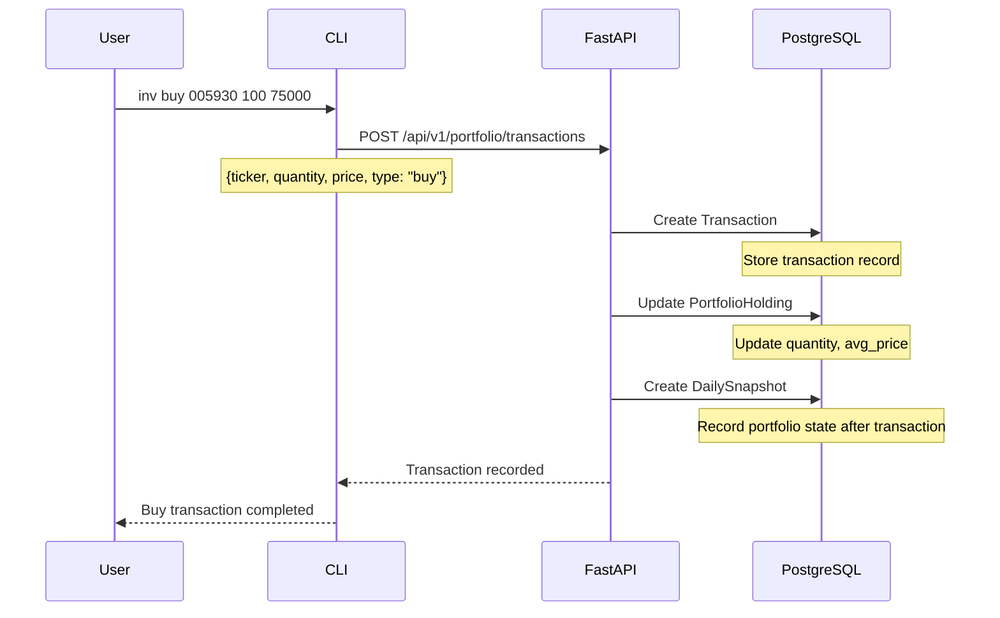

---

## 6. 콘텐츠 검색 흐름 (Content Search Flow)

### 6.1 종목 관련 콘텐츠 조회

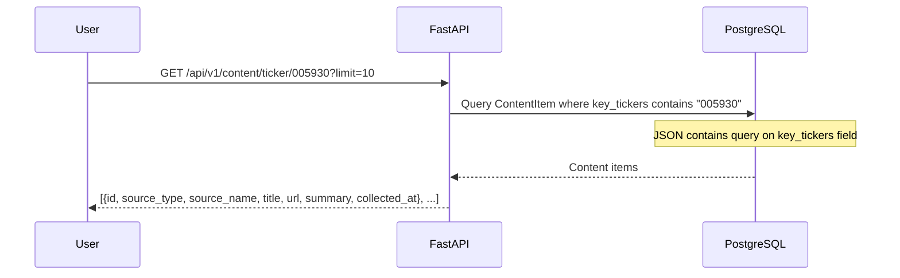

### 6.2 콘텐츠 텍스트 검색

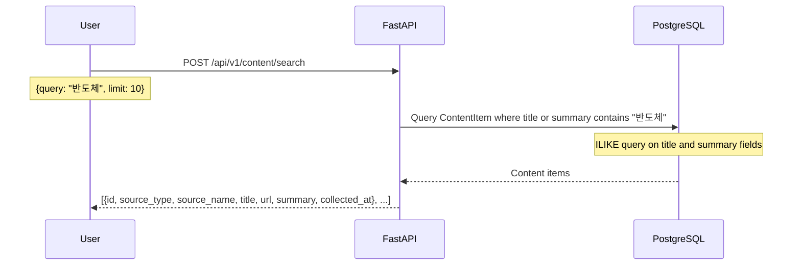

---

## 7. 리포트 조회 흐름 (Report Retrieval Flow)

### 7.1 최신 리포트 조회

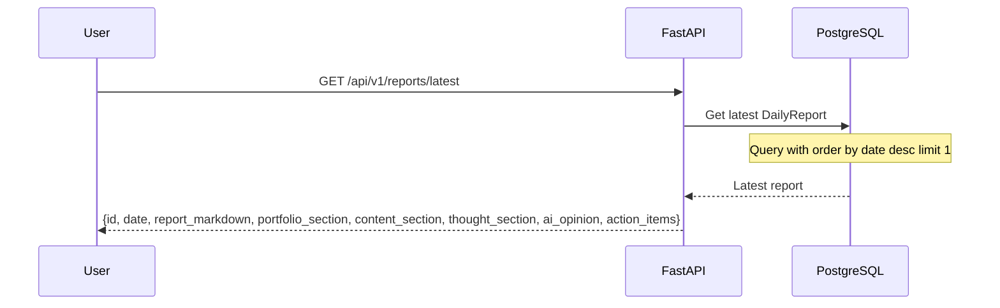

### 7.2 날짜별 리포트 조회

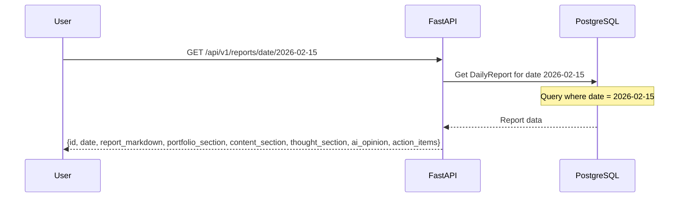

---

## 8. MCP 서버 흐름 (MCP Server Flow)

### 8.1 Portfolio MCP Server - 포트폴리오 요약 조회

```mermaid
sequenceDiagram
    participant Claude as Claude Desktop
    participant Portfolio as Portfolio MCP
    participant DB as PostgreSQL

    Claude->>Portfolio: get_portfolio_summary()
    
    Portfolio->>DB: Get portfolio holdings
    DB-->>Portfolio: Holdings data
    
    Portfolio->>DB: Get latest stock prices
    DB-->>Portfolio: Stock prices
    
    Portfolio->>Portfolio: Calculate total value, P&L
    
    Portfolio-->>Claude: {
        total_value: 1000000,
        total_pnl: 50000,
        total_pnl_pct: 5.0,
        holdings: [...]
    }
```

### 8.2 Memory MCP Server - 생각 기록

```mermaid
sequenceDiagram
    participant Claude as Claude Desktop
    participant Memory as Memory MCP
    participant DB as PostgreSQL
    participant Vector as pgvector

    Claude->>Memory: log_thought(content, type, tickers, confidence)
    
    Memory->>DB: Create Thought record
    Note over DB: Store thought metadata
    
    Memory->>Vector: Generate embedding
    Note over Vector: Use nomic-embed-text model
    
    Memory->>Vector: Store thought embedding
    Note over Vector: Store with thought_id for semantic search
    
    Memory-->>Claude: {
        message: "Thought logged successfully",
        thought_id: "...",
        content: "...",
        type: "..."
    }
```

### 8.3 Memory MCP Server - 의미 기반 생각 검색

```mermaid
sequenceDiagram
    participant Claude as Claude Desktop
    participant Memory as Memory MCP
    participant Vector as pgvector
    participant DB as PostgreSQL

    Claude->>Memory: recall_thoughts(query, limit)
    
    Memory->>Vector: Generate query embedding
    Vector-->>Memory: query_embedding
    
    Memory->>Vector: Search similar thoughts
    Note over Vector: Vector similarity search
    
    Vector-->>Memory: Similar thought IDs with distances
    
    Memory->>DB: Get thoughts by IDs
    DB-->>Memory: Thought data
    
    Memory-->>Claude: [
        {
            id: "...",
            content: "...",
            metadata: {...},
            relevance: 0.95
        }, ...
    ]
```

### 8.4 Content MCP Server - 의미 기반 콘텐츠 검색

```mermaid
sequenceDiagram
    participant Claude as Claude Desktop
    participant Content as Content MCP
    participant Vector as pgvector

    Claude->>Content: search_content(query, limit)
    
    Content->>Vector: Generate query embedding
    Vector-->>Content: query_embedding
    
    Content->>Vector: Search related content
    Note over Vector: Vector similarity search
    
    Vector-->>Content: Content IDs with distances
    
    Content-->>Claude: [
        {
            id: "...",
            content: "...",
            metadata: {...},
            relevance: 0.92
        }, ...
    ]
```

### 8.5 MCP 서버 통합 흐름 - 복합 쿼리

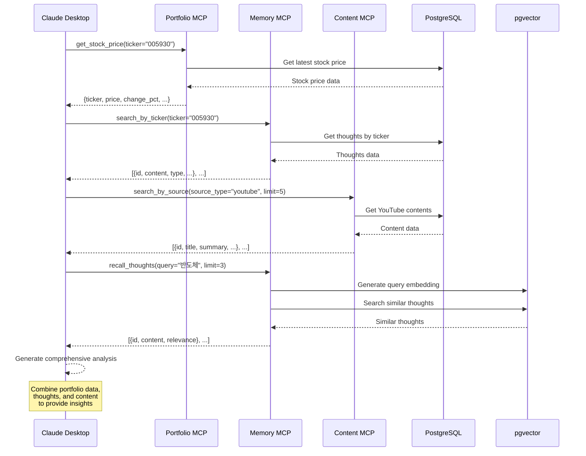

---

## 데이터 흐름 요약 (Data Flow Summary)

```
┌─────────────────────────────────────────────────────────────────────────────┐
│                           Data Flow Summary                                 │
├─────────────────────────────────────────────────────────────────────────────┤
│                                                                             │
│  Collection Layer → Storage Layer → Analysis Layer → Interface Layer       │
│       ↓                  ↓                  ↓                  ↓             │
│  • Stock API        • PostgreSQL       • LLM Router     • CLI              │
│  • YouTube RSS      • pgvector         • Report Builder  • Telegram Bot     │
│  • Naver Blog RSS   • Raw data files   • Summarizer      • Web API          │
│  • User Input       • Markdown files   • Extractor       • Dashboard        │
│                                                                     ↓   │
│                                                            • MCP Servers      │
│                                                            - Portfolio       │
│                                                            - Memory          │
│                                                            - Content         │
│                                                                             │
├─────────────────────────────────────────────────────────────────────────────┤
│                                                                             │
│  Key Data Models:                                                           │
│  • StockPrice: 주식 가격 데이터                                             │
│  • PortfolioHolding: 포트폴리오 보유 종목                                  │
│  • Transaction: 매수/매도 기록                                            │
│  • DailySnapshot: 일별 포트폴리오 스냅샷                                    │
│  • ContentItem: 수집된 콘텐츠 (YouTube, Naver Blog)                       │
│  • Thought: 사용자 생각 기록                                              │
│  • DailyReport: 생성된 리포트                                              │
│  • VectorStore: 벡터 임베딩 (pgvector)                                      │
│                                                                             │
├─────────────────────────────────────────────────────────────────────────────┤
│                                                                             │
│  Scheduled Jobs:                                                           │
│  • YouTube Collection: 6시간마다                                          │
│  • Naver Blog Collection: 12시간마다                                       │
│  • Stock Tracking: 장중 1시간마다                                          │
│  • Daily Report: 매일 8시                                                  │
│  • Weekly Report: 일요일 9시                                               │
│  • Daily Snapshot: 매일 6시                                                │
│                                                                             │
└─────────────────────────────────────────────────────────────────────────────┘
```

---

## API 엔드포인트 요약 (API Endpoint Summary)

```
┌─────────────────────────────────────────────────────────────────────────────┐
│                        API Endpoint Summary                                 │
├─────────────────────────────────────────────────────────────────────────────┤
│                                                                             │
│  Portfolio API (/api/v1/portfolio)                                          │
│  • GET /summary - 포트폴리오 요약                                           │
│  • GET /holdings - 보유 종목 목록                                           │
│  • POST /holdings - 종목 추가                                               │
│  • GET /prices/{ticker} - 종목 가격                                         │
│  • POST /prices/fetch - 가격 수집                                           │
│  • POST /transactions - 매수/매도 기록                                      │
│  • GET /snapshots - 일별 스냅샷                                             │
│                                                                             │
│  Thoughts API (/api/v1/thoughts)                                           │
│  • POST / - 생각 기록                                                       │
│  • GET / - 최근 생각 목록                                                   │
│  • GET /{thought_id} - 특정 생각 조회                                       │
│  • PUT /{thought_id} - 생각 업데이트                                       │
│  • DELETE /{thought_id} - 생각 삭제                                         │
│  • POST /search - 의미 기반 검색                                             │
│  • GET /ticker/{ticker} - 종목 관련 생각                                    │
│                                                                             │
│  Content API (/api/v1/content)                                              │
│  • GET /content/ - 최근 콘텐츠 목록                                          │
│  • GET /content/{content_id} - 특정 콘텐츠 조회                              │
│  • GET /content/ticker/{ticker} - 종목 관련 콘텐츠                           │
│  • POST /content/collect/youtube - YouTube 수집 시작                        │
│  • POST /content/collect/naver - 네이버 블로그 수집 시작                     │
│  • POST /content/collect/all - 전체 콘텐츠 수집 시작                          │
│  • POST /content/search - 콘텐츠 검색                                         │
│                                                                             │
│  Reports API (/api/v1/reports)                                              │
│  • GET /reports/ - 최근 리포트 목록                                          │
│  • GET /reports/latest - 최신 리포트                                         │
│  • GET /reports/{report_id} - 특정 리포트 조회                              │
│  • GET /reports/date/{target_date} - 날짜별 리포트                          │
│  • POST /reports/generate/daily - 일일 리포트 생성                          │
│  • POST /reports/generate/weekly - 주간 리포트 생성                         │
│                                                                             │
│  MCP Servers (Claude Desktop Integration)                                    │
│                                                                             │
│  Portfolio MCP Server                                                        │
│  • get_portfolio_summary - 포트폴리오 요약                                  │
│  • get_stock_price - 종목 가격 조회                                          │
│  • get_portfolio_history - 포트폴리오 수익률 히스토리                       │
│  • log_transaction - 매수/매도 기록                                         │
│  • get_holdings - 보유 종목 목록                                            │
│                                                                             │
│  Memory MCP Server                                                           │
│  • log_thought - 투자 생각 기록                                              │
│  • recall_thoughts - 과거 생각 의미 검색                                     │
│  • get_thought_timeline - 특정 종목/주제에 대한 생각 타임라인               │
│  • get_recent_thoughts - 최근 생각 목록                                      │
│  • search_by_ticker - 종목 관련 생각 검색                                    │
│                                                                             │
│  Content MCP Server                                                          │
│  • get_recent_contents - 최근 수집된 콘텐츠 목록                             │
│  • search_content - 의미 기반 콘텐츠 검색                                    │
│  • get_content_stats - 콘텐츠 통계                                          │
│  • search_by_source - 특정 소스의 콘텐츠 검색                                │
│                                                                             │
└─────────────────────────────────────────────────────────────────────────────┘
```

---

## 9. WebSocket 실시간 업데이트 흐름 (WebSocket Real-time Update Flow)

### 9.1 포트폴리오 실시간 업데이트

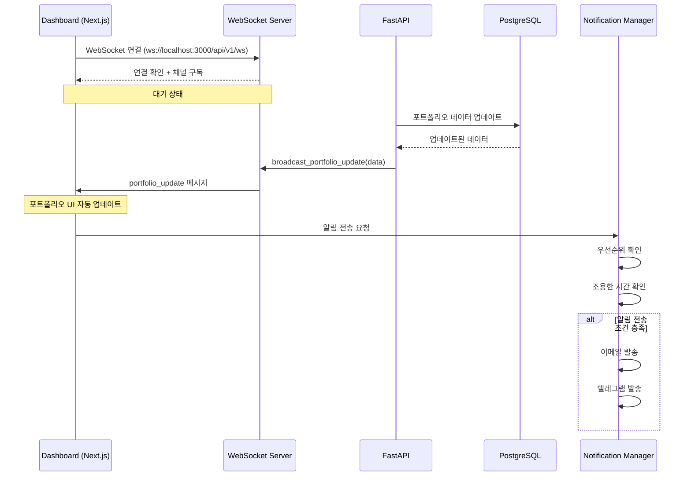

### 9.2 가격 알림 흐름

```mermaid
sequenceDiagram
    participant Scheduler as Scheduler
    participant Tracker as StockTracker
    participant WS as WebSocket Server
    participant Notif as Notification Manager
    participant Email as Email Notifier
    participant Telegram as Telegram Notifier

    Scheduler->>Tracker: 주식 가격 추적 (1시간마다)
    Tracker->>Tracker: 현재 가격 확인
    
    alt 가격이 목표에 도달
        Tracker->>WS: broadcast_alert(alert_data)
        WS->>Dashboard: alert 메시지
        
        Tracker->>Notif: send_price_alert()
        Notif->>Notif: 우선순위 확인 (high)
        
        alt 이메일 활성화
            Notif->>Email: send(notification)
            Email-->>Notif: 전송 성공
        end
        
        alt 텔레그램 활성화
            Notif->>Telegram: send(notification)
            Telegram-->>Notif: 전송 성공
        end
    end
```

### 9.3 새로운 생각 브로드캐스팅

```mermaid
sequenceDiagram
    participant CLI as CLI
    participant API as FastAPI
    participant WS as WebSocket Server
    participant Dashboard as Dashboard
    participant Vector as pgvector

    CLI->>API: POST /api/v1/thoughts
    API->>Vector: 생각 임베딩 생성
    Vector-->>API: embedding vector
    API->>API: 저장 완료
    
    API->>WS: broadcast_new_thought(thought_data)
    
    WS->>Dashboard: new_thought 메시지
    Note over Dashboard: 생각 UI 자동 업데이트
```

---

## 10. 알림 시스템 흐름 (Notification System Flow)

### 10.1 이메일 알림 전송

```mermaid
sequenceDiagram
    participant System as Market Insight
    participant Notif as Notification Manager
    participant Email as Email Notifier
    participant SMTP as SMTP Server
    participant User as User Email

    System->>Notif: send_notification(title, message, type, priority)
    
    Notif->>Notif: 우선순위 확인
    Notif->>Notif: 조용한 시간 확인
    
    alt 알림 전송 조건 충족
        Notif->>Email: send(notification)
        Email->>Email: HTML 이메일 생성
        Email->>SMTP: SMTP 연결
        Email->>SMTP: 이메일 전송
        SMTP-->>Email: 전송 성공
        Email-->>Notif: 성공
        SMTP->>User: 이메일 수신
    else 조건 불충족
        Notif-->>System: 알림 스킵
    end
```

### 10.2 텔레그램 알림 전송

```mermaid
sequenceDiagram
    participant System as Market Insight
    participant Notif as Notification Manager
    participant Telegram as Telegram Notifier
    participant API as Telegram API
    participant User as User Telegram

    System->>Notif: send_notification(title, message, type, priority)
    
    Notif->>Notif: 우선순위 확인
    Notif->>Notif: 조용한 시간 확인
    
    alt 알림 전송 조건 충족
        Notif->>Telegram: send(notification)
        Telegram->>Telegram: 메시지 포맷팅 (HTML)
        Telegram->>API: POST /sendMessage
        API-->>Telegram: 성공
        Telegram-->>Notif: 성공
        API->>User: 텔레그램 메시지 수신
    else 조건 불충족
        Notif-->>System: 알림 스킵
    end
```

### 10.3 우선순위 및 조용한 시간 필터링

```mermaid
flowchart TD
    A[알림 요청] --> B{우선순위 확인}
    B -->|우선순위 >= 최소| C{조용한 시간 확인}
    B -->|우선순위 < 최소| E[알림 스킵]
    
    C -->|조용한 시간 외| D{알림 채널 확인}
    C -->|조용한 시간 내| F{긴급 우선순위?}
    
    F -->|예| D
    F -->|아니오| E
    
    D -->|이메일 활성화| G[이메일 전송]
    D -->|텔레그램 활성화| H[텔레그램 전송]
    
    G --> I[전송 완료]
    H --> I
    E --> J[로그 기록]
```
