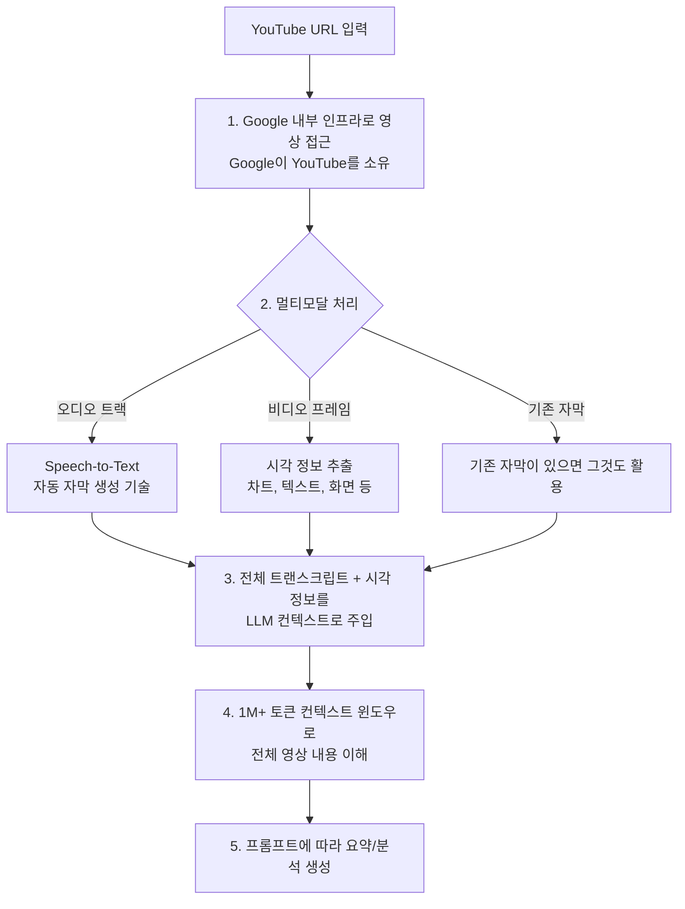
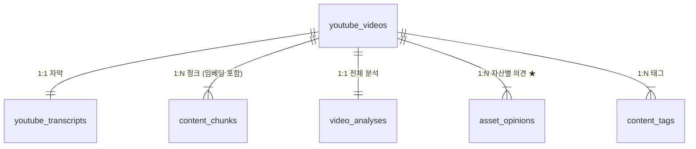

요청하신 내용을 생략 없이 순서 그대로 유지하여 Markdown 및 Mermaid로 포매팅했습니다.

***

# Preview & Analysis

**The user is building a personal investment intelligence system and wants to improve their YouTube data collection pipeline.**

Let me analyze their questions and needs:
1.  How to store data in DB
2.  How to do embeddings and what query patterns to use
3.  How Gemini processes YouTube video links (understanding the mechanism)
4.  Time-series tracking of opinions

Let me provide a comprehensive response covering:
*   **YouTube transcript extraction** - The key missing piece. RSS feeds only give title + description. They need full video transcripts.
*   **DB schema redesign** - Proper tables for YouTube-specific data, transcript chunks, etc.
*   **Embedding strategy** - How to chunk, embed, and query
*   **How Gemini processes YouTube** - When you paste a YouTube link, it extracts the audio, transcribes it using speech-to-text, and can analyze the full content to understand context and nuance that RSS feeds completely miss.
*   **Time-series opinion tracking** - I need to think about how to structure this so they can monitor sentiment shifts and changing perspectives from creators over time.

The real bottleneck here is that RSS feeds give almost nothing—just titles and descriptions. To actually understand what investment creators are saying, they need the full transcript content, which is what Gemini can access when given a direct video link.

For extracting this locally, I can use the YouTube transcript API for Korean captions or fall back to audio extraction with Whisper if transcripts aren't available. Then I need to design the database to store video metadata, chunked transcripts with timestamps, and the LLM analysis results. I'm also considering vector embeddings for semantic search and a time-series component to track how opinions evolve.

The embedding strategy needs to handle semantic chunking of transcripts and combine multiple search approaches for investment-related queries. I'm outlining the full architecture now—how to handle transcript extraction using either the YouTube transcript API for auto-generated Korean subtitles, or falling back to Whisper for videos without captions, plus leveraging Gemini's multimodal capabilities directly. For chunking, I need to consider time-based segmentation to preserve temporal context for financial data.

Now I'm thinking through the database schema—organizing it with separate tables for video metadata, full transcripts with timestamps, semantic chunks for embeddings, LLM-generated analyses like entities and sentiment, and the embedding vectors themselves. I'm also considering a two-level embedding approach where I capture both video-level summaries and individual chunk embeddings, using a Korean-optimized model rather than generic options.

For the query patterns, I'm mapping out how different user questions would flow through the system: embedding the query, searching the vector store for similar chunks, filtering by relevant metadata like topic or company ticker, sorting by recency, and then having an LLM synthesize the retrieved chunks into a coherent answer—with some queries needing time-series analysis to show how perspectives have evolved.

To support this properly, I need to ensure every data point has both a `published_at` timestamp for when the content was created and a `video_published_at` for when the source video was published, so I can answer questions comparing opinions across different time periods.

Now I'm thinking through the full scope here—the user wants me to focus on YouTube data collection improvements while also addressing how Gemini processes YouTube content, the database design, embedding strategy, query patterns, and time-series tracking. I'll structure the response in Korean and cover all these areas comprehensively.

For collecting transcripts, I have a few practical options: using the `youtube-transcript-api` library to grab auto-generated captions, downloading audio with `yt-dlp` and running local Whisper transcription, or leveraging the Gemini API's multimodal capabilities to process YouTube videos directly—which is particularly appealing since the user already works with Gemini.

The cost consideration is real though; processing longer videos through Gemini could get expensive quickly. The `youtube-transcript-api` approach is actually the sweet spot here—it's free, fast, and most Korean YouTube videos already have auto-generated Korean subtitles available, plus it returns timestamped data which is valuable for time-series analysis.

Designing the database schema... Defining the schema for content chunks and analysis results... Defining the schema for content tags to optimize search across tickers, companies, sectors, and other financial entities, with normalized values for consistent querying and a confidence score to track extraction reliability.

I'm simplifying the approach—the key is embedding at two levels: a video-level summary for broad searches and semantic chunks of the transcript for specific queries, with chunks around 500-1000 tokens and some overlap between them. For the query pipeline, I'm thinking through how to handle a user's question by first analyzing intent and extracting entities like sector or time range, then running a hybrid search that combines vector similarity on the embedded chunks with metadata filtering.

Now I'm considering the practical implementation details: how to actually fetch transcripts using the YouTube API, what to do when transcripts aren't available, the cost implications of embedding and LLM processing, and which embedding model works best for Korean text—I'm leaning toward `nomic-embed-text` but need to evaluate other options.

---

# YouTube 데이터 수집 고도화 종합 설계

## 1. Gemini가 YouTube 영상을 처리하는 방식

AI Studio에 YouTube 링크를 붙여넣으면 내부적으로 이런 과정이 일어납니다:



**핵심 포인트:** Gemini가 잘 분석하는 이유는 **영상의 전체 음성 내용(트랜스크립트)**을 확보하기 때문입니다. 현재 시스템은 RSS의 제목+설명(수십 자~수백 자)만 사용하고 있어 근본적으로 정보량이 부족합니다.

## 2. 핵심 문제: 자막(Transcript) 수집이 반드시 필요

**현재 vs 개선 후 정보량 비교**

| 구분 | 내용 | 분석 가능한 텍스트 |
| :--- | :--- | :--- |
| **현재 (RSS)** | 제목: "반도체 빅사이클 시작? HBM 수혜주 분석" (30자)<br>설명: 채널 홍보 + 링크 모음 (실질 내용 거의 없음) | ~100자 |
| **개선 후 (Transcript)** | 자막 전문: 30분 영상 기준 약 5,000~10,000자 | ~10,000자 **(100배 증가)** |

**자막 수집 방법 3가지**

```python
# 방법 1: youtube-transcript-api (가장 추천 - 무료, 빠름)
# 대부분의 한국 유튜브 영상에 자동생성 한국어 자막 있음
from youtube_transcript_api import YouTubeTranscriptApi

def get_transcript(video_id: str) -> dict:
    try:
        # 한국어 자막 우선, 없으면 자동생성 자막
        transcript_list = YouTubeTranscriptApi.list_transcripts(video_id)
        
        try:
            transcript = transcript_list.find_transcript(['ko'])
        except:
            transcript = transcript_list.find_generated_transcript(['ko'])
        
        segments = transcript.fetch()
        # segments = [{'text': '안녕하세요', 'start': 0.0, 'duration': 2.5}, ...]
        
        full_text = ' '.join([s['text'] for s in segments])
        return {
            'full_text': full_text,
            'segments': segments,
            'language': 'ko'
        }
    except Exception as e:
        return None


# 방법 2: yt-dlp + whisper (자막 없는 영상용 fallback)
# pip install yt-dlp faster-whisper
import subprocess
from faster_whisper import WhisperModel

def transcribe_audio(video_id: str) -> dict:
    url = f"https://www.youtube.com/watch?v={video_id}"
    audio_path = f"/tmp/{video_id}.mp3"
    
    # 오디오만 다운로드
    subprocess.run([
        "yt-dlp", "-x", "--audio-format", "mp3",
        "-o", audio_path, url
    ])
    
    # Whisper로 트랜스크립션
    model = WhisperModel("large-v3", device="cpu")  # GPU있으면 "cuda"
    segments, info = model.transcribe(audio_path, language="ko")
    
    result_segments = []
    for segment in segments:
        result_segments.append({
            'text': segment.text,
            'start': segment.start,
            'end': segment.end
        })
    
    full_text = ' '.join([s['text'] for s in result_segments])
    return {'full_text': full_text, 'segments': result_segments, 'language': 'ko'}


# 방법 3: Gemini API (비용 발생하지만 가장 고품질)
# 영상이 너무 중요한 경우에만 선별적 사용
import google.generativeai as genai

def analyze_with_gemini(video_url: str, prompt: str) -> str:
    model = genai.GenerativeModel('gemini-2.5-pro')
    response = model.generate_content([
        video_url,
        prompt
    ])
    return response.text
```

## 3. DB 스키마 재설계

현재 단일 `ContentItem` 테이블에서 목적별 분리가 필요합니다:

```sql
-- ============================================
-- 1. YouTube 영상 메타데이터
-- ============================================
CREATE TABLE youtube_videos (
    id UUID PRIMARY KEY DEFAULT gen_random_uuid(),
    video_id VARCHAR(20) UNIQUE NOT NULL,        -- YouTube video ID
    channel_id VARCHAR(50) NOT NULL,
    channel_name VARCHAR(200),
    title TEXT NOT NULL,
    description TEXT,
    url TEXT NOT NULL,
    
    -- 메타데이터 (YouTube Data API로 수집 가능)
    duration_seconds INTEGER,
    view_count INTEGER,
    like_count INTEGER,
    
    -- 분류
    category VARCHAR(50),          -- investment, economy, knowledge
    
    -- 시간 정보 (매우 중요!)
    published_at TIMESTAMP NOT NULL,    -- 영상 게시 시각 = 의견이 형성된 시점
    collected_at TIMESTAMP DEFAULT NOW(),
    
    -- 처리 상태
    has_transcript BOOLEAN DEFAULT FALSE,
    is_analyzed BOOLEAN DEFAULT FALSE,
    
    created_at TIMESTAMP DEFAULT NOW(),
    updated_at TIMESTAMP DEFAULT NOW()
);

CREATE INDEX idx_videos_published ON youtube_videos(published_at DESC);
CREATE INDEX idx_videos_channel ON youtube_videos(channel_id, published_at DESC);
CREATE INDEX idx_videos_category ON youtube_videos(category);


-- ============================================
-- 2. 영상 자막 (원본 보존)
-- ============================================
CREATE TABLE youtube_transcripts (
    id UUID PRIMARY KEY DEFAULT gen_random_uuid(),
    video_id VARCHAR(20) UNIQUE REFERENCES youtube_videos(video_id),
    language VARCHAR(10) DEFAULT 'ko',
    source VARCHAR(20),                -- 'manual', 'auto_generated', 'whisper'
    full_text TEXT NOT NULL,           -- 전체 자막 텍스트
    segments JSONB,                    -- 타임스탬프 포함 세그먼트
    word_count INTEGER,
    created_at TIMESTAMP DEFAULT NOW()
);


-- ============================================
-- 3. 의미 단위 청크 (임베딩 대상)
-- ============================================
CREATE TABLE content_chunks (
    id UUID PRIMARY KEY DEFAULT gen_random_uuid(),
    video_id VARCHAR(20) REFERENCES youtube_videos(video_id),
    chunk_type VARCHAR(20) NOT NULL,   -- 'summary', 'segment'
    chunk_index INTEGER,               -- 순서
    content TEXT NOT NULL,             -- 청크 텍스트
    
    -- 영상 내 위치 정보
    start_time FLOAT,                  -- 초 단위
    end_time FLOAT,
    
    -- 임베딩
    embedding vector(768),             -- pgvector
    
    -- 메타데이터 (비정규화 - 검색 성능)
    channel_name VARCHAR(200),
    video_title TEXT,
    published_at TIMESTAMP,            -- 영상 게시일 복사 (조인 회피)
    
    token_count INTEGER,
    created_at TIMESTAMP DEFAULT NOW()
);

CREATE INDEX idx_chunks_video ON content_chunks(video_id);
CREATE INDEX idx_chunks_published ON content_chunks(published_at DESC);
CREATE INDEX idx_chunks_embedding ON content_chunks 
    USING ivfflat (embedding vector_cosine_ops) WITH (lists = 100);


-- ============================================
-- 4. AI 분석 결과
-- ============================================
CREATE TABLE video_analyses (
    id UUID PRIMARY KEY DEFAULT gen_random_uuid(),
    video_id VARCHAR(20) REFERENCES youtube_videos(video_id),
    
    -- 요약
    summary TEXT,
    key_points JSONB,                  -- ["핵심1", "핵심2", ...]
    
    -- 감정/전망 분석
    overall_sentiment_score FLOAT,     -- -5.0 ~ +5.0
    overall_sentiment_label VARCHAR(20),
    sentiment_reasoning TEXT,
    
    -- 시간 범위 (이 영상이 다루는 전망의 시간축)
    time_horizon VARCHAR(20),          -- short_term, medium_term, long_term
    
    -- 분석에 사용된 모델
    llm_model VARCHAR(50),
    analyzed_at TIMESTAMP DEFAULT NOW(),
    
    -- 영상 게시일 (비정규화)
    published_at TIMESTAMP
);


-- ============================================
-- 5. 자산/종목별 의견 (핵심 테이블!)
-- ============================================
-- 하나의 영상에서 여러 자산에 대한 의견이 나올 수 있음
CREATE TABLE asset_opinions (
    id UUID PRIMARY KEY DEFAULT gen_random_uuid(),
    video_id VARCHAR(20) REFERENCES youtube_videos(video_id),
    analysis_id UUID REFERENCES video_analyses(id),
    
    -- 자산 식별
    asset_type VARCHAR(20) NOT NULL,   -- 'stock', 'sector', 'commodity', 'currency', 'bond', 'crypto', 'index'
    asset_code VARCHAR(50),            -- '005930', 'AAPL', 'gold', 'USD/KRW', 'US10Y', 'BTC'
    asset_name VARCHAR(200),           -- '삼성전자', 'Apple', '금', '달러/원', '미국 10년물', '비트코인'
    asset_name_normalized VARCHAR(200),-- 정규화된 이름 (검색용)
    
    -- 의견
    sentiment_score FLOAT,             -- -5.0 ~ +5.0
    sentiment_label VARCHAR(20),       -- very_bearish ~ very_bullish
    opinion_summary TEXT,              -- "HBM 수요 증가로 하반기 실적 개선 기대"
    
    -- 근거 (자막에서 추출한 관련 부분)
    supporting_quotes JSONB,           -- ["관련 발언 1", "관련 발언 2"]
    
    -- 컨텍스트
    channel_name VARCHAR(200),
    published_at TIMESTAMP NOT NULL,   -- ★ 의견이 나온 시점
    
    created_at TIMESTAMP DEFAULT NOW()
);

-- 핵심 인덱스들
CREATE INDEX idx_opinions_asset ON asset_opinions(asset_type, asset_code);
CREATE INDEX idx_opinions_asset_time ON asset_opinions(asset_code, published_at DESC);
CREATE INDEX idx_opinions_type_time ON asset_opinions(asset_type, published_at DESC);
CREATE INDEX idx_opinions_name ON asset_opinions(asset_name_normalized);
CREATE INDEX idx_opinions_published ON asset_opinions(published_at DESC);


-- ============================================
-- 6. 토픽 태그 (검색 최적화)
-- ============================================
CREATE TABLE content_tags (
    id UUID PRIMARY KEY DEFAULT gen_random_uuid(),
    video_id VARCHAR(20) REFERENCES youtube_videos(video_id),
    
    tag_type VARCHAR(30) NOT NULL,     -- 'ticker', 'company', 'sector', 'commodity', 
                                       -- 'currency_pair', 'bond', 'macro_topic', 
                                       -- 'investment_strategy', 'theme'
    tag_value VARCHAR(100) NOT NULL,
    tag_normalized VARCHAR(100),       -- 정규화 (소문자, 공백제거 등)
    confidence FLOAT DEFAULT 1.0,
    
    created_at TIMESTAMP DEFAULT NOW()
);

CREATE INDEX idx_tags_type_value ON content_tags(tag_type, tag_normalized);
CREATE INDEX idx_tags_video ON content_tags(video_id);
-- GIN 인덱스 (부분 매칭용)
CREATE INDEX idx_tags_normalized_gin ON content_tags 
    USING gin(tag_normalized gin_trgm_ops);
```

**ER Diagram (관계)**



## 4. 임베딩 & 청킹 전략

### 4.1 청킹 전략: 2-Level 접근

```python
class TranscriptChunker:
    """자막을 의미 단위로 청킹"""
    
    def chunk_transcript(
        self, 
        video_id: str,
        title: str,
        transcript_segments: List[dict],
        channel_name: str,
        published_at: datetime
    ) -> List[dict]:
        
        chunks = []
        
        # ============================
        # Level 1: 영상 전체 요약 청크
        # ============================
        full_text = ' '.join([s['text'] for s in transcript_segments])
        summary = self._generate_summary(title, full_text)
        
        chunks.append({
            'video_id': video_id,
            'chunk_type': 'summary',
            'chunk_index': 0,
            'content': f"[{channel_name}] {title}\n\n{summary}",
            'start_time': 0,
            'end_time': transcript_segments[-1].get('start', 0),
            'channel_name': channel_name,
            'video_title': title,
            'published_at': published_at,
        })
        
        # ============================
        # Level 2: 시간 기반 세그먼트 청크
        # ============================
        # 약 2~3분 단위로 묶되, 문장 경계 존중
        CHUNK_DURATION = 150  # 2.5분
        OVERLAP_DURATION = 30  # 30초 오버랩
        
        current_chunk_texts = []
        current_chunk_start = 0
        current_duration = 0
        chunk_idx = 1
        
        for seg in transcript_segments:
            current_chunk_texts.append(seg['text'])
            current_duration = seg['start'] - current_chunk_start + seg.get('duration', 0)
            
            if current_duration >= CHUNK_DURATION:
                chunk_text = ' '.join(current_chunk_texts)
                
                # 청크에 컨텍스트 헤더 추가 (검색 품질 향상)
                contextualized = (
                    f"[{channel_name}] {title} "
                    f"({self._format_time(current_chunk_start)}~{self._format_time(seg['start'])})\n\n"
                    f"{chunk_text}"
                )
                
                chunks.append({
                    'video_id': video_id,
                    'chunk_type': 'segment',
                    'chunk_index': chunk_idx,
                    'content': contextualized,
                    'start_time': current_chunk_start,
                    'end_time': seg['start'],
                    'channel_name': channel_name,
                    'video_title': title,
                    'published_at': published_at,
                })
                
                # 오버랩을 위해 마지막 30초분 텍스트 유지
                overlap_start = seg['start'] - OVERLAP_DURATION
                current_chunk_texts = [
                    s['text'] for s in transcript_segments 
                    if s['start'] >= overlap_start and s['start'] <= seg['start']
                ]
                current_chunk_start = overlap_start
                chunk_idx += 1
        
        # 마지막 남은 텍스트 처리
        if current_chunk_texts:
            chunk_text = ' '.join(current_chunk_texts)
            contextualized = (
                f"[{channel_name}] {title} "
                f"({self._format_time(current_chunk_start)}~끝)\n\n"
                f"{chunk_text}"
            )
            chunks.append({
                'video_id': video_id,
                'chunk_type': 'segment',
                'chunk_index': chunk_idx,
                'content': contextualized,
                'start_time': current_chunk_start,
                'end_time': None,
                'channel_name': channel_name,
                'video_title': title,
                'published_at': published_at,
            })
        
        return chunks
    
    def _format_time(self, seconds: float) -> str:
        m, s = divmod(int(seconds), 60)
        return f"{m}:{s:02d}"
```

### 4.2 임베딩 모델 선택

```python
# 현재: nomic-embed-text (384차원) → 영어 최적화, 한국어 성능 부족

# 추천 대안 1: bge-m3 (다국어, 한국어 우수) - Ollama 지원
# ollama pull bge-m3
# 차원: 1024

# 추천 대안 2: multilingual-e5-large - 한국어 성능 좋음
# 차원: 1024

# 추천 대안 3 (API 사용 OK라면): Gemini embedding
# models/text-embedding-004 (768차원, 다국어 매우 우수)
# 무료 할당량: 분당 1,500 요청

# 가장 현실적 추천: Gemini embedding API
import google.generativeai as genai

def embed_with_gemini(text: str) -> List[float]:
    result = genai.embed_content(
        model="models/text-embedding-004",
        content=text,
        task_type="retrieval_document"  # 문서 저장용
    )
    return result['embedding']  # 768차원

def embed_query_with_gemini(query: str) -> List[float]:
    result = genai.embed_content(
        model="models/text-embedding-004",
        content=query,
        task_type="retrieval_query"  # 쿼리용 (비대칭 검색)
    )
    return result['embedding']
```

### 4.3 임베딩 대상별 전략

| 대상 | 용도 |
| :--- | :--- |
| **영상 요약 청크**<br>(summary chunk) | **"반도체 전망 알려줘" 같은 넓은 검색**<br>→ 관련 영상 전체를 빠르게 찾기 |
| **세그먼트 청크**<br>(segment chunk) | **"HBM 3E 수율 문제" 같은 구체적 검색**<br>→ 영상 내 특정 구간을 정밀하게 찾기 |
| **자산별 의견**<br>(asset_opinion) | **"삼성전자에 대한 최근 의견" 같은 종목/자산 특화 검색**<br>→ 시계열 분석에 특히 유용 |

## 5. 쿼리 패턴 설계

### 5.1 쿼리 처리 파이프라인

```python
class InvestmentQueryEngine:
    """투자 질문 처리 엔진"""
    
    async def process_query(self, user_query: str) -> dict:
        # =====================
        # Step 1: 쿼리 분석
        # =====================
        query_analysis = await self._analyze_query(user_query)
        # {
        #   "intent": "asset_opinion",      -- 의도
        #   "assets": [{"type": "stock", "code": "005930", "name": "삼성전자"}],
        #   "topics": ["반도체", "HBM"],
        #   "time_range": "recent",          -- recent, last_week, last_month, all
        #   "query_type": "opinion_summary"  -- opinion_summary, trend_analysis, 
        #                                       comparison, general_search
        # }
        
        # =====================
        # Step 2: 하이브리드 검색
        # =====================
        results = await self._hybrid_search(user_query, query_analysis)
        
        # =====================
        # Step 3: 답변 생성
        # =====================
        answer = await self._generate_answer(user_query, query_analysis, results)
        
        return answer
    
    async def _analyze_query(self, query: str) -> dict:
        """LLM으로 쿼리 의도 분석"""
        prompt = f"""사용자의 투자 관련 질문을 분석하세요.

질문: {query}

분석 결과를 JSON으로 출력:
{{
  "intent": "asset_opinion | sector_outlook | macro_analysis | general_search | trend_comparison",
  "assets": [
    {{"type": "stock|sector|commodity|currency|bond|crypto|index", 
      "code": "종목코드 또는 자산코드",
      "name": "자산명"}}
  ],
  "topics": ["관련 토픽"],
  "time_range": "recent | last_week | last_month | last_quarter | all",
  "query_type": "opinion_summary | trend_analysis | comparison | general_search"
}}"""
        return await self.llm.generate_structured(prompt)
    
    async def _hybrid_search(self, query: str, analysis: dict) -> dict:
        """벡터 검색 + 구조화 검색 결합"""
        
        results = {
            'chunks': [],        # 벡터 검색 결과
            'opinions': [],      # 자산별 의견 (구조화 검색)
            'videos': []         # 관련 영상 메타
        }
        
        # ----- 벡터 검색 -----
        query_embedding = self.embed_query(query)
        
        # 시간 필터 생성
        time_filter = self._get_time_filter(analysis.get('time_range', 'recent'))
        
        chunk_results = await self.db.execute(f"""
            SELECT 
                c.id, c.content, c.video_id, c.chunk_type,
                c.start_time, c.channel_name, c.video_title,
                c.published_at,
                1 - (c.embedding <=> :embedding) as similarity
            FROM content_chunks c
            WHERE c.published_at >= :time_start
            ORDER BY c.embedding <=> :embedding
            LIMIT 20
        """, {
            'embedding': query_embedding,
            'time_start': time_filter
        })
        results['chunks'] = chunk_results
        
        # ----- 자산별 의견 검색 (구조화) -----
        if analysis.get('assets'):
            for asset in analysis['assets']:
                opinions = await self.db.execute("""
                    SELECT 
                        ao.*, yv.title, yv.channel_name, yv.url
                    FROM asset_opinions ao
                    JOIN youtube_videos yv ON ao.video_id = yv.video_id
                    WHERE (ao.asset_code = :code OR ao.asset_name_normalized LIKE :name)
                    AND ao.published_at >= :time_start
                    ORDER BY ao.published_at DESC
                    LIMIT 20
                """, {
                    'code': asset.get('code', ''),
                    'name': f"%{asset.get('name', '')}%",
                    'time_start': time_filter
                })
                results['opinions'].extend(opinions)
        
        # ----- 토픽 기반 태그 검색 -----
        if analysis.get('topics'):
            for topic in analysis['topics']:
                tagged_videos = await self.db.execute("""
                    SELECT DISTINCT yv.*
                    FROM content_tags ct
                    JOIN youtube_videos yv ON ct.video_id = yv.video_id
                    WHERE ct.tag_normalized LIKE :topic
                    AND yv.published_at >= :time_start
                    ORDER BY yv.published_at DESC
                    LIMIT 10
                """, {
                    'topic': f"%{topic}%",
                    'time_start': time_filter
                })
                results['videos'].extend(tagged_videos)
        
        return results
```

### 5.2 구체적 쿼리 시나리오

> **시나리오 1: "삼성전자 최근 전망은?"**
>
> **Step 1 - 쿼리 분석:**
> *   intent: asset_opinion
> *   assets: [{type: "stock", code: "005930", name: "삼성전자"}]
> *   time_range: recent (7일)
>
> **Step 2 - 검색:**
> *   a) asset_opinions에서 asset_code='005930' 최근 7일 조회
> *   b) 벡터 검색으로 "삼성전자 전망" 관련 청크 검색
> *   c) content_tags에서 '삼성전자' 태그된 영상 조회
>
> **Step 3 - 답변 생성:**
> *   "최근 7일간 3개 채널에서 삼성전자를 언급했습니다:
>     *   [월가아재] (6/15): HBM 수요 증가로 긍정적 (점수: +3)
>     *   [김단테] (6/14): 밸류에이션 부담 지적 (점수: -1)
>     *   [미과장] (6/13): 하반기 실적 턴어라운드 기대 (점수: +2)
> *   종합: 대체로 긍정적이나 밸류에이션 부담 의견 존재
> *   평균 감정 점수: +1.3 (약간 긍정적)"

> **시나리오 2: "금 가격 어떻게 될까?"**
>
> **Step 1 - 쿼리 분석:**
> *   intent: asset_opinion
> *   assets: [{type: "commodity", code: "gold", name: "금"}]
> *   time_range: recent
>
> **Step 2 - 검색:**
> *   a) asset_opinions에서 asset_type='commodity' AND asset_code='gold'
> *   b) 벡터 검색 "금 가격 전망"
> *   c) content_tags에서 tag_type='commodity' AND tag_normalized='gold'
>
> **Step 3 - 답변:**
> *   시계열로 의견 변화 추적 가능

> **시나리오 3: "반도체 업종 전망"**
>
> **Step 1:**
> *   intent: sector_outlook
> *   assets: [{type: "sector", code: "semiconductor", name: "반도체"}]
>
> **Step 2:**
> *   a) asset_opinions에서 asset_type='sector' AND '반도체' 관련
> *   b) 벡터 검색으로 반도체 관련 청크
> *   c) 관련 개별 종목 의견도 함께 조회 (삼성전자, SK하이닉스 등)

> **시나리오 4: "달러/원 환율 전망"**
>
> **Step 1:**
> *   intent: asset_opinion
> *   assets: [{type: "currency", code: "USD/KRW", name: "달러원"}]

> **시나리오 5: "최근 시황 정리해줘" (넓은 질문)**
>
> **Step 1:**
> *   intent: macro_analysis
> *   topics: ["시황", "마켓"]
> *   time_range: last_week
>
> **Step 2:**
> *   a) 최근 1주일 영상의 summary 청크들 벡터 검색
> *   b) 최근 1주일 전체 video_analyses 조회
> *   c) asset_opinions 전체를 시계열로 조회
>
> **Step 3:**
> *   종합 시황 리포트 생성

## 6. 시계열 분석 설계

### 6.1 의견 변화 추적 쿼리

```sql
-- 특정 자산에 대한 의견 변화 추적
-- "지난 한 달간 삼성전자에 대한 유튜버들의 의견 변화"

SELECT 
    ao.published_at::date as opinion_date,
    ao.channel_name,
    ao.sentiment_score,
    ao.sentiment_label,
    ao.opinion_summary,
    yv.title as video_title,
    yv.url as video_url
FROM asset_opinions ao
JOIN youtube_videos yv ON ao.video_id = yv.video_id
WHERE ao.asset_code = '005930'  -- 삼성전자
AND ao.published_at >= NOW() - INTERVAL '30 days'
ORDER BY ao.published_at DESC;


-- 일별 평균 감정 점수 추이
SELECT 
    ao.published_at::date as date,
    ROUND(AVG(ao.sentiment_score), 2) as avg_sentiment,
    COUNT(*) as mention_count,
    ARRAY_AGG(DISTINCT ao.channel_name) as channels
FROM asset_opinions ao
WHERE ao.asset_code = '005930'
AND ao.published_at >= NOW() - INTERVAL '90 days'
GROUP BY ao.published_at::date
ORDER BY date;


-- 특정 채널의 의견 변화 추적
-- "월가아재가 반도체에 대해 어떻게 의견이 바뀌었나?"
SELECT 
    ao.published_at,
    ao.sentiment_score,
    ao.opinion_summary,
    yv.title
FROM asset_opinions ao
JOIN youtube_videos yv ON ao.video_id = yv.video_id
WHERE ao.channel_name = '월가아재의 과학적 투자'
AND (ao.asset_code = 'semiconductor' OR ao.asset_name_normalized LIKE '%반도체%')
ORDER BY ao.published_at;


-- 자산 유형별 최근 감정 히트맵
SELECT 
    ao.asset_type,
    ao.asset_name,
    ao.asset_code,
    ROUND(AVG(ao.sentiment_score), 2) as avg_sentiment,
    COUNT(*) as mention_count,
    MAX(ao.published_at) as last_mentioned
FROM asset_opinions ao
WHERE ao.published_at >= NOW() - INTERVAL '7 days'
GROUP BY ao.asset_type, ao.asset_name, ao.asset_code
ORDER BY mention_count DESC;
```

### 6.2 시계열 시각화용 API

```python
@router.get("/opinions/timeline/{asset_code}")
async def get_opinion_timeline(
    asset_code: str,
    days: int = 30,
    channel: Optional[str] = None
):
    """특정 자산에 대한 의견 타임라인"""
    query = """
        SELECT 
            ao.published_at,
            ao.channel_name,
            ao.sentiment_score,
            ao.sentiment_label,
            ao.opinion_summary,
            yv.title,
            yv.url
        FROM asset_opinions ao
        JOIN youtube_videos yv ON ao.video_id = yv.video_id
        WHERE ao.asset_code = :asset_code
        AND ao.published_at >= NOW() - :days * INTERVAL '1 day'
    """
    if channel:
        query += " AND ao.channel_name = :channel"
    query += " ORDER BY ao.published_at DESC"
    
    return await db.fetch_all(query, {
        'asset_code': asset_code,
        'days': days,
        'channel': channel
    })
```

## 7. LLM 분석 파이프라인 (자막 → 구조화 데이터)

영상 자막을 수집한 후 LLM으로 분석하는 핵심 로직:

```python
class VideoAnalyzer:
    """영상 자막 분석기"""
    
    async def analyze_video(self, video_id: str, title: str, 
                            transcript: str, channel_name: str,
                            published_at: datetime) -> dict:
        
        # 자막이 너무 길면 요약 후 분석
        if len(transcript) > 15000:
            # 청크별로 요약 후 통합
            transcript_for_analysis = await self._summarize_long_transcript(transcript)
        else:
            transcript_for_analysis = transcript
        
        prompt = f"""다음은 투자 관련 YouTube 영상의 자막입니다.
이 영상의 내용을 분석하세요.

채널: {channel_name}
제목: {title}
게시일: {published_at.strftime('%Y-%m-%d')}

자막 내용:
{transcript_for_analysis}

다음 JSON 형식으로 분석 결과를 출력하세요:

{{
  "summary": "영상 전체 내용 요약 (300자 이내)",
  
  "key_points": [
    "핵심 포인트 1",
    "핵심 포인트 2",
    "핵심 포인트 3"
  ],
  
  "asset_opinions": [
    {{
      "asset_type": "stock | sector | commodity | currency | bond | crypto | index",
      "asset_code": "종목코드(005930) 또는 자산코드(gold, USD/KRW, US10Y, BTC, KOSPI)",
      "asset_name": "자산명 (삼성전자, 금, 달러/원 등)",
      "sentiment_score": -5에서 +5 사이 숫자,
      "sentiment_label": "very_bearish | bearish | neutral | bullish | very_bullish",
      "opinion_summary": "이 자산에 대한 의견 요약 (1~2문장)",
      "supporting_quotes": ["관련 발언 인용 1", "관련 발언 인용 2"]
    }}
  ],
  
  "topics": [
    {{
      "category": "macro | sector | stock | strategy | risk | commodity | forex",
      "subtopics": ["세부 토픽1", "세부 토픽2"]
    }}
  ],
  
  "overall_sentiment_score": -5에서 +5,
  "overall_sentiment_label": "very_bearish | bearish | neutral | bullish | very_bullish",
  "sentiment_reasoning": "전반적 감정 판단 근거",
  
  "time_horizon": "short_term | medium_term | long_term",
  
  "tags": [
    {{"type": "ticker", "value": "005930"}},
    {{"type": "company", "value": "삼성전자"}},
    {{"type": "sector", "value": "반도체"}},
    {{"type": "commodity", "value": "gold"}},
    {{"type": "currency_pair", "value": "USD/KRW"}},
    {{"type": "macro_topic", "value": "연준 금리"}},
    {{"type": "theme", "value": "AI"}}
  ]
}}

중요 규칙:
1. 한국 종목은 6자리 코드, 미국 종목은 티커 심볼 사용
2. 영상에서 직접 언급된 자산/종목만 포함 (추측 X)
3. 의견이 명확하지 않으면 neutral로 표시
4. asset_opinions에는 의견이 있는 자산만 포함 (단순 언급은 tags에만)
5. supporting_quotes는 실제 자막에서 발췌"""

        result = await self.llm.generate_structured(prompt)
        return result
```

## 8. 전체 수집 파이프라인

```python
class EnhancedYouTubeCollector:
    """고도화된 YouTube 수집기"""
    
    async def collect_and_analyze(self, channel_id: str, channel_name: str):
        """수집 → 자막 추출 → 청킹 → 분석 → 임베딩 → 저장"""
        
        # Step 1: RSS로 새 영상 목록 가져오기
        feed = self._fetch_rss(channel_id)
        
        for entry in feed.entries:
            video_id = entry.yt_videoid
            
            # 중복 체크
            if await self._exists(video_id):
                continue
            
            # Step 2: 영상 메타데이터 저장
            video = await self._save_video_metadata(entry, channel_id, channel_name)
            
            # Step 3: 자막 추출 ★★★
            transcript_data = self._get_transcript(video_id)
            if not transcript_data:
                # 자막 없으면 건너뛰기 (또는 whisper fallback)
                logger.warning(f"No transcript: {video_id} - {entry.title}")
                continue
            
            await self._save_transcript(video_id, transcript_data)
            
            # Step 4: 청킹 + 임베딩
            chunks = self.chunker.chunk_transcript(
                video_id=video_id,
                title=entry.title,
                transcript_segments=transcript_data['segments'],
                channel_name=channel_name,
                published_at=video.published_at
            )
            
            for chunk in chunks:
                embedding = self.embedder.embed(chunk['content'])
                chunk['embedding'] = embedding
                await self._save_chunk(chunk)
            
            # Step 5: LLM 분석 (요약 + 엔티티 + 감정 + 자산별 의견)
            analysis = await self.analyzer.analyze_video(
                video_id=video_id,
                title=entry.title,
                transcript=transcript_data['full_text'],
                channel_name=channel_name,
                published_at=video.published_at
            )
            
            # Step 6: 분석 결과 저장
            await self._save_analysis(video_id, analysis)
            await self._save_asset_opinions(video_id, analysis, channel_name, video.published_at)
            await self._save_tags(video_id, analysis)
            
            logger.info(f"Processed: [{channel_name}] {entry.title}")
            
            # Rate limiting
            await asyncio.sleep(2)
```

## 9. 자산 코드 정규화 매핑

```yaml
# config/asset_mapping.yaml

# 한국 주식
korean_stocks:
  삼성전자: { code: "005930", aliases: ["삼성", "삼전", "Samsung Electronics"] }
  SK하이닉스: { code: "000660", aliases: ["하이닉스", "SK Hynix"] }
  현대차: { code: "005380", aliases: ["현대자동차", "현대모비스 아님"] }
  LG에너지솔루션: { code: "373220", aliases: ["LG에너솔", "LGES"] }
  네이버: { code: "035420", aliases: ["NAVER"] }
  카카오: { code: "035720", aliases: ["Kakao"] }

# 미국 주식
us_stocks:
  Apple: { code: "AAPL", aliases: ["애플"] }
  NVIDIA: { code: "NVDA", aliases: ["엔비디아", "엔디비아"] }
  Tesla: { code: "TSLA", aliases: ["테슬라"] }
  Microsoft: { code: "MSFT", aliases: ["마이크로소프트", "MS"] }
  Amazon: { code: "AMZN", aliases: ["아마존"] }
  Google: { code: "GOOGL", aliases: ["구글", "알파벳", "Alphabet"] }

# 원자재
commodities:
  금: { code: "gold", aliases: ["Gold", "골드", "금값"] }
  은: { code: "silver", aliases: ["Silver", "실버"] }
  원유: { code: "crude_oil", aliases: ["유가", "WTI", "브렌트", "Crude Oil"] }
  구리: { code: "copper", aliases: ["Copper", "닥터코퍼"] }
  천연가스: { code: "natural_gas", aliases: ["Natural Gas"] }

# 환율
currencies:
  달러/원: { code: "USD/KRW", aliases: ["달러원", "원달러", "환율"] }
  달러/엔: { code: "USD/JPY", aliases: ["달러엔", "엔화"] }
  유로/달러: { code: "EUR/USD", aliases: ["유로달러", "유로화"] }
  달러인덱스: { code: "DXY", aliases: ["달러 인덱스", "Dollar Index"] }

# 금리
bonds:
  미국 10년물: { code: "US10Y", aliases: ["미 10년물", "미국채 10년", "US 10Y Treasury"] }
  미국 2년물: { code: "US2Y", aliases: ["미 2년물", "미국채 2년"] }
  한국 3년물: { code: "KR3Y", aliases: ["한국 국채 3년", "한국채"] }

# 지수
indices:
  S&P500: { code: "SPX", aliases: ["S&P", "에스앤피", "에센피"] }
  나스닥: { code: "NASDAQ", aliases: ["나스닥", "IXIC"] }
  코스피: { code: "KOSPI", aliases: ["코스피"] }
  코스닥: { code: "KOSDAQ", aliases: ["코스닥"] }
  VIX: { code: "VIX", aliases: ["빅스", "공포지수", "변동성지수"] }

# 섹터
sectors:
  반도체: { code: "semiconductor", aliases: ["반도체", "Semiconductor", "칩"] }
  AI: { code: "ai", aliases: ["인공지능", "AI", "Artificial Intelligence"] }
  배터리: { code: "battery", aliases: ["2차전지", "배터리", "리튬"] }
  바이오: { code: "bio", aliases: ["바이오", "제약", "헬스케어"] }
  자동차: { code: "auto", aliases: ["자동차", "EV", "전기차"] }

# 거시경제 토픽  
macro_topics:
  연준: { code: "fed", aliases: ["FED", "FOMC", "파월", "연방준비제도"] }
  금리: { code: "interest_rate", aliases: ["기준금리", "금리 인상", "금리 인하"] }
  인플레이션: { code: "inflation", aliases: ["물가", "CPI", "PCE"] }
  고용: { code: "employment", aliases: ["실업률", "고용지표", "NFP", "비농업고용"] }
  GDP: { code: "gdp", aliases: ["경제성장률", "GDP"] }
```

## 10. 구현 우선순위 로드맵

```
Phase 1 (1주차): 자막 수집 기반 구축
━━━━━━━━━━━━━━━━━━━━━━━━━━━━━━━━━━━
├── youtube-transcript-api 연동
├── DB 마이그레이션 (새 테이블 생성)
├── 기본 자막 수집 + 원본 저장
└── 기존 채널 대상 자막 일괄 수집

Phase 2 (2주차): LLM 분석 파이프라인
━━━━━━━━━━━━━━━━━━━━━━━━━━━━━━━━━━━
├── 자막 → 분석 프롬프트 설계 및 테스트
├── asset_opinions 추출 로직
├── 자산 코드 매핑 테이블 구축
└── 분석 결과 저장 로직

Phase 3 (3주차): 임베딩 + 검색
━━━━━━━━━━━━━━━━━━━━━━━━━━━━━━━━━━━
├── 청킹 전략 구현
├── 임베딩 모델 교체 (Gemini embedding 또는 bge-m3)
├── 하이브리드 검색 엔진
└── 쿼리 분석 LLM 로직

Phase 4 (4주차): 쿼리 인터페이스 + 시계열
━━━━━━━━━━━━━━━━━━━━━━━━━━━━━━━━━━━
├── 자연어 쿼리 처리 파이프라인
├── 시계열 의견 추적 API
├── 답변 생성 (RAG) 로직
└── 프론트엔드 연동
```

## 핵심 정리

| 항목 | 현재 | 개선 후 |
| :--- | :--- | :--- |
| **정보량** | RSS 제목+설명 (~100자) | 전체 자막 (~10,000자) |
| **DB 구조** | 단일 ContentItem 테이블 | 목적별 5개 테이블 분리 |
| **임베딩** | 영상 단위 1개 임베딩 | 요약 + 세그먼트 다중 임베딩 |
| **검색** | 단순 벡터 검색 | 쿼리 분석 → 하이브리드 검색 → RAG |
| **감정 분석** | 감정: 3단계 (bull/bear/neutral) | 감정 점수 (-5~+5) + 자산별 의견 분리 |
| **시계열** | 시계열 추적 불가 | `asset_opinions` 테이블로 의견 변화 추적 |
| **시간 축** | 영상 게시일만 기록 | `published_at`을 모든 분석 레코드에 비정규화 |

**가장 중요한 한 가지: `youtube-transcript-api`로 자막을 수집하는 것.** 이것만 해도 분석 품질이 근본적으로 달라집니다.