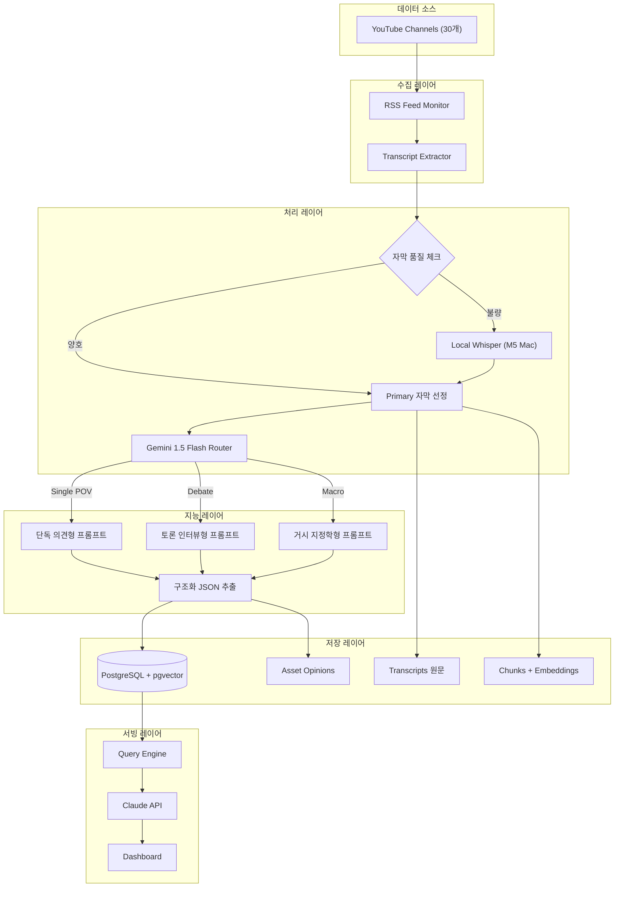
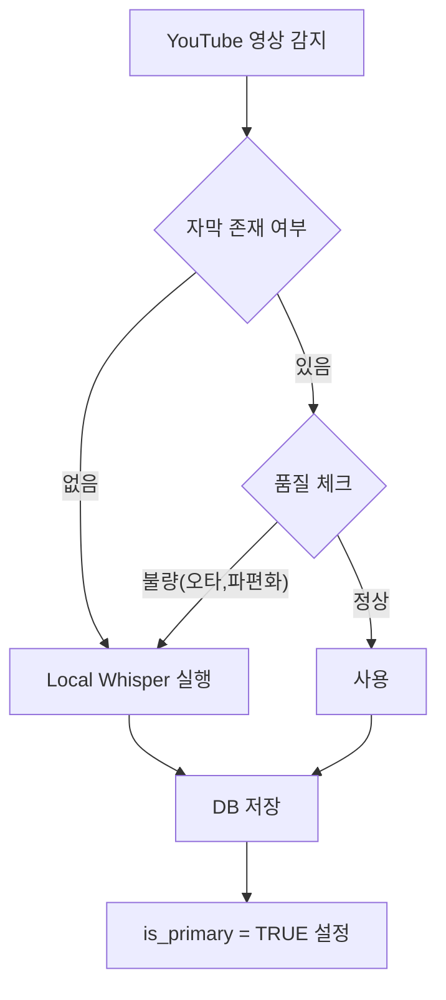
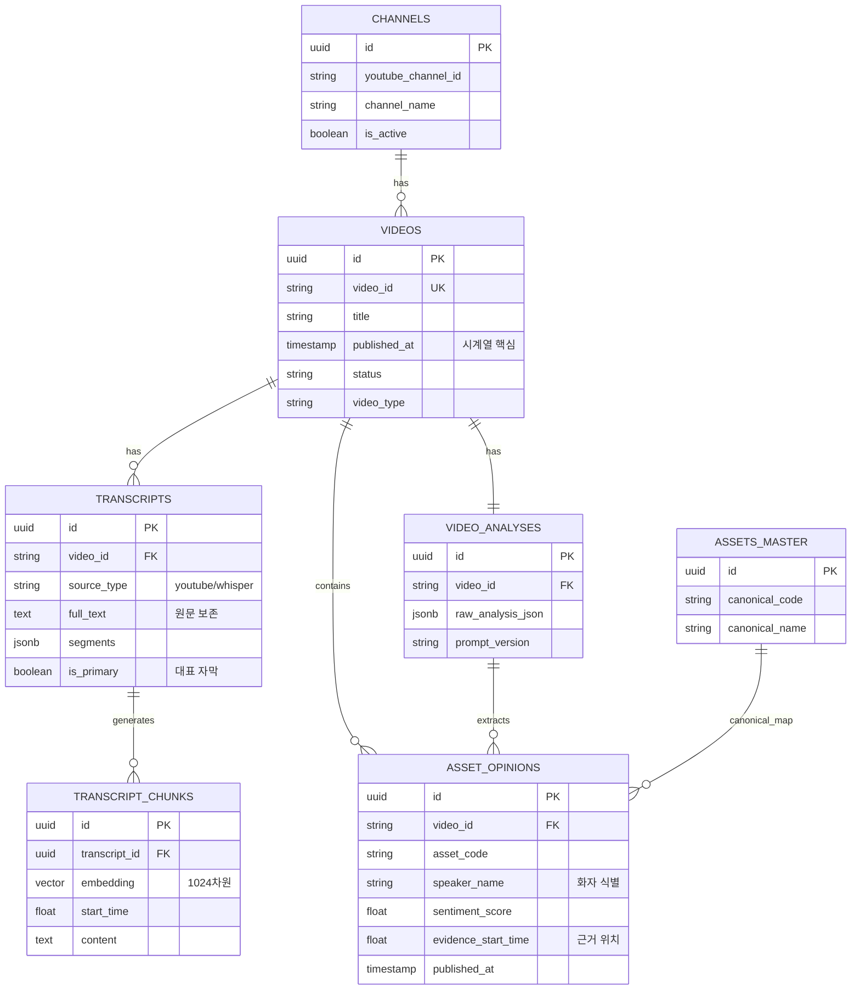

프로젝트 전체 내용을 문서화할 수 있도록 정리했습니다. 그대로 복사해서 `.md` 파일로 저장하시면 됩니다.

markdown
# 📊 투자 인텔리전스 시스템: YouTube 데이터 고도화 설계서

> **목표**: 유튜브, 블로그, 트위터 등에서 전문가 의견을 수집하여 시계열 변화(Diff)를 추적하고, LLM을 활용해 투자 인사이트를 도출하는 시스템 구축. 1단계로 YouTube 데이터 수집 고도화 진행.

---

## 1. 시스템 아키텍처 (Architecture)

전체 데이터 파이프라인은 **수집 → 정제 → 분석 → 적재 → 서빙**의 흐름을 가집니다.


자막품질체크에서 양호하다고 해도, HBM을 에치비엠 같은 단어로 뭉갠 발음으로 저장될 수 있으니 LLM 통해서 오탈자나 단어교정이 필요한 부분들 한번 더 체크시켜서 양질의 데이터로 정제하는 과정을 사이에 넣는것도 좋을거같다는 생각이 듬.

---

## 2. 데이터 수집 전략 (Collection Strategy)

### 2.1 자막 수집: 하이브리드 3단계 폴백
단일 소스에 의존하지 않고, 품질 기반의 멀티 소스 전략을 채택합니다.

| 순위 | 방식 | 장점 | 단점 | 비용 |
|------|------|------|------|------|
| **1차** | `youtube-transcript-api` | 빠름(1초), 타임스탬프 정확, 원본 보존 | 품질 낮을 수 있음 | **무료** |
| **2차** | Local Whisper (M5 Mac) | 고품질, 오프라인 가능 | 느림(3~5분) | **무료** |
| **3차** | Gemini URL 직접 분석 | 오디오+비디오 통합 이해 | 텍스트 원본 손실 위험 | **저렴** |

### 2.2 품질 관리 프로세스



**품질 체크 기준 (Heuristic)**
- 텍스트 길이가 너무 짧음 (< 100자)
- 의미 없는 문자열 비율 높음 (e.g., "ㅋㅋㅋ", "음")
- 문장 평균 길이 지나치게 짧음 (< 5자)

---

## 3. LLM 분석 전략 (Analysis Strategy)

### 3.1 모델 사용 분리 (Model Routing)

| 용도 | 모델 | 이유 |
|------|------|------|
| **영상 분석/구조화** | Gemini 1.5 Flash | 멀티모달(영상 직접 처리), 저비용, 빠른 속도 |
| **임베딩 생성** | **BGE-M3 (Local Ollama)** | 한국어 성능 우수, 무료, M5 Mac 최적화 |
| **최종 인사이트 생성** | Claude 3.5 Sonnet | 복잡한 추론, 높은 신뢰도 필요 |
| **배치 리포트 생성** | Gemini 1.5 Flash | 대량 처리, 비용 효율성 |

### 3.2 프롬프트 라우팅 (Prompt Routing)
영상 유형에 따라 다른 분석 프롬프트를 적용하여 정확도를 높입니다.

1.  **Classification (Gemini Flash)**: 영상 유형 판별 (Single POV, Debate, Macro 등)
2.  **Extraction (Specialized Prompt)**: 유형별 맞춤 프롬프트로 구조화 데이터 추출

**프롬프트 유형 예시**
- **Type A (Single POV)**: 화자 1명, 명확한 의견 추출, Thesis 근거 강조.
- **Type B (Debate/Interview)**: 화자별 의견 분리, 찬반(Disagreement) 포인트 추출.
- **Type C (Macro/Geopolitics)**: 시나리오별 영향도 분석, 자산별 연쇄 효과 추출.
- **Type D (Asset Allocation)**: 포트폴리오 비중, 리밸런싱 전략 추출.

### 3.3 신뢰성 확보 (Verification)
LLM의 환각(Hallucination)을 방지하기 위해 **원문 기반 검증(Verifiable Citation)** 구조를 사용합니다.
- 모든 분석 결과에는 `supporting_quotes`와 `evidence_start_time`을 포함.
- 사용자 쿼리 응답 시 원문 스니펫을 함께 제공하여 근거 제시.

---

## 4. 임베딩 및 검색 전략 (Embedding & Search)

### 4.1 임베딩 모델 선정
- **선정 모델**: `BGE-M3` (via Ollama)
- **차원 수**: **1024차원**
- **선정 이유**:
  - M5 Mac(16GB) 로컬 실행 가능 (GPU 가속).
  - 한국어 성능 매우 우수.
  - 무료 운영 가능.

### 4.2 청킹 전략 (Chunking)
2-Level 청킹으로 검색 효율성 확보.
1.  **Level 1 (Summary)**: 영상 전체 요약 (넓은 주제 검색용).
2.  **Level 2 (Segment)**: 2~3분 단위 발화 조각 (구체적 내용 검색용).
    - 시간 정보(`start_time`, `end_time`) 보존하여 원문 위치 추적 가능.

### 4.3 하이브리드 검색 (Hybrid Search)
벡터 검색과 키워드 검색을 결합.

```sql
-- 예시: "삼성전자 HBM" 검색 쿼리
SELECT * FROM transcript_chunks
WHERE content LIKE '%삼성전자%' -- 키워드 필터링
ORDER BY embedding <=> :query_vector -- 벡터 유사도
LIMIT 10;
```

---

## 5. 데이터베이스 설계 (Database Schema)

### 5.1 ERD (Entity Relationship Diagram)



### 5.2 핵심 설계 원칙

1.  **원문 보존 (Source of Truth)**: `TRANSCRIPTS` 테이블에 모든 버전의 자막을 저장. LLM 분석 결과(JSON)와 분리하여 관리.
2.  **시계열 최적화**: `ASSET_OPINIONS` 테이블에 `published_at`을 비정규화하여 조인 없이 시계열 조회 가능.
3.  **화자 식별**: `speaker_name`, `speaker_role` 컬럼을 통해 채널 내 다수의 전문가 의견을 분리 추적.
4.  **참조 무결성**: `TRANSCRIPT_CHUNKS`는 `VIDEOS`가 아닌 `TRANSCRIPTS`를 참조하여, 자막 버전 변경 시 관련 청크가 자동 관리되도록 설계 (`ON DELETE CASCADE`).
5.  **확장성**: JSONB 컬럼 활용으로 스키마 변경 최소화.

---

## 6. 구현 로드맵 (Roadmap)

### Phase 1: 기반 구축 (1주차)
- [x] DB 스키마 생성 (PostgreSQL + pgvector).
- [x] Ollama `bge-m3` 모델 설치 및 임베딩 API 테스트.
- [x] `youtube-transcript-api` 연동 및 RSS 수집기 구현.

### Phase 2: 분석 파이프라인 (2주차)
- [ ] Gemini 1.5 Flash 분석 로직 구현.
- [ ] Router 패턴 적용 (영상 분류 → 프롬프트 선택).
- [ ] `ASSET_OPINIONS` 추출 및 저장 로직.

### Phase 3: 검색 및 시계열 (3주차)
- [ ] 청킹 및 임베딩 생성 배치 구현.
- [ ] 하이브리드 검색 엔진 구현.
- [ ] 시계열 의견 조회 API 개발.

### Phase 4: 서비스화 (4주차)
- [ ] Claude API 연동 최종 답변 생성.
- [ ] Streamlit/FastAPI 대시보드 구현.
- [ ] 일간/주간 리포트 자동화.


---

## 7. 상세 구현 가이드 (Implementation Guide)

### 7.1 데이터베이스 초기 설정 (SQL DDL)

앞서 설계한 내용을 바탕으로 한 최종 SQL 스크립트입니다. 로컬 BGE-M3 사용을 가정하여 벡터 차원을 **1024**로 설정했습니다.

```sql
-- ==========================================
-- 0. 확장 기능 활성화
-- ==========================================
CREATE EXTENSION IF NOT EXISTS "uuid-ossp";
CREATE EXTENSION IF NOT EXISTS "pgvector";
CREATE EXTENSION IF NOT EXISTS "pg_trgm";   -- 키워드 유사도 검색용

-- ==========================================
-- 1. 채널 정보
-- ==========================================
CREATE TABLE channels (
    id UUID PRIMARY KEY DEFAULT uuid_generate_v4(),
    youtube_channel_id VARCHAR(100) UNIQUE NOT NULL,
    channel_name VARCHAR(200) NOT NULL,
    channel_url TEXT,
    thumbnail_url TEXT,
    category VARCHAR(50),            -- 'investment', 'economy'
    is_active BOOLEAN DEFAULT TRUE,
    created_at TIMESTAMP DEFAULT NOW()
);

-- ==========================================
-- 2. 영상 메타데이터
-- ==========================================
CREATE TABLE videos (
    id UUID PRIMARY KEY DEFAULT uuid_generate_v4(),
    video_id VARCHAR(20) UNIQUE NOT NULL,
    channel_id UUID REFERENCES channels(id),
    
    title TEXT NOT NULL,
    url TEXT NOT NULL,
    thumbnail_url TEXT,
    duration_seconds INTEGER,
    
    -- 분류
    video_type VARCHAR(30),          -- 'single_pov', 'debate', 'interview'
    content_focus VARCHAR(30),       -- 'stock_pick', 'macro'
    
    -- 시간 정보
    published_at TIMESTAMP NOT NULL,
    collected_at TIMESTAMP DEFAULT NOW(),
    
    -- 처리 상태
    status VARCHAR(20) DEFAULT 'new', -- 'new', 'transcribed', 'analyzed', 'failed'
    last_error TEXT,
    last_processed_at TIMESTAMP,
    
    created_at TIMESTAMP DEFAULT NOW()
);

CREATE INDEX idx_videos_status ON videos(status);
CREATE INDEX idx_videos_published ON videos(published_at DESC);

-- ==========================================
-- 3. 자막 원문 (멀티 소스 저장)
-- ==========================================
CREATE TABLE transcripts (
    id UUID PRIMARY KEY DEFAULT uuid_generate_v4(),
    video_id VARCHAR(20) REFERENCES videos(video_id),
    
    source_type VARCHAR(30) NOT NULL,  -- 'youtube_auto', 'whisper_large_v3'
    language VARCHAR(10) DEFAULT 'ko',
    
    full_text TEXT NOT NULL,
    segments JSONB,
    
    quality_score FLOAT,
    quality_check_result JSONB,
    
    is_primary BOOLEAN DEFAULT FALSE,
    created_at TIMESTAMP DEFAULT NOW()
);

CREATE INDEX idx_transcripts_primary ON transcripts(video_id, is_primary);
-- 키워드 검색용 GIN 인덱스
CREATE INDEX idx_transcripts_text_gin ON transcripts USING gin(full_text gin_trgm_ops);

-- ==========================================
-- 4. 자막 청크 (임베딩)
-- ==========================================
CREATE TABLE transcript_chunks (
    id UUID PRIMARY KEY DEFAULT uuid_generate_v4(),
    
    -- 참조 무결성 확보 (자막이 삭제되면 청크도 삭제)
    transcript_id UUID NOT NULL REFERENCES transcripts(id) ON DELETE CASCADE,
    video_id VARCHAR(20) NOT NULL, -- 조회용 비정규화
    
    chunk_index INTEGER NOT NULL,
    content TEXT NOT NULL,
    
    start_time FLOAT,
    end_time FLOAT,
    
    -- BGE-M3 기준 1024차원
    embedding vector(1024), 
    embedding_model VARCHAR(50),       -- 'bge-m3'
    
    published_at TIMESTAMP,
    created_at TIMESTAMP DEFAULT NOW()
);

-- 벡터 검색 인덱스
CREATE INDEX idx_chunks_embedding ON transcript_chunks 
    USING ivfflat (embedding vector_cosine_ops) WITH (lists = 100);
-- 키워드 검색용 인덱스
CREATE INDEX idx_chunks_content_gin ON transcript_chunks USING gin(content gin_trgm_ops);

-- ==========================================
-- 5. 영상 분석 결과
-- ==========================================
CREATE TABLE video_analyses (
    id UUID PRIMARY KEY DEFAULT uuid_generate_v4(),
    video_id VARCHAR(20) REFERENCES videos(video_id),
    
    model_used VARCHAR(50) NOT NULL,
    prompt_version VARCHAR(20),       -- 'v1.0'
    
    summary TEXT,
    key_points JSONB,
    
    overall_sentiment_score FLOAT,
    overall_sentiment_label VARCHAR(20),
    
    raw_analysis_json JSONB,
    parsed_successfully BOOLEAN DEFAULT TRUE,
    
    input_tokens INTEGER,
    output_tokens INTEGER,
    
    published_at TIMESTAMP,
    analyzed_at TIMESTAMP DEFAULT NOW(),
    
    UNIQUE(video_id)
);

-- ==========================================
-- 6. 자산 마스터 (정규화용)
-- ==========================================
CREATE TABLE assets_master (
    id UUID PRIMARY KEY DEFAULT uuid_generate_v4(),
    canonical_code VARCHAR(50) UNIQUE NOT NULL,
    canonical_name VARCHAR(200) NOT NULL,
    asset_type VARCHAR(20) NOT NULL,
    aliases JSONB,
    created_at TIMESTAMP DEFAULT NOW()
);

-- ==========================================
-- 7. 자산별 의견
-- ==========================================
CREATE TABLE asset_opinions (
    id UUID PRIMARY KEY DEFAULT uuid_generate_v4(),
    video_id VARCHAR(20) REFERENCES videos(video_id),
    analysis_id UUID REFERENCES video_analyses(id),
    
    -- 자산 식별
    asset_type VARCHAR(20) NOT NULL,
    asset_code VARCHAR(50),
    asset_name VARCHAR(200),
    
    -- Lazy Mapping (초기 NULL 허용)
    canonical_asset_id UUID REFERENCES assets_master(id),
    
    -- 의견
    sentiment_score FLOAT,
    sentiment_label VARCHAR(20),
    opinion_summary TEXT,
    
    -- 화자 식별
    channel_name VARCHAR(200),
    speaker_name VARCHAR(100),
    speaker_role VARCHAR(50),
    
    -- 근거
    supporting_quotes JSONB,
    confidence_score FLOAT,
    evidence_start_time FLOAT,
    
    -- 시계열용
    published_at TIMESTAMP NOT NULL,
    
    created_at TIMESTAMP DEFAULT NOW()
);

-- 성능을 위한 핵심 인덱스
CREATE INDEX idx_opinions_asset_time ON asset_opinions(asset_code, published_at DESC);
CREATE INDEX idx_opinions_speaker_time ON asset_opinions(speaker_name, published_at DESC);
```

---

### 7.2 핵심 Python 코드 스니펫

#### A. 자막 수집 및 폴백 (Collector)

```python
import asyncio
from youtube_transcript_api import YouTubeTranscriptApi
# mlx-whisper 또는 faster-whisper 등 로컬 라이브러리 사용 가정

class TranscriptCollector:
    async def get_best_transcript(self, video_id: str) -> dict:
        """
        1차: YouTube API (빠름, 무료)
        2차: 로컬 Whisper (느림, 고품질)
        """
        # 1차 시도
        yt_transcript = await self._fetch_youtube_api(video_id)
        if yt_transcript:
            quality = self._check_quality(yt_transcript['full_text'])
            if quality['is_usable']:
                return {
                    'source': 'youtube_api',
                    'text': yt_transcript['full_text'],
                    'segments': yt_transcript['segments'],
                    'quality': quality
                }
        
        # 2차 시도 (폴백)
        print(f"[{video_id}] YouTube 자막 없음/품질불량 -> Whisper 실행")
        whisper_transcript = await self._run_local_whisper(video_id)
        return {
            'source': 'whisper_local',
            'text': whisper_transcript['text'],
            'segments': whisper_transcript['segments'],
            'quality': {'is_usable': True, 'score': 0.9} # Whisper는 품질 좋다고 가정
        }

    def _check_quality(self, text: str) -> dict:
        # 간단한 품질 체크 로직 (예: 너무 짧거나 이상한 문자 많으면 제외)
        if len(text) < 100 or self._calc_garbage_ratio(text) > 0.3:
            return {'is_usable': False, 'reason': 'low_quality'}
        return {'is_usable': True, 'score': 0.7}
```

#### B. 임베딩 생성 (Local Ollama)

```python
import ollama

def generate_embedding(text: str) -> list[float]:
    """로컬 Ollama BGE-M3 모델 사용"""
    response = ollama.embeddings(
        model='bge-m3',
        prompt=text
    )
    return response['embedding']
```

#### C. DB 저장 로직 (Repository)

```python
async def save_transcript_and_chunks(video_id: str, transcript_data: dict):
    async with db.transaction():
        # 1. 기존 Primary 자막 해제
        await db.execute(
            "UPDATE transcripts SET is_primary = FALSE WHERE video_id = $1", 
            video_id
        )
        
        # 2. 새 자막 저장
        new_transcript_id = await db.fetch_val(
            """
            INSERT INTO transcripts (video_id, source_type, full_text, segments, is_primary)
            VALUES ($1, $2, $3, $4, TRUE)
            RETURNING id
            """,
            video_id, transcript_data['source'], transcript_data['text'], 
            json.dumps(transcript_data['segments'])
        )
        
        # 3. 기존 청크 삭제 (ON DELETE CASCADE 옵션 덕분에 자동 삭제되지만 명시적으로 수행 가능)
        # 여기서는 새 자막 ID 기준으로 새 청크 생성 로직만 실행하면 됨.
        
        # 4. 청킹 및 임베딩 저장
        chunks = create_chunks(transcript_data['text'])
        for chunk in chunks:
            embedding = generate_embedding(chunk['content'])
            await db.execute(
                """
                INSERT INTO transcript_chunks 
                (transcript_id, video_id, chunk_index, content, start_time, embedding, embedding_model)
                VALUES ($1, $2, $3, $4, $5, $6, 'bge-m3')
                """,
                new_transcript_id, video_id, chunk['index'], chunk['content'], 
                chunk['start_time'], embedding
            )
```

---

### 7.3 주요 프롬프트 템플릿 (Prompt Templates)

#### 공통 헤더
```
너는 투자 전문가들의 발언을 분석하는 AI 어시스턴트다.
사용자가 제공하는 YouTube 영상 내용을 바탕으로, 객관적이고 사실에 기반한 분석을 JSON 형식으로 출력하라.
주관적인 해석보다는 화자의 명확한 발언 인용을 우선시하라.
```

#### Type A: 단독 의견형 (Single POV)
```json
{
  "summary": "영상 전체 요약 (300자 내외)",
  "speaker": { "name": "화자명", "role": "역할" },
  "asset_opinions": [
    {
      "asset_name": "삼성전자",
      "sentiment_score": 3.0,
      "opinion_summary": "HBM 수율 개선으로 긍정적 전망",
      "supporting_quotes": ["원문 인용 구문"],
      "evidence_start_time": 120.5
    }
  ]
}
```

#### Type B: 토론/인터뷰형 (Debate)
```json
{
  "format": "debate",
  "speakers": [
    {
      "name": "김OO",
      "opinions": [
        { "topic": "반도체 업황", "view": "부정적", "reason": "재고 조정 이슈" }
      ]
    }
  ],
  "disagreements": [
    { "topic": "금리 인하 시점", "views": ["A는 내년 상반기", "B는 하반기"] }
  ]
}
```

---

## 8. 운영 및 유지보수 (Operations)

### 8.1 배치 작업 스케줄
- **06:00**: RSS 피드드 리드 및 신규 영상 메타데이터 수집.
- **07:00**: 수집된 영상 대상 자막 추출 및 DB 저장 (Whisper 포함).
- **08:00**: 자막 분석 (Gemini API 호출) 및 구조화 데이터 저장.
- **08:30**: 임베딩 생성 (Ollama Local) 및 Vector DB 업데이트.
- **09:00**: 일일 시황 요약 리포트 생성 및 사용자 알림.

### 8.2 데이터 정합성 체크리스트
- [ ] `transcripts` 테이블에 `is_primary=True`가 2개 이상인 영상 없는지 확인.
- [ ] `transcript_chunks` 테이블의 `embedding_model`이 현재 사용 모델과 일치하는지 확인.
- [ ] `asset_opinions`의 `published_at`이 원본 영상 게시일과 일치하는지 확인.

### 8.3 확장성 고려사항
- **채널 추가**: `channels` 테이블에 데이터만 추가하면 자동 수집 대상에 포함.
- **모델 교체**: 임베딩 모델 교체 시, `embedding_model` 컬럼을 업데이트하고 `embedding` 컬럼 타입을 변경 후 재적재 필요.
- **프롬프트 개선**: `video_analyses` 테이블의 `prompt_version`을 통해 추후 데이터 재분석 여부 결정 가능.

---
**문서 버전**: v1.0
**최종 수정일**: 2024-02-19
