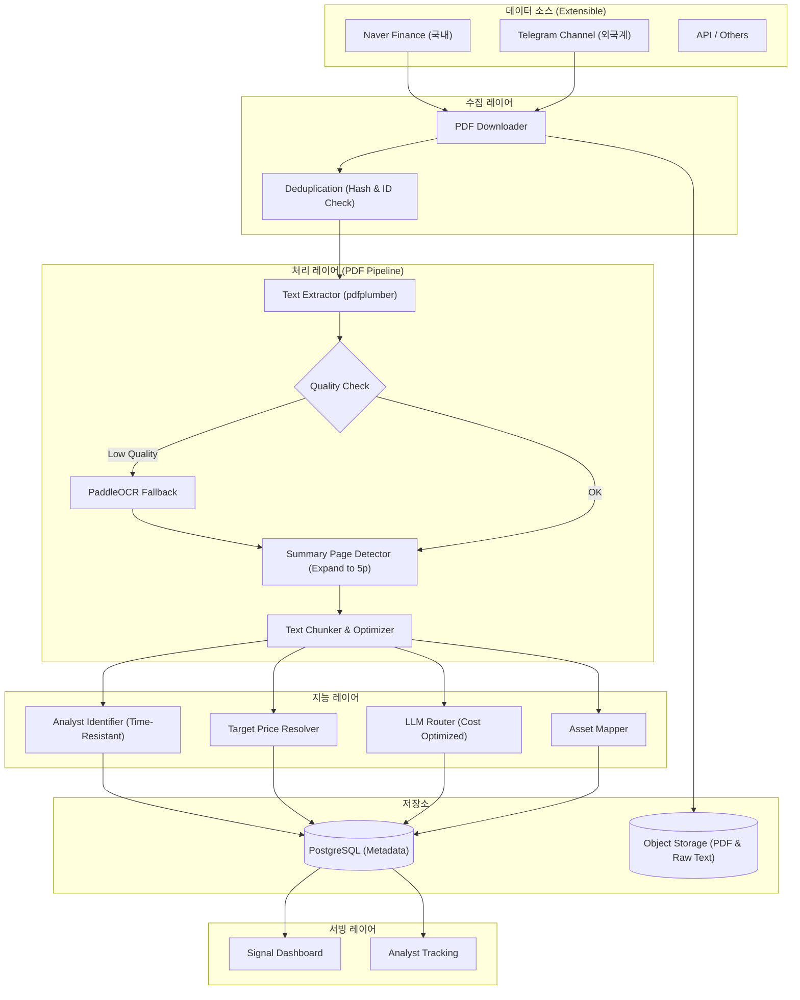
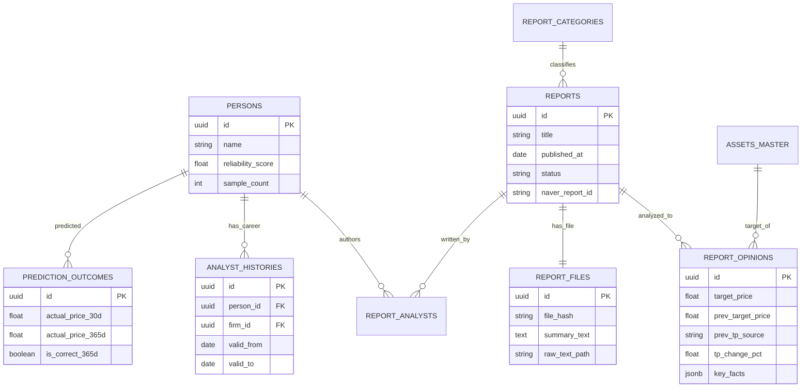

# 📊 투자 인텔리전스 시스템: 증권사 리포트 분석 설계서 (Final v5)

> **문서 목적**: 증권사 리포트(PDF)에서 핵심 투자 신호를 추출하고, 애널리스트의 이력과 성과를 추적하여 시장의 숨은 인사이트를 발굴하는 시스템 구축.
>
> **핵심 설계 원칙**:
> 1. **신호 해석 중심**: "매수" 의견 과잉 시장에서 '목표가 하향(Diff)' 등 실질적 가치가 있는 신호 포착.
> 2. **데이터 정합성**: 시간 역순 수집 및 텍스트 품질 저하 문제를 해결하는 검증 로직 탑재.
> 3. **운영 효율성**: LLM 비용 최적화 및 스토리지 관리 전략 적용.

---

## 1. 시스템 아키텍처 (System Architecture)

확장성을 고려한 모듈형 구조로, 데이터 소스 추가 시 최소한의 변경으로 통합 가능하도록 설계했습니다.



---

## 2. PDF 처리 파이프라인 (PDF Pipeline)

증권사 리포트의 다양한 형식(텍스트, 스캔본, 이미지 표)을 대응하고, '첫 페이지=요약'이라는 취약한 가정을 제거하여 데이터 추출 정확도를 높였습니다.

### 2.1 텍스트 추출 및 품질 검증 (Quality Assurance)
단순히 텍스트 레이어 유무가 아닌, 추출된 텍스트의 **유효성**을 검증하여 "가짜 텍스트 레이어(이미지를 텍스트로 덮어씌운 경우)" 문제를 해결합니다.

```python
class TextQualityChecker:
    GARBAGE_THRESHOLD = 0.3  # 깨진 문자 허용 비율
    
    def assess(self, text: str) -> tuple[bool, float]:
        if len(text) < 100: 
            return False, 0.0
        
        # 유효 문자(한글/영문/숫자/기호) 비율 계산
        valid_chars = sum(1 for c in text if self._is_valid(c))
        quality_score = valid_chars / len(text)
        
        # 유효 문자 비율이 임계값 미만이면 불량 판정
        return quality_score >= (1 - self.GARBAGE_THRESHOLD), quality_score

    def _is_valid(self, char: str) -> bool:
        cp = ord(char)
        return (
            0xAC00 <= cp <= 0xD7A3 or  # 한글 완성형
            0x0041 <= cp <= 0x007A or  # 영문
            0x0030 <= cp <= 0x0039 or  # 숫자
            char in ' .,()%\n\t-+'     # 일반 기호
        )

# 파이프라인 적용 로직
def extract_text(pdf_path: str) -> tuple[str, str]:
    # 1차: pdfplumber 시도
    text = pdfplumber_extract(pdf_path)
    is_ok, score = TextQualityChecker().assess(text)
    
    # 품질 불량 시 OCR로 폴백
    if not is_ok:
        text = paddleocr_extract(pdf_path)
        return text, 'ocr'
        
    return text, 'pdfplumber'
```

### 2.2 요약 페이지 탐지 (Intelligent Detection)
모든 리포트가 첫 페이지에 요약을 포함하지 않으므로, 키워드 점수 기반 탐지 로직을 적용합니다. 탐색 범위를 **최대 5페이지**로 확장하고 레이아웃 패턴을 고려합니다.

```python
def detect_summary_page(pages_text: list[str]) -> int:
    """
    키워드 점수가 가장 높은 페이지를 요약 페이지로 간주.
    """
    KEYWORDS = ["투자의견", "목표주가", "Buy", "Hold", "TP", "Rating", 
                "EPS", "PER", "현재주가", "상승여력"]  # 키워드 보강
    
    best_score, best_idx = -1, 0
    search_range = min(5, len(pages_text)) # 효율성을 위해 처음 5페이지만 탐색
    
    for i, text in enumerate(pages_text[:search_range]): 
        score = sum(1 for kw in KEYWORDS if kw in text)
        
        # 표 구조가 감지되면 가중치 부여
        if has_table_structure(text): score += 2 
        
        # 표지 다음 페이지(인덱스 1) 우선도 소폭 부여 (일반적인 리포트 구조)
        if i == 1: score += 0.5
        
        if score > best_score:
            best_score, best_idx = score, i
            
    return best_idx
```

## 3. 데이터베이스 설계 (Database Schema)

데이터 정합성과 확장성을 고려하여 설계된 최종 스키마입니다. 특히 애널리스트 이력 관리와 예측 평가 로직이 구체화되었습니다.

### 3.1 ERD (Entity Relationship Diagram)



### 3.2 SQL DDL (PostgreSQL)

```sql
-- ==========================================
-- 0. ENUM & Types
-- ==========================================
CREATE TYPE opinion_type AS ENUM ('STRONG_BUY', 'BUY', 'HOLD', 'SELL', 'STRONG_SELL');
CREATE TYPE prev_tp_source AS ENUM ('db_lookup', 'llm_extracted', 'unavailable');
CREATE TYPE processing_status AS ENUM (
    'collected', 'downloaded', 'text_extracted', 
    'llm_processed', 'completed', 
    'failed_download', 'failed_extraction', 'failed_llm'
);

-- ==========================================
-- 1. 마스터 테이블
-- ==========================================

-- 종목 (Asset)
CREATE TABLE assets_master (
    id UUID PRIMARY KEY DEFAULT uuid_generate_v4(),
    ticker VARCHAR(20) UNIQUE,
    name VARCHAR(100) NOT NULL,
    market VARCHAR(20),
    sector VARCHAR(100),
    aliases JSONB DEFAULT '[]', -- 별칭 관리 (예: "삼전" -> "삼성전자")
    created_at TIMESTAMP DEFAULT NOW()
);

-- 리포트 카테고리 (ENUM 대신 테이블로 유연성 확보)
CREATE TABLE report_categories (
    code VARCHAR(30) PRIMARY KEY, -- 'STOCK_ANALYSIS', 'INDUSTRY_ANALYSIS'
    naver_code VARCHAR(30),
    label_ko VARCHAR(50),
    llm_prompt_template TEXT, -- 카테고리별 프롬프트 관리
    is_active BOOLEAN DEFAULT TRUE
);

-- 증권사
CREATE TABLE securities_firms (
    id UUID PRIMARY KEY DEFAULT uuid_generate_v4(),
    name VARCHAR(50) UNIQUE NOT NULL
);

-- 애널리스트 (Person)
CREATE TABLE persons (
    id UUID PRIMARY KEY DEFAULT uuid_generate_v4(),
    name VARCHAR(50) NOT NULL,
    current_firm_id UUID REFERENCES securities_firms(id), -- 캐싱용 (배치 갱신)
    
    -- 신뢰도 지표
    reliability_score FLOAT DEFAULT 50.0, 
    sample_count INTEGER DEFAULT 0, -- 통계적 유의성 검증용
    
    created_at TIMESTAMP DEFAULT NOW()
);

-- 애널리스트 이력 (이직 및 시간 역순 처리 대응)
CREATE TABLE analyst_histories (
    id UUID PRIMARY KEY DEFAULT uuid_generate_v4(),
    person_id UUID REFERENCES persons(id),
    firm_id UUID REFERENCES securities_firms(id),
    sector VARCHAR(100),
    
    -- 핵심: Valid Period 관리 (시간 역순 수집 대응)
    valid_from DATE NOT NULL, -- 해당 소속 시작일
    valid_to DATE,            -- 해당 소속 종료일 (NULL이면 현재)
    
    created_at TIMESTAMP DEFAULT NOW()
);

-- ==========================================
-- 2. 리포트 및 원본 관리
-- ==========================================

CREATE TABLE reports (
    id UUID PRIMARY KEY DEFAULT uuid_generate_v4(),
    title TEXT NOT NULL,
    published_at DATE NOT NULL,
    category_code VARCHAR(30) REFERENCES report_categories(code),
    
    -- 소스 추적
    source_url TEXT,
    naver_report_id VARCHAR(50) UNIQUE, -- 네이버 중복 수집 방지용 ID
    source_type VARCHAR(20) DEFAULT 'naver', -- 'naver', 'telegram'
    
    -- 처리 상태
    status processing_status DEFAULT 'collected',
    failed_stage VARCHAR(30),
    retry_count INTEGER DEFAULT 0,
    next_retry_at TIMESTAMP,
    
    created_at TIMESTAMP DEFAULT NOW()
);

-- PDF 파일 및 추출물 (스토리지 최적화)
CREATE TABLE report_files (
    id UUID PRIMARY KEY DEFAULT uuid_generate_v4(),
    report_id UUID REFERENCES reports(id),
    file_hash VARCHAR(64) UNIQUE, -- 중복 방지 (SHA-256)
    storage_path TEXT,            -- PDF 파일 경로 (S3/Local)
    raw_text_path TEXT,           -- 추출된 전체 텍스트 경로 (DB 부하 방지)
    summary_text TEXT,            -- 탐지된 요약 페이지 텍스트 (분석용)
    extraction_method VARCHAR(20),-- 'pdfplumber', 'ocr'
    created_at TIMESTAMP DEFAULT NOW()
);

-- 리포트-애널리스트 매핑 (다중 작성자 대응 M:N)
CREATE TABLE report_analysts (
    report_id UUID REFERENCES reports(id),
    person_id UUID REFERENCES persons(id),
    role VARCHAR(20) DEFAULT 'author', -- 'author', 'co_author'
    PRIMARY KEY (report_id, person_id)
);

-- ==========================================
-- 3. 분석 결과
-- ==========================================

-- 공통 분석 결과
CREATE TABLE report_opinions (
    id UUID PRIMARY KEY DEFAULT uuid_generate_v4(),
    report_id UUID REFERENCES reports(id),
    asset_id UUID REFERENCES assets_master(id), -- 종목 분석 시에만 유효
    
    -- 목표가 및 의견
    target_price FLOAT,
    prev_target_price FLOAT,       -- 이전 리포트 대비
    prev_tp_source prev_tp_source, -- 출처 명시 ('db_lookup' 우선)
    
    current_stock_price FLOAT,     -- 발행일 종가
    opinion_label opinion_type,
    
    -- 계산 필드 (Generated Columns)
    tp_change_pct FLOAT GENERATED ALWAYS AS (
        CASE 
            WHEN prev_target_price IS NULL OR prev_target_price = 0 THEN NULL
            ELSE ((target_price - prev_target_price) / prev_target_price) * 100 
        END
    ) STORED,
    
    tp_upside_pct FLOAT GENERATED ALWAYS AS (
        CASE 
            WHEN current_stock_price IS NULL OR current_stock_price = 0 THEN NULL
            ELSE ((target_price - current_stock_price) / current_stock_price) * 100 
        END
    ) STORED,
    
    -- LLM 추출 내용
    key_facts JSONB,    -- 객관적 팩트
    key_theses JSONB,   -- 주관적 논리
    risk_factors JSONB, -- 리스크 요인
    
    -- LLM 메타데이터 (버전 관리)
    llm_raw_response JSONB,    -- 원본 보존 (재처리용)
    llm_model VARCHAR(50),     -- 'gpt-4o-2024-08-06'
    llm_prompt_version VARCHAR(20), -- 'v2.1'
    extraction_confidence FLOAT,    -- LLM 자신감 점수
    
    created_at TIMESTAMP DEFAULT NOW()
);

-- 섹터 분석 상세 (확장성)
CREATE TABLE sector_analysis_details (
    opinion_id UUID PRIMARY KEY REFERENCES report_opinions(id),
    sector_name VARCHAR(100),
    market_outlook VARCHAR(20), -- 'OVERWEIGHT', 'NEUTRAL'
    top_picks JSONB             -- [{"ticker": "...", "reason": "..."}]
);

-- ==========================================
-- 4. 신뢰도 평가 (Prediction vs Outcome)
-- ==========================================

CREATE TABLE prediction_outcomes (
    id UUID PRIMARY KEY DEFAULT uuid_generate_v4(),
    opinion_id UUID REFERENCES report_opinions(id),
    person_id UUID REFERENCES persons(id), -- 비정규화 (조인 비용 절감)
    
    prediction_date DATE NOT NULL,
    predicted_target_price FLOAT NOT NULL,
    
    -- 다중 Horizon 결과 (개별 컬럼 관리)
    actual_price_30d FLOAT, is_correct_30d BOOLEAN, evaluated_30d_at TIMESTAMP,
    actual_price_90d FLOAT, is_correct_90d BOOLEAN, evaluated_90d_at TIMESTAMP,
    actual_price_180d FLOAT, is_correct_180d BOOLEAN, evaluated_180d_at TIMESTAMP,
    actual_price_365d FLOAT, is_correct_365d BOOLEAN, evaluated_365d_at TIMESTAMP,
    
    created_at TIMESTAMP DEFAULT NOW()
);

-- ==========================================
-- 5. 성능 최적화 인덱스
-- ==========================================

-- 리포트 날짜 기반 조회 (가장 빈번)
CREATE INDEX idx_reports_published_at ON reports(published_at DESC);

-- 자산별 의견 이력 조회
CREATE INDEX idx_report_opinions_asset_date 
    ON report_opinions(asset_id, created_at DESC);

-- 애널리스트별 리포트 조회
CREATE INDEX idx_report_analysts_person 
    ON report_analysts(person_id);

-- 이력 범위 쿼리 최적화 (valid_from + valid_to 복합)
CREATE INDEX idx_analyst_histories_range 
    ON analyst_histories(person_id, valid_from, valid_to);

-- 실패 항목 재처리 배치용
CREATE INDEX idx_reports_retry 
    ON reports(status, next_retry_at) 
    WHERE status LIKE 'failed%';

-- 평가 대기 중인 예측 배치용 (예: 365일 경과 미평가)
CREATE INDEX idx_prediction_unevaluated 
    ON prediction_outcomes(prediction_date) 
    WHERE evaluated_365d_at IS NULL;
```

## 4. 핵심 로직 (Core Logic)

데이터의 정합성을 보장하고 운영 효율을 높이기 위한 핵심 알고리즘입니다.

### 4.1 목표가 출처 해결 (Target Price Resolver)

리포트 본문에 명시된 "기존 목표가"는 수정 과정에서의 오류나 오타 가능성이 있으므로, **DB에 저장된 직전 리포트의 목표가**를 최우선으로 신뢰합니다.

```python
class TargetPriceResolver:
    """
    prev_target_price 결정 우선순위:
    1. DB에서 동일 자산의 직전 리포트 조회 (가장 신뢰)
    2. LLM이 본문에서 추출한 값 (보조)
    3. NULL (산출 불가)
    """
    async def resolve(
        self, 
        asset_id: UUID, 
        report_date: date,
        llm_extracted_prev_tp: float | None
    ) -> tuple[float | None, str]:
        
        # 1. DB에서 동일 자산의 직전 리포트 조회 (최우선)
        db_prev = await self.db.fetchrow("""
            SELECT ro.target_price
            FROM report_opinions ro
            JOIN reports r ON r.id = ro.report_id
            WHERE ro.asset_id = $1 
              AND r.published_at < $2
              AND ro.target_price IS NOT NULL
            ORDER BY r.published_at DESC
            LIMIT 1
        """, asset_id, report_date)
        
        if db_prev:
            return db_prev['target_price'], 'db_lookup'
        
        # 2. LLM이 본문에서 추출한 값 (보조)
        if llm_extracted_prev_tp:
            return llm_extracted_prev_tp, 'llm_extracted'
            
        return None, 'unavailable'
```

### 4.2 시간 역순 이력 처리 (Time-Resistant History)

리포트가 발행일 역순으로 수집되더라도 애널리스트의 소속 이력이 꼬이지 않도록, **Valid Period(유효기간)** 개념을 사용하여 충돌을 처리합니다.

```python
async def upsert_analyst_history(
    person_id: UUID, 
    firm_id: UUID, 
    report_date: date
):
    """
    과거 리포트가 나중에 수집되어도 미래의 이력 데이터와 충돌하지 않도록 처리.
    """
    async with db.transaction():
        # 해당 날짜 이후의 가장 오래된 이력 (Future)
        future_h = await db.fetchrow("""
            SELECT id, firm_id, valid_from FROM analyst_histories
            WHERE person_id = $1 AND valid_from > $2
            ORDER BY valid_from ASC LIMIT 1
        """, person_id, report_date)
        
        # 해당 날짜 이전의 가장 최근 이력 (Past)
        past_h = await db.fetchrow("""
            SELECT id, firm_id FROM analyst_histories
            WHERE person_id = $1 AND valid_from <= $2
            ORDER BY valid_from DESC LIMIT 1
        """, person_id, report_date)
        
        # 케이스 1: 이미 동일 기간/소속 이력이 존재하면 종료
        if past_h and past_h['firm_id'] == firm_id:
            return

        # 케이스 2: 미래 이력과 같은 회사면 valid_from을 과거로 당김 (기간 연장)
        if future_h and future_h['firm_id'] == firm_id:
            await db.execute(
                "UPDATE analyst_histories SET valid_from = $1 WHERE id = $2",
                report_date, future_h['id']
            )
            return

        # 케이스 3: 신규 이력 생성
        # 종료일(valid_to)은 미래 이력의 시작일 하루 전으로 설정
        valid_to = (future_h['valid_from'] - timedelta(days=1)) if future_h else None
        
        await db.execute("""
            INSERT INTO analyst_histories 
            (person_id, firm_id, valid_from, valid_to)
            VALUES ($1, $2, $3, $4)
        """, person_id, firm_id, report_date, valid_to)
```

### 4.3 신뢰도 점수: 시간 감쇠 (Time Decay)

오래된 예측보다 최근 예측의 적중 여부가 점수에 더 큰 영향을 주도록 반영합니다. 또한 샘플 수가 적을 때의 편향을 보정합니다.

```python
import math

def calculate_reliability_score(outcomes: list[dict]) -> float:
    """
    시간 감쇠 가중 신뢰도 점수
    - 최근 예측일수록 가중치 높음 (반감기: 365일)
    - 샘플 수 보정 유지
    """
    if not outcomes:
        return 50.0
    
    HALF_LIFE_DAYS = 365  # 1년 전 예측은 현재의 50% 가중치
    
    weighted_hits = 0.0
    total_weight = 0.0
    
    for outcome in outcomes:
        days_ago = (date.today() - outcome['prediction_date']).days
        # 시간 감쇠 가중치 계산
        weight = math.exp(-days_ago * math.log(2) / HALF_LIFE_DAYS)
        
        # 365일 적중 여부 기준 (없으면 180d, 90d 순)
        hit = 1 if outcome.get('is_correct_365d') else 0
        
        weighted_hits += weight * hit
        total_weight += weight
    
    if total_weight == 0:
        return 50.0
    
    weighted_rate = weighted_hits / total_weight
    
    # 샘플 수 보정 (최소 10건이어야 Full Credit)
    confidence = min(1.0, len(outcomes) / 10.0)
    
    # 기본 점수 50점 기준 계산
    return 50 + (weighted_rate * 100 - 50) * confidence
```

---

## 5. LLM 분석 전략 (LLM Strategy)

### 5.1 비용 최적화 라우팅 (Cost Optimization)

모든 리포트를 고가 모델(GPT-4o)로 처리할 경우 비용이 폭증하므로, **텍스트 길이와 중요도에 따라 모델을 라우팅**합니다.

```python
class LLMRoutingStrategy:
    """
    단계별 모델 전략으로 비용 최적화
    """
    
    async def extract(self, summary_text: str, full_text_path: str) -> StockAnalysisModel:
        
        # 1단계: 요약 페이지만으로 처리 시도 (저렴한 모델)
        # 요약 페이지는 핵심 정보가 응축되어 있으므로 Mini 모델로 충분한 경우가 많음
        if len(summary_text) < 3000:
            return await self._call_llm(summary_text, model="gpt-4o-mini")
        
        # 2단계: 요약 + 핵심 섹션 검색 (RAG)
        # Object Storage에서 전체 텍스트를 가져와 관련 섹션 검색
        full_text = await self.storage.read(full_text_path)
        key_sections = self._retrieve_key_sections(
            full_text, 
            query="목표주가, 투자의견, 실적 전망, 리스크 요인"
        )
        
        combined = f"{summary_text}\n\n[보강 섹션]\n{key_sections}"
        
        # 토큰 한계 체크 후 모델 선택
        if self._count_tokens(combined) > 8000:
            # 긴 텍스트는 청킹 후 병합 처리
            return await self._chunked_extract(combined, model="gpt-4o-mini")
            
        return await self._call_llm(combined, model="gpt-4o-mini")

    async def _chunked_extract(self, text: str, model: str) -> StockAnalysisModel:
        """긴 텍스트는 청크별 추출 후 결과 병합"""
        chunks = self._split_by_tokens(text, max_tokens=6000)
        results = [await self._call_llm(chunk, model=model) for chunk in chunks]
        return self._merge_results(results)
```

### 5.2 Structured Output 강제

Hallucination을 방지하고 DB 저장을 용이하게 하기 위해 Pydantic 모델을 사용하여 출력 형식을 강제합니다.

```python
from pydantic import BaseModel, Field
from typing import List, Optional, Literal

class StockAnalysisModel(BaseModel):
    """단일 종목 분석 결과 구조"""
    asset_name: str = Field(..., description="종목명 (예: 삼성전자)")
    opinion: Literal["STRONG_BUY", "BUY", "HOLD", "SELL", "STRONG_SELL"]
    target_price: Optional[float] = Field(None, description="목표 주가")
    prev_target_price_text: Optional[float] = Field(None, description="리포트에 명시된 기존 목표가")
    
    key_facts: List[str] = Field(default_factory=list, description="객관적 팩트 (수치, 실적 등)")
    key_theses: List[str] = Field(default_factory=list, description="투자 논리")
    risk_factors: List[str] = Field(default_factory=list, description="리스크 요인")
    
    analysts_mentioned: List[str] = Field(default_factory=list, description="PDF 내 명시된 애널리스트 이름")

# LLM 호출 (OpenAI Library 예시)
response = client.beta.chat.completions.parse(
    model="gpt-4o-mini",
    messages=[{
        "role": "system", 
        "content": "너는 증권사 리포트 분석가다. 주어진 텍스트에서 정보를 추출하라."
    }, {
        "role": "user", 
        "content": f"다음 리포트 분석:\n\n{summary_text}"
    }],
    response_format=StockAnalysisModel, # Structured Output 강제
)

parsed_data = response.choices[0].message.parsed
```

## 6. 운영 및 유지보수 (Operations)

시스템의 안정적인 운영을 위한 재처리 정책과 배치 작업 전략입니다.

### 6.1 재시도 정책 (Retry Policy)

실패 단계별로 다른 재시도 전략을 적용하여 불필요한 리소스 낭비를 막고 데이터 누락을 방지합니다.

| 실패 단계 | 상태 코드 | 재시도 전략 | 비고 |
|:---|:---|:---|:---|
| **다운로드 실패** | `failed_download` | 3회 재시도 (지수 백오프: 1분, 5분, 30분) | 네트워크 일시 장애 대응 |
| **텍스트 추출 실패** | `failed_extraction` | 즉시 OCR 엔진으로 전환 (재시도 없음) | `pdfplumber` 실패 시 자동 폴백 |
| **LLM 파싱 실패** | `failed_llm` | 2회 재시도 후 수동 확인 큐 이동 | 프롬프트/모델 이슈 가능성 |
| **유효성 검증 실패** | `validation_failed` | 알림 발송 후 `skipped` 처리 | 목표가 음수 등 비정상 데이터 |

### 6.2 배치 작업 (Batch Jobs)

시스템 부하를 줄이고 데이터 최신성을 유지하기 위한 정기 작업입니다.

1.  **애널리스트 신뢰도 갱신 (Daily)**
    - 전일 기준 새로운 평가 결과(`prediction_outcomes`)가 반영된 애널리스트의 점수 재계산.
    - `persons` 테이블의 `current_firm_id` 캐시 갱신.

2.  **예측 결과 평가 (Weekly)**
    - `prediction_outcomes` 테이블에서 `evaluated_XXX_at`이 NULL인 데이터 조회.
    - 외부 주가 API를 통해 해당 날짜의 종가 확인 후 업데이트.

3.  **데이터 품질 모니터링 (Daily)**
    - 최근 24시간 내 `status='failed'` 건수 모니터링.
    - LLM `extraction_confidence` 평균 저하 시 알림 (프롬프트 점검 필요).

---

## 7. 유즈케이스 (Use Cases)

### Case 1. 스텔스 매도 신호 탐지
- **상황**: A 애널리스트가 투자의견은 '매수'를 유지했으나, 목표가를 10만원 → 8만원으로 대폭 하향 조정.
- **시스템 동작**:
    1. `Target Price Resolver`가 DB 조회를 통해 이전 목표가 10만원 확인.
    2. `tp_change_pct`를 -20%로 계산.
    3. 의견(Buy)과 목표가 변화(Down)의 괴리를 감지하여 `signal_score` 하락 혹은 별도 알림 발생.
- **인사이트**: 공식 의견보다 목표가 하향이 더 강력한 매도 신호임을 포착하여 사용자에게 경고.

### Case 2. 이직한 애널리스트 추적
- **상황**: 과거 A사에 있던 '김철수' 애널리스트가 B사로 이직 후 첫 리포트 발행.
- **시스템 동작**:
    1. `Time-Resistant History` 로직이 새 리포트의 소속(B사)을 반영하여 이력 테이블 갱신.
    2. `persons` 테이블의 신뢰도 점수는 그대로 유지됨 (이력은 변경되어도 능력은 유지).
- **인사이트**: "이직 후 첫 리포트. 과거 데이터에 기반한 신뢰도 점수(85점)가 여전히 유효함. 새로운 플랫폼에서의 목소리 확인 필요."

### Case 3. 다기간 성과 기반 전략 수립
- **상황**: 특정 애널리스트는 단기(3개월) 적중률은 높으나 장기(1년) 적중률은 낮음.
- **시스템 동작**:
    1. `prediction_outcomes` 테이블의 `is_correct_90d`와 `is_correct_365d` 데이터 비교.
    2. 신뢰도 점수 계산 시 시간 가중치 적용 가능 (옵션).
- **인사이트**: "해당 애널리스트는 스윙 트레이딩 성향의 종목 추천에 강점. 장기 투자용 참고 자료로는 부적합."이라는 구체적인 피드백 제공.

---

## 8. 구현 로드맵 (Roadmap)

### Phase 1: 인프라 구축 및 수집 (Infrastructure & Collection)
- [ ] PostgreSQL 스키마 생성 및 인덱싱.
- [ ] Object Storage(S3/Local) 연동.
- [ ] 네이버 금융 크롤러 및 PDF 다운로더 구현 (중복 방지 포함).
- [ ] PDF 텍스트 추출 파이프라인 (pdfplumber + PaddleOCR).

### Phase 2: 분석 및 식별 (Analysis & Identification)
- [ ] 애널리스트 식별 및 이력 관리 로직 구현.
- [ ] LLM 라우팅 및 Structured Output 추출 기능.
- [ ] 목표가 해결사(Resolver) 로직 구현.

### Phase 3: 평가 및 서빙 (Evaluation & Serving)
- [ ] 예측 결과 평가 배치 잡 구현 (주가 데이터 연동).
- [ ] 신뢰도 점수 계산 로직 구현.
- [ ] 대시보드 API 및 알림 서비스 구축.

---

## 9. 결론 (Conclusion)

본 설계서는 단순한 리포트 요약 시스템을 넘어, **'시장의 왜곡된 신호를 교정'**하고 **'정보의 질을 평가'**하는 종합적인 인텔리전스 플랫폼을 목표로 합니다.

- **데이터 정합성**: 시간 역순 수집, 텍스트 품질 저하, 목표가 출처 불명 등 실제 데이터 환경의 문제를 해결했습니다.
- **경제적 효율성**: 스토리지 분리와 모델 라우팅을 통해 운영 비용을 최적화했습니다.
- **확장성**: 국내/외국계 소스 통합 및 다양한 분석 카테고리를 수용할 수 있는 유연한 구조를 갖추었습니다.

이 시스템은 사용자에게 단순한 정보 제공을 넘어, **"어떤 애널리스트의 어떤 신호를 믿을 것인가"**에 대한 객관적인 판단 근거를 제공함으로써 투자 의사결정의 질을 높이는 데 기여할 것입니다.