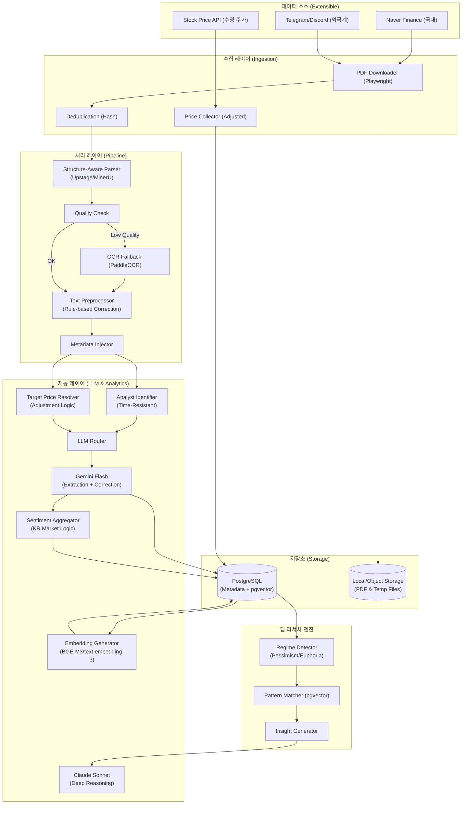
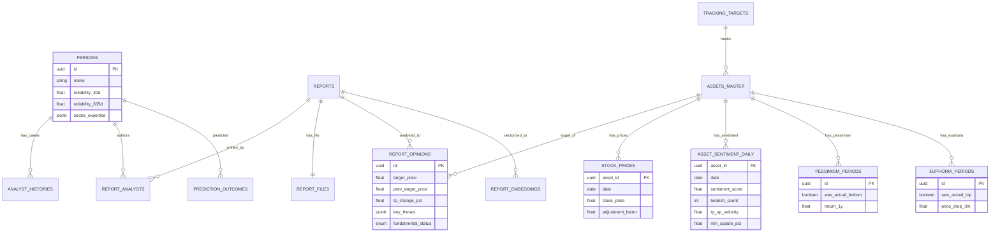

지금까지 논의된 모든 내용(초기 설계부터 Claude/Gemini의 검토사항, PDF 파서 교체, 수정 주가 로직, 모멘텀/과열 탐지 등)을 완벽하게 통합한 **최종 설계서(Final Ultimate Version)**를 작성합니다.

문서가 방대하므로 순차적으로 작성하겠습니다. 완료될 때까지 `continue`를 입력해 주세요.

---

# 📊 투자 인텔리전스 시스템: 증권사 리포트 분석 설계서 (Final Ultimate Ver.)

> **문서 목적**: 증권사 리포트(PDF) 및 유튜브 데이터를 기반으로 시장의 왜곡된 신호를 교정하고, '비관의 끝(저점)'과 '시장 과열(고점)'을 판별하며, 애널리스트 신뢰도를 추적하여 심층 투자 인사이트를 제공하는 개인용 알파(Alpha) 생성 시스템 구축.

---

## 1. 설계 개요 및 전략적 목표

### 1.1 핵심 설계 원칙
본 시스템은 단순한 정보 요약을 넘어, 데이터의 **'진위 여부 검증'**과 **'시장 사이클 포착'**에 집중합니다.

1.  **Signal over Opinion (신호 중심)**: 한국 시장의 구조적 편향(매수 의견 과잉)을 고려하여, '목표가 하향'과 '의견 변경'을 핵심 신호로 해석합니다.
2.  **Data Integrity (데이터 정합성)**: 액면분할/증자로 인한 목표가 왜곡을 방지하는 '수정 주가 로직'을 적용하고, 시간 역순 수집에도 안전한 이력 관리 체계를 갖춥니다.
3.  **Strategic Duality (전략적 이중성)**: 켄 피셔 스타일의 '역발상(비관의 끝)'과 드러켄밀러 스타일의 '모멘텀(가속도)'을 동시에 탐지합니다.
4.  **Cost Efficiency (경제적 효율성)**: Gemini Flash(저비용 추출)와 Claude Sonnet(고품질 분석)의 역할 분리, 로컬 리소스(Mac) 활용을 통해 운영 비용을 최소화합니다.

### 1.2 투자 철학 구현 (Use Cases)
-   **Contrarian (매수 타이밍)**: 애널리스트들의 극도의 비관(+ 목표가 대폭 하향)이 감지될 때, 과거 패턴과 비교하여 저점 가능성 탐지.
-   **Momentum (추세 추종)**: 목표가 상향 속도(Velocity)가 빨라지고 컨센서스가 좁혀질 때, 추세의 강도 확인.
-   **Risk Aversion (매도/회피 타이밍)**: 목표가 상승 여력이 소진되고 모든 의견이 '매수'로 일치할 때, 과열(Euphoria) 국면 경고.
-   **Value Trap 회피**: 저평가 종목 중 펀더멘털이 '구조적 쇠퇴'인 종목을 자동 필터링.

### 1.3 시스템 아키텍처 (Architecture)



---

## 2. PDF 처리 및 텍스트 정제 파이프라인 (Advanced Pipeline)

증권사 리포트의 복잡한 레이아웃과 텍스트 오류를 처리하기 위한 고도화된 전처리 과정입니다.

### 2.1 문서 구조 인식 파서 (Structure-Aware Parser)
기존 `pdfplumber`는 다단 레이아웃에서 텍스트 순서가 뒤섞이는 문제가 있습니다. 이를 해결하기 위해 **시각적 구조를 이해하는 파서**를 도입합니다.

-   **1순위 (API)**: **Upstage Document Parse** (한국어 서류 특화, 표 인식 우수).
-   **2순위 (Local)**: **MinerU (Magic-PDF)** (오픈소스, PDF를 Markdown으로 변환, 로컬 실행 가능).
-   **3순위 (Fallback)**: `pdfplumber` + `PaddleOCR` (텍스트 레이어 없는 스캔본 대응).

### 2.2 텍스트 품질 검증 및 교정 (Correction Strategy)
비용 효율성을 위해 Rule-based와 LLM을 혼합한 하이브리드 방식을 사용합니다.

**Step 1: Rule-based 사전 교정 (Cost: $0)**
유튜브 자막 및 OCR 오류 중 빈도가 높은 패턴을 정규식으로 치환합니다.
```python
CORRECTION_DICT = {
    r"에치비엠": "HBM",
    r"엔비디야": "NVIDIA",
    r"삼전": "삼성전자",
    r"티에스엠씨": "TSMC",
    # 금융/IT 도메인 특화 단어 사전 유지
}

def preprocess_text(text: str) -> str:
    for pattern, replacement in CORRECTION_DICT.items():
        text = re.sub(pattern, replacement, text)
    return text
```

**Step 2: LLM 프롬프트 통합 교정**
별도의 API 호출 없이 추출 단계에서 교정을 지시하여 비용을 절감합니다.
```python
EXTRACTION_PROMPT = """
PDF 텍스트를 분석하여 JSON을 생성하라.
주의: 음성 인식 오류나 오타로 보이는 고유명사(예: '에치비엠')는 문맥을 고려하여 
올바른 금융 용어('HBM')로 교정하여 출력하라.
...
"""
```

### 2.3 메타데이터 주입 (Vector Search Optimization)
RAG 검색 시 "이 회사" 등 대명사 사용으로 인한 검색 누락(False Negative)을 방지하기 위해, 청킹 시 메타데이터를 강제로 부착합니다.
```python
def create_chunk_with_metadata(text: str, report_meta: dict) -> str:
    # 예: "[종목: 삼성전자] [날짜: 2024-10-25] 본문 텍스트..."
    prefix = f"[종목: {report_meta['asset_name']}] [날짜: {report_meta['date']}] "
    return prefix + text
```

## 3. 데이터베이스 설계 (Database Schema v7)

투자 전략의 이원화(저점 탐지/고점 탐지)와 데이터 신뢰성 확보(수정 주가)를 위한 최종 스키마입니다.

### 3.1 ERD (Entity Relationship Diagram)



### 3.2 SQL DDL (PostgreSQL)

```sql
-- ==========================================
-- 0. 확장 기능 및 ENUM (Types)
-- ==========================================
CREATE EXTENSION IF NOT EXISTS "uuid-ossp";
CREATE EXTENSION IF NOT EXISTS "pgvector";
CREATE EXTENSION IF NOT EXISTS "pg_trgm";

-- 의견 유형
CREATE TYPE opinion_type AS ENUM ('STRONG_BUY', 'BUY', 'HOLD', 'SELL', 'STRONG_SELL');
-- 펀더멘털 상태 (가치 함정 탐지용)
CREATE TYPE fundamental_status AS ENUM (
    'CYCLICAL_DOWNTURN', -- 순환적 침체 (매수 기회)
    'STRUCTURAL_DECLINE',-- 구조적 쇠퇴 (가치 함정 - 제외)
    'GROWTH',            -- 성장
    'TURNAROUND'         -- 턴어라운드
);
-- 처리 상태
CREATE TYPE processing_status AS ENUM (
    'collected', 'downloaded', 'text_extracted', 
    'llm_processed', 'completed', 
    'failed_download', 'failed_extraction', 'failed_llm',
    'validation_failed', 'skipped'
);

-- ==========================================
-- 1. 마스터 및 운영 테이블
-- ==========================================

-- 종목 (Asset)
CREATE TABLE assets_master (
    id UUID PRIMARY KEY DEFAULT uuid_generate_v4(),
    ticker VARCHAR(20) UNIQUE,
    name VARCHAR(100) NOT NULL,
    market VARCHAR(20),
    sector VARCHAR(100),
    aliases JSONB DEFAULT '[]',
    created_at TIMESTAMP DEFAULT NOW()
);
CREATE INDEX idx_assets_aliases ON assets_master USING gin(aliases);

-- 데이터 수집 타겟 관리 (백필 및 트래킹용)
CREATE TABLE tracking_targets (
    id UUID PRIMARY KEY DEFAULT uuid_generate_v4(),
    target_type VARCHAR(20),   -- 'ASSET', 'SECTOR'
    target_name VARCHAR(100),
    backfill_years INTEGER,    -- 수집 기간 (예: 5년, 10년)
    is_active BOOLEAN DEFAULT TRUE,
    last_collected_at TIMESTAMP
);

-- 애널리스트 (Person)
CREATE TABLE persons (
    id UUID PRIMARY KEY DEFAULT uuid_generate_v4(),
    name VARCHAR(50) NOT NULL,
    current_firm_id UUID REFERENCES securities_firms(id),
    
    -- 다중 Horizon 신뢰도
    reliability_30d FLOAT DEFAULT 50.0,
    reliability_90d FLOAT DEFAULT 50.0,
    reliability_365d FLOAT DEFAULT 50.0,
    sample_count INTEGER DEFAULT 0,
    sector_expertise JSONB DEFAULT '{}',
    
    created_at TIMESTAMP DEFAULT NOW()
);

-- 애널리스트 이력 (Valid Period 관리)
CREATE TABLE analyst_histories (
    id UUID PRIMARY KEY DEFAULT uuid_generate_v4(),
    person_id UUID REFERENCES persons(id),
    firm_id UUID REFERENCES securities_firms(id),
    sector VARCHAR(100),
    valid_from DATE NOT NULL,
    valid_to DATE,
    created_at TIMESTAMP DEFAULT NOW()
);
CREATE INDEX idx_analyst_histories_range ON analyst_histories(person_id, valid_from, valid_to);

-- ==========================================
-- 2. 리포트 및 원본 관리
-- ==========================================

CREATE TABLE reports (
    id UUID PRIMARY KEY DEFAULT uuid_generate_v4(),
    title TEXT NOT NULL,
    published_at DATE NOT NULL,
    category_code VARCHAR(30) REFERENCES report_categories(code),
    source_url TEXT,
    naver_report_id VARCHAR(50) UNIQUE,
    status processing_status DEFAULT 'collected',
    created_at TIMESTAMP DEFAULT NOW()
);
CREATE INDEX idx_reports_published_at ON reports(published_at DESC);

CREATE TABLE report_files (
    id UUID PRIMARY KEY DEFAULT uuid_generate_v4(),
    report_id UUID REFERENCES reports(id),
    file_hash VARCHAR(64) UNIQUE,
    storage_path TEXT,
    raw_text_path TEXT,
    summary_text TEXT,
    extraction_method VARCHAR(20),
    created_at TIMESTAMP DEFAULT NOW()
);

CREATE TABLE report_analysts (
    report_id UUID REFERENCES reports(id),
    person_id UUID REFERENCES persons(id),
    role VARCHAR(20) DEFAULT 'author',
    PRIMARY KEY (report_id, person_id)
);

-- ==========================================
-- 3. 분석 결과 (가치 함정 판별 추가)
-- ==========================================

CREATE TABLE report_opinions (
    id UUID PRIMARY KEY DEFAULT uuid_generate_v4(),
    report_id UUID REFERENCES reports(id),
    asset_id UUID REFERENCES assets_master(id),
    
    -- 목표가
    target_price FLOAT,
    prev_target_price FLOAT,
    prev_tp_source VARCHAR(20), -- 'db_lookup', 'llm_extracted'
    
    current_stock_price FLOAT,
    opinion_label opinion_type,
    
    -- 펀더멘털 상태 (New)
    fundamental_status fundamental_status,
    
    -- 계산 필드
    tp_change_pct FLOAT GENERATED ALWAYS AS (
        CASE 
            WHEN prev_target_price IS NULL OR prev_target_price = 0 THEN NULL
            ELSE ((target_price - prev_target_price) / prev_target_price) * 100 
        END
    ) STORED,
    
    tp_upside_pct FLOAT GENERATED ALWAYS AS (
        CASE 
            WHEN current_stock_price IS NULL OR current_stock_price = 0 THEN NULL
            ELSE ((target_price - current_stock_price) / current_stock_price) * 100 
        END
    ) STORED,
    
    -- 내용
    key_theses JSONB,
    risk_factors JSONB,
    key_facts JSONB,
    
    -- 메타데이터
    llm_model VARCHAR(50),
    llm_prompt_version VARCHAR(20),
    
    created_at TIMESTAMP DEFAULT NOW()
);

-- ==========================================
-- 4. 시계열 데이터 (수정 주가 및 감성)
-- ==========================================

-- 주가 시계열 (수정 주가 반영)
CREATE TABLE stock_prices (
    asset_id UUID REFERENCES assets_master(id),
    date DATE NOT NULL,
    close_price FLOAT NOT NULL,
    adjustment_factor FLOAT DEFAULT 1.0, -- 액면분할/증자 보정 계수
    volume BIGINT,
    market_cap BIGINT,
    PRIMARY KEY (asset_id, date)
);
CREATE INDEX idx_stock_prices_date ON stock_prices(date DESC);

-- 종목별 일별 센티멘트 집계 (모멘텀/과열 지표 추가)
CREATE TABLE asset_sentiment_daily (
    asset_id UUID REFERENCES assets_master(id),
    date DATE NOT NULL,
    
    -- 의견 분포 (Hold=Sell 로직 적용 계산)
    bullish_count INTEGER DEFAULT 0,
    neutral_count INTEGER DEFAULT 0,
    bearish_count INTEGER DEFAULT 0,
    
    -- 목표가 지표
    avg_target_price FLOAT,
    avg_tp_change_pct FLOAT,
    
    -- 모멘텀 및 과열 지표 (New)
    tp_up_velocity FLOAT,           -- 목표가 상승 기울기
    consecutive_tp_up INTEGER,      -- 연속 상향 횟수
    consecutive_tp_down INTEGER,    -- 연속 하향 횟수
    target_price_spread FLOAT,      -- 목표가 표준편차
    min_upside_pct FLOAT,           -- 최소 상승 여력
    
    sentiment_score FLOAT,          -- (Bullish - Bearish - Neutral*0.5) / Total
    created_at TIMESTAMP DEFAULT NOW(),
    
    PRIMARY KEY (asset_id, date)
);

-- ==========================================
-- 5. 임베딩 (pgvector)
-- ==========================================

CREATE TABLE report_embeddings (
    id UUID PRIMARY KEY DEFAULT uuid_generate_v4(),
    report_id UUID REFERENCES reports(id) ON DELETE CASCADE,
    opinion_id UUID REFERENCES report_opinions(id),
    embedding_type VARCHAR(30) NOT NULL, -- 'thesis', 'risk', 'combined'
    embedding vector(1536),
    model_used VARCHAR(50),
    created_at TIMESTAMP DEFAULT NOW()
);

CREATE INDEX idx_embeddings_thesis ON report_embeddings USING ivfflat (embedding vector_cosine_ops) WITH (lists = 100) WHERE embedding_type = 'thesis';

-- ==========================================
-- 6. 국면 탐지 (Pessimism & Euphoria)
-- ==========================================

-- 비관 국면 (매수 타이밍)
CREATE TABLE pessimism_periods (
    id UUID PRIMARY KEY DEFAULT uuid_generate_v4(),
    asset_id UUID REFERENCES assets_master(id),
    start_date DATE NOT NULL,
    end_date DATE,
    min_sentiment_score FLOAT,
    avg_tp_change_pct FLOAT,
    was_actual_bottom BOOLEAN,
    price_at_start FLOAT,
    price_1y_after FLOAT,
    return_1y FLOAT GENERATED ALWAYS AS (
        CASE WHEN price_at_start > 0 THEN (price_1y_after - price_at_start) / price_at_start * 100 ELSE NULL END
    ) STORED,
    created_at TIMESTAMP DEFAULT NOW()
);

-- 환희 국면 (매도 타이밍)
CREATE TABLE euphoria_periods (
    id UUID PRIMARY KEY DEFAULT uuid_generate_v4(),
    asset_id UUID REFERENCES assets_master(id),
    start_date DATE NOT NULL,
    end_date DATE,
    max_sentiment_score FLOAT,
    min_upside_pct FLOAT,
    was_actual_top BOOLEAN,
    price_at_start FLOAT,
    price_3m_after FLOAT,
    price_drop_3m FLOAT GENERATED ALWAYS AS (
        CASE WHEN price_at_start > 0 THEN (price_3m_after - price_at_start) / price_at_start * 100 ELSE NULL END
    ) STORED,
    created_at TIMESTAMP DEFAULT NOW()
);
```

## 4. 핵심 로직 (Core Logic v7)

데이터의 정합성을 보장하고 한국 시장 특성을 반영하기 위한 핵심 알고리즘입니다.

### 4.1 목표가 보정 로직 (Adjusted Price Logic)
액면분할, 유상증자 등으로 인해 목표가의 연속성이 깨지는 것을 방지합니다. 이는 시스템이 잘못된 "하향 조정" 신호를 내는 것을 막는 가장 중요한 로직입니다.

```python
def calculate_adjusted_tp_change(
    current_tp: float, 
    prev_tp: float, 
    prev_date: date, 
    asset_id: UUID,
    db_conn
) -> float:
    """
    목표가 변화율 계산 시 수정 주가(Adjustment Factor) 반영
    """
    # 1. 이전 리포트 작성 시점의 보정 계수 조회
    # stock_prices 테이블에 daily로 저장된 adjustment_factor를 사용
    adj_factor_row = await db_conn.fetchrow("""
        SELECT adjustment_factor 
        FROM stock_prices 
        WHERE asset_id = $1 AND date <= $2 
        ORDER BY date DESC LIMIT 1
    """, asset_id, prev_date)
    
    if not adj_factor_row:
        return 0.0 # 기준 없음
        
    adj_factor = adj_factor_row['adjustment_factor']
    
    # 2. 과거 목표가를 현재 주가 기준으로 보정 (역보정)
    # 예: 1:50 액면분할 시, 과거 목표가 300만원 -> 6만원으로 보정
    # 계산식: Adjusted_Prev = Prev_TP / Adj_Factor
    # 주의: DB에 저장된 factor가 누적 배수라면 로직에 따라 나누거나 곱해야 함.
    # 여기서는 "현재 1주가 과거 몇 주인가" 비율이라 가정하고 역산.
    adjusted_prev_tp = prev_tp / adj_factor if adj_factor > 0 else prev_tp
    
    # 3. 변화율 계산
    if adjusted_prev_tp == 0: return 0.0
    return ((current_tp - adjusted_prev_tp) / adjusted_prev_tp) * 100
```

### 4.2 감성 점수 계산 (Korean Market Style)
한국 시장의 구조적 특성(Hold = Sell)을 반영하여 감성 점수를 재정의합니다.

```python
def calculate_sentiment_score(bullish: int, neutral: int, bearish: int) -> float:
    """
    한국 시장 특성 반영: Hold(Neutral)를 약한 매도(Bearish)로 처리
    분모는 전체 리포트 수, 분자는 매수세에서 매도세를 뺀 값.
    """
    # Hold를 Bearish의 50% 가중치로 포함 (시장 관행 반영)
    effective_bearish = bearish + (neutral * 0.5)
    total = bullish + neutral + bearish
    
    if total == 0: return 0.0
    
    # 점수: -100 (극도의 비관) ~ 100 (극도의 낙관)
    score = ((bullish - effective_bearish) / total) * 100
    return score
```

### 4.3 LLM 프롬프트: 가치 함정 탐지 및 교정 (Value Trap Detection)

```python
EXTRACTION_PROMPT_TEMPLATE = """
당신은 증권사 리포트 분석 전문가입니다.
다음 텍스트를 분석하여 JSON 형식으로 출력하시오.

[주의사항]
1. 텍스트 내 오타나 음성 인식 오류(예: '에치비엠')를 문맥에 맞는 올바른 용어('HBM')로 교정하시오.
2. 한국 시장 기준으로 '중립(Hold)' 의견은 사실상 '매도'의미임을 인지하고 분석하시오.

[분석 항목]
1. opinion: 투자의견 (STRONG_BUY, BUY, HOLD, SELL, STRONG_SELL)
2. target_price: 목표주가 (숫자만 추출)
3. fundamental_status: 
   - CYCLICAL_DOWNTURN: 업황 사이클 일시 침체
   - STRUCTURAL_DECLINE: 구조적 쇠퇴 (적자 심화, 경쟁력 상실) -> 이 경우 반드시 이유 명시
   - GROWTH: 성장 국면
4. key_theses: 핵심 투자 논거 3가지
5. risk_factors: 리스크 요인

텍스트:
{pdf_text}
"""
```

### 4.4 애널리스트 이력 관리 (Time-Resistant Logic)
리포트가 발행일 역순으로 수집되더라도 소속 정보가 꼬이지 않도록 Valid Period 기반으로 관리합니다.

```python
async def upsert_analyst_history(person_id: UUID, firm_id: UUID, report_date: date):
    async with db.transaction():
        # 미래 이력 조회 (가장 가까운)
        future_h = await db.fetchrow("... WHERE valid_from > $1 ...", report_date)
        # 과거 이력 조회
        past_h = await db.fetchrow("... WHERE valid_from <= $1 ...", report_date)
        
        # 1. 이미 같은 소속이면 패스
        if past_h and past_h['firm_id'] == firm_id: return
        
        # 2. 미래 이력과 같은 회사면 기간 연장 (valid_from 과거로 당김)
        if future_h and future_h['firm_id'] == firm_id:
            await db.execute("UPDATE ... SET valid_from = $1", report_date)
            return
            
        # 3. 신규 이력 생성 (valid_to는 다음 이력 하루 전으로 설정)
        valid_to = (future_h['valid_from'] - timedelta(days=1)) if future_h else None
        await db.execute("INSERT ... VALUES (...)", ...)
```

---

## 5. 딥 리서치 엔진 (Deep Research Engine v7)

시장의 사이클(비관/과열/모멘텀)을 판별하고 대응 전략을 제시하는 엔진입니다.

### 5.1 국면 탐지 로직 (Regime Detector)

```python
async def detect_market_regimes(asset_id: UUID):
    recent_data = await db.fetch("""
        SELECT sentiment_score, min_upside_pct, consecutive_tp_down, tp_up_velocity
        FROM asset_sentiment_daily
        WHERE asset_id = $1 ORDER BY date DESC LIMIT 30
    """, asset_id)
    
    if not recent_data: return
    
    latest = recent_data[0]
    
    # 1. 환희 국면 (Euphoria) - 매도 타이밍
    # 조건: 센티멘트 과열(90 이상) + 상승 여력 소진(5% 미만)
    if latest['sentiment_score'] > 90 and latest['min_upside_pct'] < 5:
        await db.execute("INSERT INTO euphoria_periods ...")
        return "EUPHORIA_DETECTED"
        
    # 2. 비관 국면 (Pessimism) - 매수 타이밍
    # 조건: 센티멘트 빙하기(-50 이하) + 연속 목표가 하향(3회 이상)
    if latest['sentiment_score'] < -50 and latest['consecutive_tp_down'] >= 3:
        await db.execute("INSERT INTO pessimism_periods ...")
        return "PESSIMISM_DETECTED"
        
    # 3. 모멘텀 가속 (Momentum) - 추세 추종
    # 조건: 목표가 상향 속도(Velocity) 급증
    if latest['tp_up_velocity'] > 5.0: # 기울기 임계값
        return "MOMENTUM_ACCELERATING"
```

### 5.2 패턴 매칭 및 인사이트 생성 (Pattern Matching)

```python
async def generate_deep_insight(asset_id: UUID):
    # 1. 현재 상황 준비
    current_context = await get_current_context(asset_id)
    current_embedding = await create_embedding(current_context['theses'])
    
    # 2. pgvector 검색: 과거 실제 저점이었던 유사 사례 찾기
    # 텍스트 의미가 유사하고, 실제로 was_actual_bottom=True인 과거 데이터 검색
    similar_cases = await db.fetch("""
        SELECT r.published_at, ro.key_theses, p.return_1y
        FROM report_embeddings re
        JOIN report_opinions ro ON ro.id = re.opinion_id
        JOIN pessimism_periods p ON p.asset_id = ro.asset_id
        WHERE ro.asset_id = $1 
          AND p.was_actual_bottom IS TRUE
          AND 1 - (re.embedding <=> $2) > 0.75
        ORDER BY similarity DESC LIMIT 10
    """, asset_id, current_embedding)
    
    # 3. Claude Sonnet 추론 요청
    prompt = f"""
    현재 상황: {current_context}
    과거 유사 저점 사례: {similar_cases}
    
    위 데이터를 바탕으로:
    1. 현재 비관 국면이 과거 실제 저점과 어떤 점이 유사/상이한지 분석하라.
    2. 펀더멘털 상태가 STRUCTURAL_DECLINE(가치 함정)이 아닌지 확인하라.
    3. 매수 타이밍으로서의 적합성을 0~100점으로 평가하라.
    """
    
    return await claude_client.messages.create(...)
```

## 6. LLM 전략 (Model Routing)

비용 효율성과 분석 품질의 균형을 맞추기 위해 작업 유형에 따라 최적의 모델을 선택합니다.

### 6.1 모델 역할 분리

| 작업 유형 | 모델 | 이유 |
| :--- | :--- | :--- |
| **구조화 추출** | **Gemini 2.0 Flash** | 대량 처리, 저비용, 빠른 속도. OCR/오타 교정과 구조화 동시 수행에 최적. |
| **심층 분석** | **Claude 3.7 Sonnet** | 복잡한 추론(Extended Thinking). 패턴 비교, 전략 수립, 뉘앙스 파악에 강점. |
| **임베딩 생성** | **text-embedding-3-small** | 적절한 차원 수(1536)와 성능, 가성비 균형. |
| **로컬 처리** | **BGE-M3 (Ollama)** | 프라이버시가 필요하거나 API 비용을 아낄 때 사용 (Mac Local). |

### 6.2 라우팅 파이프라인 구현

```python
from anthropic import Anthropic
import google.generativeai as genai
from openai import OpenAI

class LLMRouter:
    def __init__(self):
        self.gemini = genai.GenerativeModel("gemini-2.0-flash")
        self.claude = Anthropic()
        self.openai = OpenAI()

    async def extract_structured(self, text: str) -> dict:
        """
        [Gemini Flash] 초저비용 구조화 추출
        - 오타 교정, Value Trap 분류, Target Price 추출 동시 수행
        """
        response = await self.gemini.generate_content_async(
            contents=f"{EXTRACTION_PROMPT_TEMPLATE}\n\n{text}",
            generation_config={"response_mime_type": "application/json"}
        )
        return response.text

    async def create_embedding(self, text: str) -> list[float]:
        """
        [text-embedding-3-small] 벡터화
        """
        response = await self.openai.embeddings.create(
            model="text-embedding-3-small",
            input=text
        )
        return response.data[0].embedding

    async def deep_analysis(self, context: dict, cases: list) -> str:
        """
        [Claude Sonnet] Extended Thinking 딥 리서치
        """
        prompt = f"""
        현재 상황: {context}
        유사 과거 사례: {cases}
        
        위 정보를 바탕으로 현재 시점이 '비관의 끝'인지, 아니면 '가치 함정'인지 심층 분석하라.
        너의 추론 과정(Thinking)을 포함하여 답변하라.
        """
        
        response = await self.claude.messages.create(
            model="claude-3-7-sonnet-20250219",
            max_tokens=16000,
            thinking={"type": "enabled", "budget_tokens": 8000},
            messages=[{"role": "user", "content": prompt}]
        )
        return response.content
```

---

## 7. 운영 및 배치 작업 (Operations)

개인용 로컬 환경(Mac)을 기준으로 효율적인 운영 방안을 정의합니다.

### 7.1 배치 스케줄러 (Idempotent & Robust)
중단되어도 재실행 시 실패 지점부터 이어서 작업하도록 설계합니다.

```python
import asyncio
import random
import os

async def daily_batch_job():
    print("=== 배치 작업 시작 ===")
    
    # 1. 미완료 작업 조회 (Resume Capability)
    pending_reports = await db.fetch(
        "SELECT * FROM reports WHERE status NOT IN ('completed', 'skipped') ORDER BY published_at DESC"
    )
    
    for report in pending_reports:
        try:
            # 2. Rate Limit 대응 (Jitter)
            # 네이버/증권사 크롤링 차단 방지를 위한 불규칙 대기
            await asyncio.sleep(random.uniform(2.0, 5.0))
            
            # 3. 처리 파이프라인 실행
            # PDF 다운로드 -> 텍스트 추출 -> LLM 분석 -> DB 저장
            await process_report_pipeline(report)
            
        except Exception as e:
            print(f"Error processing {report.id}: {e}")
            await db.execute(
                "UPDATE reports SET status = 'failed_llm', error_msg = $1 WHERE id = $2",
                str(e), report.id
            )
            
        finally:
            # 4. 리소스 정리 (Disk Space Management)
            # 처리가 끝난 임시 PDF/오디오 파일 즉시 삭제
            if os.path.exists(report.temp_path):
                os.remove(report.temp_path)
                
    print("=== 배치 작업 종료 ===")
```

### 7.2 발열 관리 (Thermal Management)
M-series Mac의 지속적 부하로 인한 발열/팬 소음을 줄이기 위해 작업을 분리합니다.

-   **Phase 1 (저녁 7~9시)**: **Network/I/O Bound**. 리포트 메타데이터 수집, PDF 다운로드.
-   **Phase 2 (저녁 9~11시)**: **API Bound**. Gemini/Claude API 호출 (대기 시간 多).
-   **Phase 3 (심야 11시~)**: **Compute Bound**. 로컬 임베딩(BGE-M3) 생성, OCR 처리.

### 7.3 초기 데이터 백필 (Backfill Strategy)
과거 데이터(5년/10년 치) 적재 시 발생하는 비용과 시간을 관리합니다.

1.  **Tracking Targets 설정**: `tracking_targets` 테이블에 종목/섹터별 수집 기간 설정.
2.  **점진적 수집**: 한 번에 긁지 않고, `sleep`을 길게 주어 IP 차단 방지.
3.  **비용 관리**: Gemini Flash는 저렴하지만(약 $0.1/1M tokens), 수만 건 처리 시 비용 발생. 1일 처리 한도 설정 (예: 1일 500건).

---

## 8. 유즈케이스 (Use Cases)

### Case 1. 가치 함정 회피 (Value Trap Avoidance)
-   **상황**: 섬유 기업 A가 저PER/저PBR로 '저평가'되어 보이고, 리포트 의견도 'Buy'임.
-   **시스템 동작**:
    1. LLM이 리포트 본문 분석 중 "적자 누적", "중국 저가 공세", "시장 점유율 하락" 감지.
    2. `fundamental_status`를 `STRUCTURAL_DECLINE`으로 판별.
    3. 센티멘트 점수가 낮아도 "비관의 끝" 후보에서 자동 제외.
-   **인사이트**: "단순 저평가가 아닌 구조적 도태 위험. 매수 금지."

### Case 2. 과열 경보 및 매도 타이밍 (Euphoria Detection)
-   **상황**: AI 반도체 기업 B의 주가가 급등. 모든 애널리스트가 'Strong Buy'.
-   **시스템 동작**:
    1. `sentiment_score` 95점 도달 (극도의 낙관).
    2. `min_upside_pct`가 2%로 하락 (목표가 상승 여력 소진).
    3. 시스템이 `Euphoria Period`로 마킹 후 알림 발송.
-   **인사이트**: "기대치가 포화 상태. 더 이상의 호재 없음. 분할 매도 시점."

### Case 3. 숨은 진주 발굴 (Divergence Detection)
-   **상황**: 중소형주 C의 주가는 횡보 중인데, 리포트의 목표가만 지속적으로 상향 조정됨.
-   **시스템 동작**:
    1. `stock_prices` 추세(Flat) vs `tp_up_velocity`(Rising) 다이버전스 감지.
    2. "시장이 아직 모르는 호재" 가능성 제기.
-   **인사이트**: "펀더멘털 개선 속도 > 주가 상승 속도. 미반영된 상승 여력 존재."

---

## 9. 결론 (Conclusion)

본 설계서(Final Ultimate Version)는 단순한 텍스트 분석 시스템을 넘어, **시장의 심리(Cycle)와 데이터의 진위(True/False)를 동시에 파악하는 실전 투자 플랫폼**을 정의합니다.

### 9.1 핵심 경쟁력
1.  **신호의 정제**: Hold=Sell, 목표가 보정, 가치 함정 분류를 통해 데이터의 노이즈를 제거했습니다.
2.  **전략의 완결성**: 저점 매수(Contrarian)와 고점 매도(Euphoria), 추세 추종(Momentum)을 모두 커버합니다.
3.  **현실적 운영**: 로컬 맥북 환경을 고려한 배치 설계와 비용 효율적인 LLM 라우팅을 통해 개인이 운영 가능한 수준으로 최적화했습니다.

### 9.2 기대 효과
이 시스템은 투자자에게 **"지금이 사이클의 어디인가?"**를 객관적인 데이터로 알려주며, 정보의 홍수 속에서 진정한 투자 기회와 위험 신호를 포착할 수 있게 해줍니다.