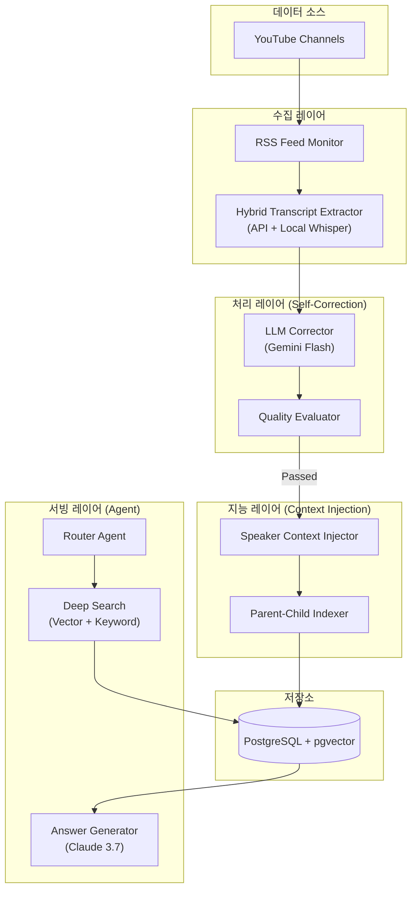
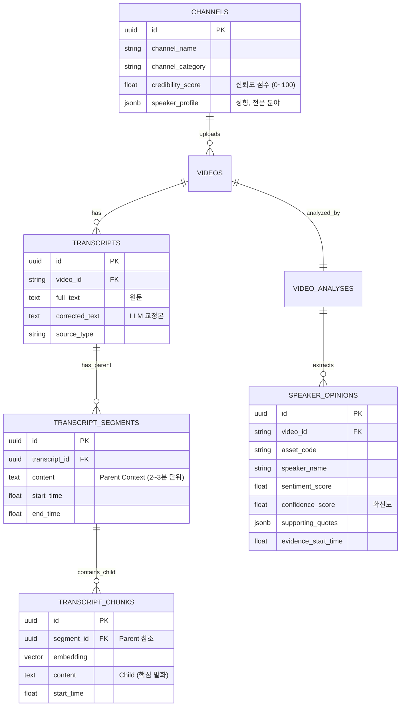

제공해주신 유튜브 데이터 설계문서와 앞서 논의한 v9 아키텍처의 핵심 기술(Parent-Child Retrieval, Agentic Workflow, Context Injection)을 결합하여, **[투자 인텔리전스 시스템: YouTube 데이터 고도화 설계서 v9.0]**을 작성합니다.

기존 설계의 '수집 중심'에서 **'분석 및 신뢰성 중심'**으로 패러다임을 전환하여, 증권사 리포트 분석 시스템과 동등한 수준의 지능을 갖추도록 설계했습니다.

---

# 📊 투자 인텔리전스 시스템: YouTube 데이터 고도화 설계서 (v9.0 Final)

> **목표**: 유튜브(동영상) 데이터의 '비정형성'과 '신뢰성 난제'를 해결하기 위해, **Context-Aware RAG**와 **Self-Correcting Pipeline**을 도입. 발화자의 컨텍스트(성향, 전문성)를 이해하고, 시간이 지남에 따라 의견의 선행성을 검증하는 '전문가 의견 추적 시스템' 구축.

---

## 1. 설계 개요 및 전략적 목표

### 1.1 핵심 설계 원칙 (v9 Upgrade)
1.  **Context over Text**: 단순 텍스트(자막)가 아닌, **발화자의 컨텍스트(Channel Profile, 과거 적중률)**를 임베딩에 주입하여 검색 품질을 높입니다.
2.  **Parent-Child Retrieval**: 검색은 핵심 발화(Child)로, 추론은 전후 맥락(Parent)으로 수행하여 '단편적 이해'를 방지합니다.
3.  **Self-Correction Loop**: 자동 생성 자막의 오타(노이즈)를 LLM이 사전 교정하여 데이터 품질을 확보합니다.
4.  **Verifiable Citation**: 모든 인사이트는 타임스탬프와 함께 제공되어, 사용자가 원본 영상에서 즉시 검증할 수 있게 합니다.

### 1.2 시스템 아키텍처 (Architecture v9)



---

## 2. 데이터 수집 및 정제 전략 (Collection & Refinement)

### 2.1 자막 수집: 하이브리드 3단계 폴백
기존 전략을 유지하되, 2차(Whisper)의 우선순위를 상향 조정하여 품질을 높입니다.

| 순위 | 방식 | 시나리오 | 특징 |
|------|------|----------|------|
| **1차** | `youtube-transcript-api` | 자동 생성 자막 품질 양호 시 | 빠름 (1초), 비용 없음. |
| **2차** | **Local Whisper (Large-v3)** | 자막 없음 or 품질 불량 시 | **고품질**, M5 Mac 활용. |
| **3차** | Gemini 2.0 Flash (Audio) | 오디오 품질 매우 불량 시 | 멀티모달 직접 청취. |

### 2.2 자막 품질 관리 및 LLM 교정 (New!)
유튜브 자막의 가장 큰 문제인 '오타'와 '단어 오인식'을 해결합니다.

**Process**:
1.  **1차 필터링 (Rule-based)**: 텍스트 길이, 특수문자 비율 등으로 명백한 불량 데이터 제거.
2.  **2차 교정 (LLM-based)**: 통과된 텍스트라도 금융 용어(HBM -> 에치비엠) 오류가 많으므로 **Gemini Flash**를 통해 1차 교정.

```python
# LLM Correction Prompt 예시
prompt = """
너는 금융 전문가다. 아래 유튜브 자막 텍스트에는 음성 인식 오류가 많다.
문맥을 고려하여 금융 용어, 기업명, 전문 용어를 올바르게 교정하라.
단, 원문의 문체와 의미는 훼손하지 마라.

[원문]:
"에치비엠 수주가 늘어나면서 삼성전자의 실적이 개선될 기미가 보인다."

[교정문]:
"HBM 수주가 늘어나면서 삼성전자의 실적이 개선될 기미가 보인다."
"""
```

---

## 3. LLM 분석 및 컨텍스트 주입 전략

### 3.1 동적 컨텍스트 주입 (Dynamic Context Injection)
검색 정확도를 높이기 위해, 자막 청크(Child)에 **메타데이터 Prefix**를 주입합니다.

*   **Prefix 구조**: `[발화자: OOO | 채널성향: 스윙트레이딩 | 전문성: 반도체] + [자막 내용]`
*   **효과**: 동일한 "지금 사도 된다"는 발언이라도, '스윙 트레이더'의 발언과 '펀더멘털 애널리스트'의 발언을 벡터 공간에서 분리하여 검색 정확도 향상.

### 3.2 프롬프트 라우팅 및 분석 (Analysis Strategy)

영상 유형에 따라 분석 프롬프트를 다르게 적용합니다.

1.  **Classification**: 영상 유형 판별 (Single POV, Debate, Macro).
2.  **Extraction**:
    *   **Opinion Extraction**: 주장, 근거, 관련 종목 추출.
    *   **Sentiment Calibration**: 단순 긍정/부정이 아닌, **확신도(Confidence Score)** 부여.

---

## 4. 임베딩 및 검색 전략 (Parent-Child Retrieval)

### 4.1 청킹 전략 (2-Level Architecture)
**"검색은 작게, 맥락은 크게"** 원칙을 적용합니다.

1.  **Parent (Context)**: 2~3분 단위의 발화 덩어리 (전후 맥락 파악용).
2.  **Child (Index)**: Parent 내에서 핵심 주장이 담긴 문장 단위 (벡터 검색용).

### 4.2 검색 프로세스 (Hybrid Search)

```sql
-- 하이브리드 검색 쿼리 예시
SELECT 
    p.content as parent_context,  -- 전후 맥락
    c.content as child_hit,       -- 검색된 핵심 문장
    c.start_time,                 -- 타임스탬프
    v.title, v.url
FROM transcript_chunks c
JOIN transcript_segments p ON c.parent_id = p.id
JOIN videos v ON c.video_id = v.video_id
WHERE 
    c.content LIKE '%삼성전자%' -- 키워드 필터링
ORDER BY c.embedding <=> :query_vector -- 벡터 유사도
LIMIT 5;
```

---
**[제1부] 완료.**
다음 섹션인 **[제2부: 데이터베이스 설계 (Schema v9) 및 구현 가이드]**를 이어서 작성하겠습니다. `continue`를 입력해 주세요.

---

## 5. 데이터베이스 설계 (Database Schema v9)

v9 아키텍처의 핵심인 **Parent-Child 구조**와 **신뢰성 검증(Verifiable Citation)**, 그리고 **화자 컨텍스트(Speaker Context)**를 완벽하게 지원하는 스키마입니다.

### 5.1 ERD (Entity Relationship Diagram)



### 5.2 SQL DDL (PostgreSQL)

Parent-Child 관계와 컨텍스트 검색을 위한 구조화된 스키마입니다.

```sql
-- ==========================================
-- 0. 확장 기능 활성화
-- ==========================================
CREATE EXTENSION IF NOT EXISTS "uuid-ossp";
CREATE EXTENSION IF NOT EXISTS "pgvector";
CREATE EXTENSION IF NOT EXISTS "pg_trgm";

-- ==========================================
-- 1. 채널 정보 (화자 컨텍스트)
-- ==========================================
CREATE TABLE channels (
    id UUID PRIMARY KEY DEFAULT uuid_generate_v4(),
    youtube_channel_id VARCHAR(100) UNIQUE NOT NULL,
    channel_name VARCHAR(200) NOT NULL,
    
    -- v9: 신뢰도 관리
    credibility_score FLOAT DEFAULT 50.0, -- 0~100 (과거 적중률 기반)
    channel_category VARCHAR(50),        -- 'technical', 'macro', 'entertainment'
    
    -- v9: 동적 프로필 (LLM이 업데이트)
    speaker_profile JSONB DEFAULT '{}', -- {"style": "스윙트레이딩", "expertise": ["반도체", "2차전지"]}
    
    is_active BOOLEAN DEFAULT TRUE,
    created_at TIMESTAMP DEFAULT NOW()
);

-- ==========================================
-- 2. 영상 메타데이터
-- ==========================================
CREATE TABLE videos (
    id UUID PRIMARY KEY DEFAULT uuid_generate_v4(),
    video_id VARCHAR(20) UNIQUE NOT NULL,
    channel_id UUID REFERENCES channels(id),
    
    title TEXT NOT NULL,
    published_at TIMESTAMP NOT NULL,
    duration_seconds INTEGER,
    
    -- 처리 상태
    status VARCHAR(20) DEFAULT 'new', -- 'new', 'corrected', 'analyzed'
    video_type VARCHAR(30),           -- 'single_pov', 'debate'
    
    created_at TIMESTAMP DEFAULT NOW()
);

-- ==========================================
-- 3. 자막 원문 및 교정 (Source of Truth)
-- ==========================================
CREATE TABLE transcripts (
    id UUID PRIMARY KEY DEFAULT uuid_generate_v4(),
    video_id VARCHAR(20) REFERENCES videos(video_id),
    
    -- 원문 보존
    source_type VARCHAR(30) NOT NULL, -- 'youtube_api', 'whisper'
    full_text TEXT NOT NULL,
    
    -- v9: LLM 교정 텍스트
    corrected_text TEXT, 
    
    is_primary BOOLEAN DEFAULT TRUE,
    created_at TIMESTAMP DEFAULT NOW()
);

-- ==========================================
-- 4. 자막 세그먼트 (Parent Document)
-- ==========================================
CREATE TABLE transcript_segments (
    id UUID PRIMARY KEY DEFAULT uuid_generate_v4(),
    transcript_id UUID REFERENCES transcripts(id) ON DELETE CASCADE,
    video_id VARCHAR(20) NOT NULL,
    
    -- Parent Context (2~3분 단위)
    content TEXT NOT NULL, 
    
    start_time FLOAT NOT NULL,
    end_time FLOAT NOT NULL,
    
    created_at TIMESTAMP DEFAULT NOW()
);

-- ==========================================
-- 5. 자막 청크 (Child Document & Vector)
-- ==========================================
CREATE TABLE transcript_chunks (
    id UUID PRIMARY KEY DEFAULT uuid_generate_v4(),
    
    -- Parent 참조 (맥락 확보용)
    segment_id UUID REFERENCES transcript_segments(id) ON DELETE CASCADE,
    video_id VARCHAR(20) NOT NULL,
    
    -- Child Content (검색용)
    content TEXT NOT NULL, -- 핵심 발화 문장
    start_time FLOAT,      -- 정확한 타임스탬프
    
    -- Vector (BGE-M3: 1024차원)
    embedding vector(1024),
    
    created_at TIMESTAMP DEFAULT NOW()
);

-- Vector Index
CREATE INDEX idx_chunks_embedding ON transcript_chunks 
    USING ivfflat (embedding vector_cosine_ops) WITH (lists = 100);

-- ==========================================
-- 6. 전문가 의견 추출 (Opinion)
-- ==========================================
CREATE TABLE speaker_opinions (
    id UUID PRIMARY KEY DEFAULT uuid_generate_v4(),
    video_id VARCHAR(20) REFERENCES videos(video_id),
    analysis_id UUID REFERENCES video_analyses(id),
    
    -- 자산 식별
    asset_code VARCHAR(50),
    asset_name VARCHAR(200),
    
    -- 의견 내용
    speaker_name VARCHAR(100),
    sentiment_score FLOAT,       -- -1.0 ~ 1.0
    confidence_score FLOAT,      -- 0.0 ~ 1.0 (화자의 확신도)
    opinion_summary TEXT,
    
    -- 근거 (Verifiable Citation)
    supporting_quotes JSONB,     -- ["인용 문구 1", "인용 문구 2"]
    evidence_start_time FLOAT,   -- 영상 내 증거 위치
    
    -- 시계열
    published_at TIMESTAMP NOT NULL,
    
    created_at TIMESTAMP DEFAULT NOW()
);

-- 검색용 인덱스
CREATE INDEX idx_opinions_asset_time ON speaker_opinions(asset_code, published_at DESC);
```

---

## 6. 상세 구현 가이드 (Implementation Guide)

### 6.1 자막 교정 및 정제 (Correction Logic)

단순 OCR 오류를 넘어, 금융 도메인 용어를 정확히 교정하는 로직입니다.

```python
async def correct_transcript(raw_text: str, video_id: str) -> str:
    """
    Gemini Flash를 사용하여 자막 품질 고도화
    """
    prompt = f"""
    너는 금융 전문가다. 아래 유튜브 자막 텍스트에는 음성 인식 오류가 많다.
    문맥을 고려하여 금융 용어, 기업명, 전문 용어를 올바르게 교정하라.
    원문의 줄바꿈과 문체는 유지하되, 가독성을 위해 문단 구분을 추천한다.

    [원문]:
    {raw_text}

    [교정문]:
    """
    
    response = await gemini_client.generate_content_async(prompt)
    corrected_text = response.text
    
    # DB 업데이트
    await db.execute(
        "UPDATE transcripts SET corrected_text = $1 WHERE video_id = $2",
        corrected_text, video_id
    )
    return corrected_text
```

### 6.2 Parent-Child 청킹 및 임베딩 (Chunking Logic)

"검색은 작게, 맥락은 크게" 전략을 구현합니다.

```python
async def create_parent_child_chunks(video_id: str, transcript: dict):
    segments = transcript['segments'] # 자막 타임라인 데이터
    
    # 1. Parent Segment 생성 (2~3분 단위 병합)
    parent_segments = []
    current_buffer = []
    time_cursor = 0
    
    for seg in segments:
        current_buffer.append(seg['text'])
        
        # 180초(3분) 단위로 병합
        if seg['start'] - time_cursor > 180:
            parent_text = " ".join(current_buffer)
            parent_id = await save_parent_segment(video_id, parent_text, time_cursor, seg['start'])
            parent_segments.append((parent_id, parent_text))
            
            # 초기화
            current_buffer = []
            time_cursor = seg['start']
            
    # 2. Child Chunk 생성 및 임베딩 (문장 단위 분리)
    for parent_id, parent_text in parent_segments:
        sentences = split_sentences(parent_text) # 마침표 기준 분리
        
        for sent in sentences:
            # 핵심 내용이 담긴 문장만 Child로 선별 (선택적)
            if is_meaningful(sent): 
                # v9: 컨텍스트 주입 (발화자 정보 등)
                context_prefix = await get_speaker_prefix(video_id)
                embedding_text = f"{context_prefix}\n---\n{sent}"
                
                # 임베딩 생성 (Local BGE-M3)
                vector = generate_embedding(embedding_text)
                
                await db.execute("""
                    INSERT INTO transcript_chunks 
                    (segment_id, video_id, content, embedding, start_time)
                    VALUES ($1, $2, $3, $4, $5)
                """, parent_id, video_id, sent, vector, estimate_time(sent))
```

### 6.3 신뢰도 기반 검색 (Hybrid Search)

검색 시 채널의 신뢰도 점수를 반영하여 결과의 품질을 보정합니다.

```python
async def search_youtube_insights(query: str, asset_code: str):
    query_vector = generate_embedding(query)
    
    # SQL: 벡터 검색 + 키워드 필터 + 신뢰도 조인
    results = await db.fetch("""
        SELECT 
            c.content as child_hit,
            ps.content as parent_context,
            v.title,
            v.video_id,
            ch.channel_name,
            ch.credibility_score,
            c.start_time
        FROM transcript_chunks c
        JOIN transcript_segments ps ON c.segment_id = ps.id
        JOIN videos v ON c.video_id = v.video_id
        JOIN channels ch ON v.channel_id = ch.id
        WHERE 
            c.content LIKE :asset_keyword
        ORDER BY 
            -- 유사도(0~1)와 신뢰도(0~1)를 가중합
            (1 - (c.embedding <=> :query_vec)) * 0.7 + (ch.credibility_score / 100) * 0.3 DESC
        LIMIT 10
    """, query_vector=query_vector, asset_keyword=f"%{asset_code}%")
    
    return results
```

---

## 7. 운영 및 피드백 루프 (Operations)

### 7.1 신뢰도 점수 갱신 (Credibility Update)

유튜버의 의견이 실제 시장과 부합했는지 추적하여 신뢰도를 업데이트합니다.

*   **주기**: 월 1회.
*   **로직**: 3개월 전 '강력 매수' 의견을 냈던 종목의 수익률 확인.
    *   수익률 > 10% -> 신뢰도 +5점.
    *   수익률 < -5% -> 신뢰도 -5점.

### 7.2 배치 스케줄 (Daily)
*   **06:00**: RSS 피드 수집 및 영상 메타데이터 저장.
*   **06:30**: 자막 추출 (API -> Whisper 폴백).
*   **07:00**: **LLM 자막 교정 (Correction)**.
*   **07:30**: Parent-Child 청킹 및 임베딩.
*   **08:00**: 의견(Opinion) 추출 및 시계열 DB 업데이트.

---

## 8. 결론 (Conclusion)

본 v9.0 설계는 유튜브 데이터의 '신뢰성'과 '맥락' 문제를 해결합니다.

1.  **Self-Correction**: LLM을 통한 자막 교정으로 데이터 품질을 원천적으로 향상시켰습니다.
2.  **Parent-Child Architecture**: 핵심 발화(Child)로 검색하고 전후 맥락(Parent)으로 이해함으로써 오해를 방지합니다.
3.  **Verifiable System**: 모든 인사이트에 타임스탬프와 화자 정보를 부여하여, 사용자가 스스로 판단할 수 있는 근거를 제공합니다.
4.  **Credibility Management**: 채널별 신뢰도 점수를 관리하여, 과장된 정보는 걸러내고 검증된 전문가의 목소리에 집중할 수 있습니다.

이 시스템은 텍스트 덩어리에 불과했던 유튜브 자막을, **'시공간이 명확한 투자 의견 데이터'**로 변환하는 강력한 엔진입니다.

---
**[최종 문서 완료]**