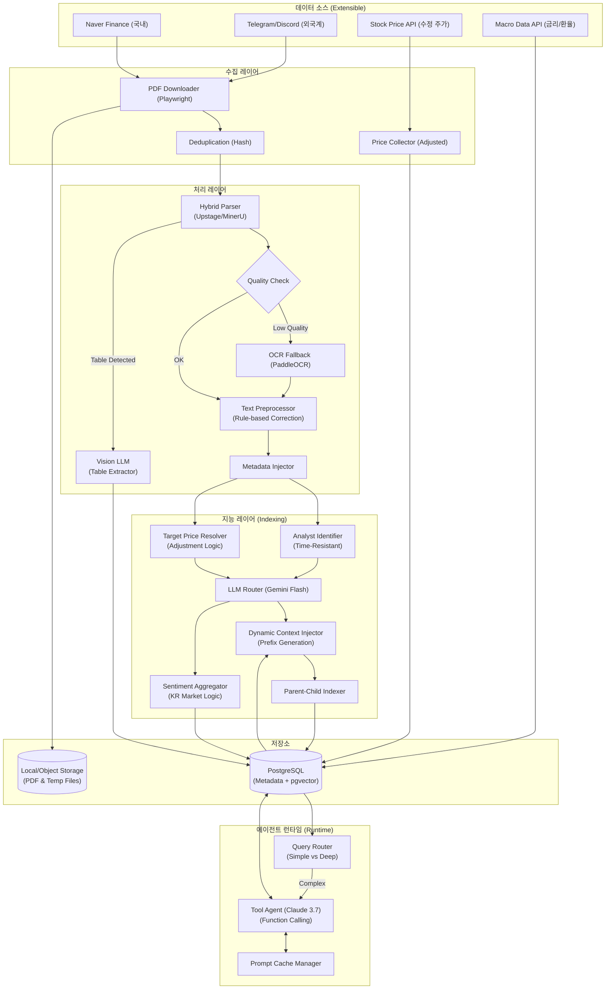
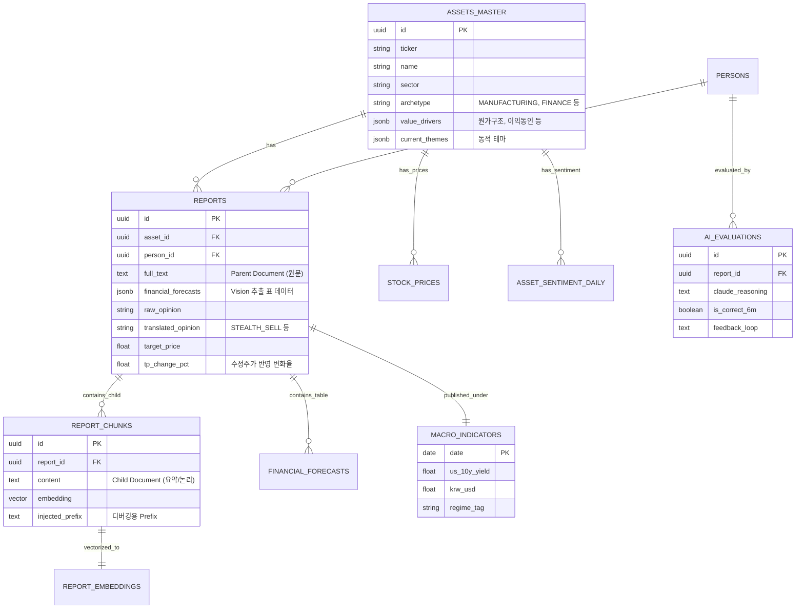

네, 알겠습니다. 기존의 모든 논의(v7의 구체적인 노드, v8의 전략적 깊이, Gemini 모델의 기술적 제안)를 하나도 빠짐없이 포함하여 **'증권사 리포트 분석 시스템 최종 마스터 버전 (v9.0)'**을 작성하겠습니다.

지금부터 **[제1부: 설계 개요 및 아키텍처]**를 시작합니다.

---

# 📊 투자 인텔리전스 시스템: 증권사 리포트 분석 설계서 (Final Ultimate Ver. 9.0)

> **문서 목적**: 단순 텍스트 검색(Naive RAG)의 한계를 극복하고, 기업의 비즈니스 아키타입(Archetype)과 원가 민감도, 매크로 환경까지 이해하는 **'Agentic RAG 기반 퀀트 펀더멘털 에이전트'** 구축. 시장의 왜곡된 신호를 교정하고 '비관의 끝(저점)'과 '시장 과열(고점)'을 판별해 개인화된 알파(Alpha)를 창출한다.

---

## 1. 설계 개요 및 전략적 목표

### 1.1 핵심 설계 원칙 (Design Principles)
본 시스템은 정보의 요약을 넘어, **'맥락의 이해(Contextual Understanding)'**와 **'시스템의 자가 진화(Self-Evolving)'**, 그리고 **'운영 효율성(Cost-Efficiency)'**에 집중합니다.

1.  **Dynamic Contextualization (동적 문맥화)**: 업종별로 돈을 버는 공식(비즈니스 아키타입)이 다름을 인지하고, 임베딩 전 종목별 핵심 팩터(원가 비중, 판가 전이력 등)를 자연어로 양자화하여 주입합니다.
2.  **Signal over Opinion (신호 중심)**: 한국 시장의 매수 편향('Hold=Sell')을 디코딩하고, 스텔스 하향(Stealth Downgrade) 및 컨센서스 다이버전스(의견 충돌)를 알파 창출의 기회로 삼습니다.
3.  **Parent-Child Retrieval (스마트 인덱싱)**: 검색은 정제된 요약본(Child)으로 수행하고, 답변 생성은 원문 전체(Parent)를 참조하여 'Lost in the Middle' 문제와 맥락 단절을 동시에 해결합니다.
4.  **Agentic Workflow (능동적 탐색)**: AI가 단순히 검색된 결과만 답하는 것이 아니라, 부족한 정보를 스스로 판단하고 DB를 재탐색(Tool-use)하는 에이전트 형태로 구동합니다.
5.  **Cost Efficiency (비용 최적화)**: 긴 시스템 프롬프트와 마스터 데이터에 **Prompt Caching**을 적용하여 운영 비용을 절감합니다.

### 1.2 시스템 아키텍처 (Architecture v9)
v7의 상세한 노드 표현에 v9의 에이전트 구조를 결합했습니다.



---

## 2. PDF 처리 및 데이터 추출 파이프라인 (Hybrid Parser)

리포트의 복잡한 레이아웃과, 본문보다 중요한 '표(Table)' 데이터를 훼손 없이 추출하기 위한 하이브리드 파이프라인입니다.

### 2.1 문서 구조 인식 파서 (Structure-Aware Parser)
-   **1순위 (API)**: **Upstage Document Parse** (한국어 서류 특화).
-   **2순위 (Local)**: **MinerU (Magic-PDF)** (오픈소스, PDF to Markdown).
-   **3순위 (Fallback)**: `pdfplumber` + `PaddleOCR`.

### 2.2 Vision LLM을 활용한 표(Table) 데이터 추출 (알파 발굴)
재무 추정치(Forward EPS, PER)나 Peer Group 비교표는 일반 PDF 파서로 읽으면 줄바꿈이 망가집니다. 표 영역이 감지되면 해당 영역을 이미지로 캡처하여 **Vision 기능이 뛰어난 Gemini 2.0 Flash**에 전달합니다.

-   **Process**: PDF에서 표 영역 감지 -> 이미지 캡처 -> **Gemini 2.0 Flash (Vision)** -> JSON 변환 -> `financial_forecasts` 테이블 저장.

```python
async def extract_table_with_vision(image_path: str) -> dict:
    """
    표 이미지를 분석하여 완벽한 구조의 JSON 재무 데이터로 변환
    """
    prompt = """
    이 이미지는 증권사 리포트의 재무 추정치 표입니다.
    2024~2026년의 매출액, 영업이익, EPS, PER 추정치를 
    정확한 JSON Key-Value 형태로 추출하시오. 단위에 주의하시오.
    """
    # Gemini Flash Vision API 호출
    response = await gemini_vision.generate_content_async()
    return parse_json(response.text)
```

### 2.3 텍스트 교정 및 '여의도 사투리' 디코딩
추출된 텍스트의 오타(예: '에치비엠')를 교정함과 동시에, 숨겨진 의미(Hold=Sell)를 명시적 데이터로 치환합니다.

1.  **Rule-based**: 정규식 사전 교정 ("에치비엠" -> "HBM").
2.  **LLM Integrated**: 추출 프롬프트 내 교정 지시 ("문맥상 오타로 보이는 단어 교정").
3.  **Bias Decoding**: 
    -   "Hold" or "중립" -> **"SELL"** (사실상 매도)
    -   "Buy" & (목표가 상승여력 < 5%) -> **"STEALTH_SELL"** (스텔스 하향)

---
**[제1부] 완료.**
다음 섹션인 **[제2부: 데이터베이스 설계 (Schema Master) 및 핵심 로직]**을 이어서 작성하겠습니다. `continue`를 입력해 주세요.
---

## 3. 데이터베이스 설계 (Schema Master v9)

v7의 구체적인 필드와 v8의 컨텍스트 전략, 그리고 v9의 Parent-Child 구조를 모두 반영한 통합 스키마입니다.

### 3.1 ERD (Entity Relationship Diagram)



### 3.2 SQL DDL (PostgreSQL)

Parent-Child 구조와 JSONB를 활용한 유연한 스키마 설계입니다.

```sql
-- ==========================================
-- 1. 종목 마스터 (Context Enrichment)
-- ==========================================
CREATE TABLE assets_master (
    id UUID PRIMARY KEY DEFAULT uuid_generate_v4(),
    ticker VARCHAR(20) UNIQUE,
    name VARCHAR(100) NOT NULL,
    sector VARCHAR(100),
    
    -- v9: 비즈니스 아키타입 (제조업, 금융, 플랫폼 등)
    archetype VARCHAR(50),
    
    -- v9: 업종별 가치 동인 및 원가 민감도 (JSONB)
    -- 예: {"cost_structure": {"copper": {"weight": "3%", "impact": "미미함"}}}
    value_drivers JSONB DEFAULT '{}',
    
    -- v9: 동적 테마 (AI가 업데이트)
    current_themes JSONB DEFAULT '[]', -- ["AI Server", "HBM"]
    
    static_bm TEXT, -- "고다층 인쇄회로기판(MLB) 제조"
    
    updated_at TIMESTAMP DEFAULT NOW()
);

-- ==========================================
-- 2. 리포트 (Parent Document)
-- ==========================================
CREATE TABLE reports (
    id UUID PRIMARY KEY DEFAULT uuid_generate_v4(),
    asset_id UUID REFERENCES assets_master(id),
    person_id UUID REFERENCES persons(id), -- 애널리스트
    
    title TEXT,
    published_at TIMESTAMP NOT NULL,
    source_url TEXT,
    
    -- Parent Document: 전체 텍스트 혹은 페이지 단위 텍스트
    full_text TEXT,
    
    -- Vision LLM 추출 데이터
    financial_forecasts JSONB, -- [{"year": 2024, "eps": 5000, ...}]
    
    -- 의견 및 목표가
    raw_opinion VARCHAR(20), -- "BUY"
    translated_opinion VARCHAR(20), -- "STEALTH_SELL" (보정됨)
    target_price FLOAT,
    prev_target_price FLOAT,
    tp_change_pct FLOAT, -- 수정 주가 로직으로 계산됨
    
    created_at TIMESTAMP DEFAULT NOW()
);

-- ==========================================
-- 3. 리포트 청크 (Child Document & Vector)
-- ==========================================
CREATE TABLE report_chunks (
    id UUID PRIMARY KEY DEFAULT uuid_generate_v4(),
    report_id UUID REFERENCES reports(id) ON DELETE CASCADE,
    
    -- Child Document: 검색용 요약/핵심 논리
    content TEXT NOT NULL,
    
    -- 벡터 (OpenAI text-embedding-3-small)
    embedding vector(1536),
    
    -- 디버깅 및 튜닝용: 주입된 Prefix 스냅샷
    injected_prefix TEXT,
    
    chunk_index INTEGER,
    start_page INTEGER,
    
    created_at TIMESTAMP DEFAULT NOW()
);

-- IVFFlat 인덱스 (검색 성능)
CREATE INDEX idx_chunks_embedding ON report_chunks 
    USING ivfflat (embedding vector_cosine_ops) WITH (lists = 100);

-- ==========================================
-- 4. 시계열 및 매크로 데이터
-- ==========================================

-- 수정 주가 (액면분할/증자 대응)
CREATE TABLE stock_prices (
    asset_id UUID REFERENCES assets_master(id),
    date DATE NOT NULL,
    close_price FLOAT NOT NULL,
    adjustment_factor FLOAT DEFAULT 1.0, -- 수정 주가 계산용
    PRIMARY KEY (asset_id, date)
);

-- 매크로 레짐 (발행 시점 환경)
CREATE TABLE macro_indicators (
    date DATE PRIMARY KEY,
    us_10y_yield FLOAT,
    krw_usd FLOAT,
    oil_price FLOAT,
    copper_price FLOAT,
    regime_tag VARCHAR(50) -- 'HIGH_RATE_STRONG_DOLLAR'
);

-- ==========================================
-- 5. AI 메타 학습 (Self-Evolution)
-- ==========================================
CREATE TABLE ai_evaluations (
    id UUID PRIMARY KEY DEFAULT uuid_generate_v4(),
    report_id UUID REFERENCES reports(id),
    
    prediction_type VARCHAR(50), -- 'BOTTOM_FISHING'
    claude_reasoning TEXT,       -- 당시 AI 판단
    
    -- 6개월 후 실제 결과
    actual_return_6m FLOAT,
    is_correct BOOLEAN,
    feedback_loop TEXT,          -- AI 반성문
    
    evaluated_at TIMESTAMP DEFAULT NOW()
);
```

---

## 4. 핵심 로직 (Core Logic Master)

데이터 신뢰성 확보(v7)와 컨텍스트 강화(v8), 그리고 구조적 검색(v9)을 결합한 알고리즘입니다.

### 4.1 Parent-Child Retrieval (스마트 인덱싱)

**원칙**: "검색은 작게(Child), 추론은 크게(Parent)".
검색 시에는 AI가 추출한 핵심 논리(Key Theses)와 메타데이터(Prefix)를 결합한 작은 청크(Child)를 벡터 검색하여 정확도를 높이고, 답변 생성 시에는 원문(Parent)을 참조하여 맥락 손실을 방지합니다.

```python
async def retrieve_context(query: str, asset_id: UUID):
    # 1. Query Embedding
    query_vector = await generate_embedding(query)
    
    # 2. Child Search (Vector Search)
    # 핵심 논리(Child)가 유사한 리포트 ID 목록 확보
    matching_chunks = await db.fetch("""
        SELECT DISTINCT report_id, 1 - (embedding <=> $1) as score
        FROM report_chunks
        WHERE report_id IN (SELECT id FROM reports WHERE asset_id = $2)
        ORDER BY embedding <=> $1
        LIMIT 10
    """, query_vector, asset_id)
    
    # 3. Parent Loading (Context Expansion)
    # 검색된 Child가 속한 리포트 원문(Parent) 로드
    parent_ids = [c['report_id'] for c in matching_chunks]
    parent_docs = await db.fetch("""
        SELECT id, full_text, published_at, financial_forecasts, translated_opinion
        FROM reports
        WHERE id = ANY($1)
    """, parent_ids)
    
    return parent_docs
```

### 4.2 동적 문맥 주입기 (Dynamic Context Injector)

비즈니스 아키타입(제조/금융)에 따라 임베딩 Prefix를 동적으로 생성하여, LLM이 '돈 버는 공식'을 이해하도록 돕습니다.

```python
def generate_contextual_prefix(asset: dict, macro: dict) -> str:
    """
    JSONB 데이터를 자연어 Prefix로 변환 (양자화 적용)
    """
    prefix = f"▪ 종목: {asset['name']} ({asset['sector']}) | 아키타입: {asset['archetype']}\n"
    
    # 1. 매크로 배경
    prefix += f"▪ 발행시점 환경: 금리 {macro['us_10y_yield']}%, 환율 {macro['krw_usd']}원 ({macro['regime_tag']})\n"
    
    # 2. 아키타입별 맞춤 정보 (Value Drivers)
    drivers = asset.get('value_drivers', {})
    
    if asset['archetype'] == 'MANUFACTURING':
        # 제조업: 원가 민감도 강조
        prefix += "▪ 원가 구조 및 민감도:\n"
        for item, data in drivers.get("cost_structure", {}).items():
            # "구리 (비중: 3%, 영향: 미미)" 형태로 변환
            prefix += f"  - {item}: 비중 {data.get('weight', 'N/A')}, 영향 {data.get('impact', 'N/A')}\n"
            
    elif asset['archetype'] == 'FINANCE':
        # 금융업: 거래대금/이자수익 강조
        prefix += f"▪ 이익 동인: {', '.join(drivers.get('macro_drivers', []))}\n"
        prefix += f"▪ 자본 규제: {drivers.get('capital_milestone', 'N/A')}\n"
        
    return prefix + "---\n"

# 최종 임베딩 텍스트 예시
"""
▪ 종목: 이수페타시스 (IT 부품) | 아키타입: MANUFACTURING
▪ 발행시점 환경: 금리 4.5%, 환율 1350원 (HIGH_RATE)
▪ 원가 구조 및 민감도:
  - 구리: 비중 3% 미만, 영향 미미함
  - AI 서버 수요: 핵심 성장 동인
---
(여기에 Gemini Flash가 추출한 리포트 핵심 논리가 붙음)
"""
```

### 4.3 수정 주가 역산 및 은닉 신호 탐지

액면분할/증자로 인한 왜곡을 보정하고, 겉으로 드러나지 않은 실질적 의견 변화를 탐지합니다.

```python
def calculate_adjusted_signals(
    current_tp: float, 
    prev_tp: float, 
    prev_date: date, 
    asset_id: UUID, 
    raw_opinion: str
) -> dict:
    
    # 1. 수정 주가 반영 (v7 핵심 로직)
    adj_factor = get_adjustment_factor(asset_id, prev_date)
    adjusted_prev_tp = prev_tp / adj_factor if adj_factor else prev_tp
    
    # 2. 목표가 변화율 계산
    tp_change_pct = ((current_tp - adjusted_prev_tp) / adjusted_prev_tp) * 100
    
    # 3. 실질 의견 판단 (v8 Stealth Downgrade)
    translated_opinion = raw_opinion
    if tp_change_pct < -10.0 and raw_opinion == 'BUY':
        translated_opinion = 'STEALTH_DOWNGRADE' # 겉은 매수, 속은 매도
        
    return {
        "tp_change_pct": tp_change_pct,
        "translated_opinion": translated_opinion
    }
```

---
**[제2부] 완료.**
다음 섹션인 **[제3부: 딥 리서치 엔진 및 에이전트 런타임]**을 이어서 작성하겠습니다. `continue`를 입력해 주세요.
---

## 5. 딥 리서치 엔진 및 에이전트 런타임 (Agent Runtime v9)

단순 RAG를 넘어 과거의 시장 심리와 현재를 수학적으로 비교하고, AI가 스스로 판단하여 정보를 추가 탐색하는 '자율적 에이전트' 구조를 설계합니다.

### 5.1 시장 국면 탐지 (Regime Detector)

시스템은 매일 배치를 통해 시장의 심리 상태를 점수화하고 국면을 분류합니다. 이는 "비관의 끝"이나 "과열 꼭지"를 판단하는 핵심 신호입니다.

```python
async def detect_regime(asset_id: UUID):
    latest = await get_latest_sentiment(asset_id)
    
    # 1. 과열 국면 (Euphoria) - 매도 타이밍
    if latest['sentiment_score'] > 90 and latest['min_upside_pct'] < 5:
        return "EUPHORIA" 
        
    # 2. 비관 국면 (Pessimism) - 매수 타이박
    if latest['sentiment_score'] < -50 and latest['consecutive_tp_down'] >= 3:
        return "PESSIMISM"
        
    # 3. 모멘텀 가속 (Momentum)
    if latest['tp_up_velocity'] > 5.0:
        return "MOMENTUM"
        
    return "NEUTRAL"
```

### 5.2 Router Agent (질문 분기 처리)

사용자의 질문 난이도와 목적에 따라 처리 경로를 분기하여 비용과 속도를 최적화합니다.

*   **Simple Path (Fast RAG)**: 단순 팩트 질문 ("삼성전자 목표가는?", "지금 투자의견 어때?").
    *   처리: 경량 모델(Gemini Flash) 혹은 DB 조회만으로 즉시 답변.
*   **Deep Path (Agentic RAG)**: 복합 분석 질문 ("지금이 바닥인가?", "원자재 가격 상승 영향은?").
    *   처리: Claude 3.7 Sonnet + Tool-use + Parent-Child Retrieval.

```python
async def route_query(query: str, asset_id: UUID):
    intent = await classify_intent(query) # LLM으로 의도 파악
    
    if intent == "SIMPLE_FACT":
        return await execute_simple_rag(query, asset_id)
    elif intent == "DEEP_ANALYSIS":
        return await execute_agent_research(query, asset_id)
```

### 5.3 Agentic Tool-use (능동적 탐색)

Deep Path로 진입한 경우, Claude는 단순히 검색된 문서만 읽는 것이 아니라, 부족한 정보를 스스로 찾기 위해 '도구(Tool)'를 사용합니다.

**정의된 도구 (Tools Definition):**
1.  `search_similar_bottoms`: 과거 저점 패턴 검색 (Vector Search).
2.  `get_financial_forecasts`: Vision LLM으로 추출된 재무 데이터 조회.
3.  `check_macro_regime`: 특정 시점의 매크로 환경 조회.

**Workflow 예시:**
1.  **User**: "이수페타시스 지금이 바닥인가? 과거와 비교해봐."
2.  **Claude (Thinking)**: "현재 리포트들의 Prefix를 보니 '비관론'이 지배적이군. 과거 비관 국면에서 어떻게 움직였는지 확인이 필요하다."
3.  **Claude (Action)**: `search_similar_bottoms(asset_id="이수페타시스", sentiment="PESSIMISM")` 호출.
4.  **System**: "2018년 4분기, 2020년 1분기 데이터를 찾았습니다."
5.  **Claude (Thinking)**: "2018년 데이터가 필요한데, 당시 재무 데이터가 없네. 숫자를 확인해야겠다."
6.  **Claude (Action)**: `get_financial_forecasts(year=2018)` 호출.
7.  **Claude (Final Answer)**: 모든 정보를 종합하여 "현재는 2018년 4분기와 유사하게 사이클 바닥이나, 원가 구조 차이로 인해..." 식의 심층 답변 생성.

### 5.4 Prompt Caching (비용 최적화)

Deep Research 시 반복적으로 사용되는 긴 컨텍스트(시스템 프롬프트, 종목 마스터 정보)를 캐싱하여 비용을 절감합니다.

```python
# Anthropic API 예시
client.messages.create(
    model="claude-3-7-sonnet-20250219",
    system=[
        {
            "type": "text",
            "text": SYSTEM_PROMPT, # 긴 분석 룰 (약 1000토큰)
            "cache_control": {"type": "ephemeral"}
        },
        {
            "type": "text", 
            "text": asset_master_context, # 종목 마스터 JSON (약 2000토큰)
            "cache_control": {"type": "ephemeral"}
        }
    ],
    messages=[...]
)
# 효과: 반복 질문 시 입력 토큰 비용 90% 절감, 응답 속도 2~3배 향상
```

---

## 6. LLM 전략 및 시스템 프롬프트

### 6.1 모델 라우팅 전략

| 프로세스 | 담당 모델 | 이유 |
| :--- | :--- | :--- |
| **PDF 표(Table) 파싱** | **Gemini 2.0 Flash (Vision)** | 복잡한 재무 표 이미지를 JSON으로 구조화하는 데 압도적 가성비. |
| **텍스트 추출 & 교정** | **Gemini 2.0 Flash** | 대량의 PDF 텍스트 처리, 오타 교정, 요약(Child 생성)을 저비용으로 수행. |
| **벡터 임베딩** | **text-embedding-3-small** | 1536차원의 고밀도 벡터 생성. 한국어 성능과 가격의 균형. |
| **심층 분석 (Deep)** | **Claude 3.7 Sonnet** | Extended Thinking을 활용한 복잡한 추론, Tool-use 실행, 다이버전스 분석. |
| **심리 분석 (Sentiment)** | **Gemini 2.0 Flash** | 일일 리포트 대상 감성 점수 계산 (빈도 높음 -> 저비용 모델). |

### 6.2 Claude 시스템 프롬프트 (안전장치 & 페르소나)

Claude가 금융 전문가로서 행동하며, 흔한 실수(원가 비중 무시 등)를 범하지 않도록 강력한 가드레일을 설정합니다.

```text
<system_prompt>
너는 월스트리트 최고 수준의 펀더멘털/퀀트 애널리스트다.
제공된 검색 결과를 바탕으로 기업의 이익 훼손 여부를 판단할 때, 아래 <rules>를 엄수하라.

<rules>
1. **Scale Awareness (비중 인지)**: 원자재/매크로 변수 악재가 언급되더라도, 함께 제공된 '원가 구조(Prefix)'에서 해당 비중이 5% 미만이거나 '영향 미미'로 분류되었다면 "마진 스퀴즈 우려는 과도하다"고 분석하라.
2. **Pricing Power (방어력)**: Prefix에 고객에게 가격을 전가할 수 있는 '판가 전이력'이나 '에스컬레이션 조항'이 있다면, 원가 상승은 오히려 매출(Q) 증가 효과로 이어질 수 있음을 지적하라.
3. **Stealth Signal (숨은 신호)**: 리포트 의견이 'BUY'라도 목표가가 대폭 하향(-10% 이상)된 경우, 이를 'STEALTH_DOWNGRADE'로 간주하고 경고하라.
4. **Structural Decline (가치 함정)**: 펀더멘털 상태가 'STRUCTURAL_DECLINE(구조적 쇠퇴)'로 태깅된 종목은 과거 유사 패턴이 아무리 좋더라도 매수 추천을 거절하라.
</rules>

분석 시 반드시 출처(리포트 발행일, 애널리스트명)를 명시하고, 투자 결정의 근거를 논리적으로 제시하라.
</system_prompt>
```

---

## 7. 메타 학습 및 운영 (Operations Master)

### 7.1 메타 학습 피드백 루프 (Self-Evolution)

시스템이 시간이 지날수록 똑똑해지도록, 과거의 예측을 실제 결과와 비교하여 스스로 가중치를 조정합니다.

```python
async def evaluate_ai_predictions():
    """매월 1회 실행: 6개월 전 Claude가 내린 판단을 실제 주가와 비교"""
    eval_targets = await db.fetch("""
        SELECT ae.id, ae.claude_reasoning, ae.prediction_type, r.asset_id, r.published_at
        FROM ai_evaluations ae
        JOIN reports r ON r.id = ae.report_id
        WHERE ae.prediction_date <= NOW() - INTERVAL '6 months'
          AND ae.is_correct IS NULL
    """)
    
    for target in eval_targets:
        # 1. 실제 6개월 수익률 계산 (수정 주가 기준)
        actual_return = await calculate_return(target['asset_id'], target['published_at'], 180)
        
        # 2. 정답 여부 판단 (예: Bottom Fishing 시 +15% 이상)
        is_correct = (target['prediction_type'] == 'BOTTOM_FISHING' and actual_return > 15.0)
        
        # 3. Claude에게 피드백 요청 (자가 성찰)
        feedback = await claude_client.generate_feedback(
            original_reasoning=target['claude_reasoning'],
            actual_result=actual_return,
            instruction="너의 과거 예측이 틀렸다면, 원자재 비중을 과대평가했는지, 매크로를 무시했는지 등 패착의 원인을 분석하여 개선점을 1줄로 제시하라."
        )
        
        # 4. DB 업데이트
        await db.execute(
            "UPDATE ai_evaluations SET actual_return_6m=$1, is_correct=$2, feedback_loop=$3 WHERE id=$4",
            actual_return, is_correct, feedback, target['id']
        )
```

### 7.2 배치 스케줄 (Local Mac Environment)

*   **Daily (저녁)**: 리포트 수집, 텍스트 추출, Vision 테이블 추출, 전처리.
*   **Daily (심야)**: Parent-Child 임베딩 생성, 애널리스트 점수 갱신, 감성 점수 계산.
*   **Weekly**: 종목 테마/원가구조 업데이트(Dynamic Tagging), 과열/비만 국면 마킹.
*   **Monthly**: AI 예측 적중률 평가 및 프롬프트/가중치 튜닝 (Meta-Learning).

---
**[제3부] 완료.**
마지막 섹션인 **[제4부: 최종 유즈케이스 및 결론]**을 이어서 작성하겠습니다. `continue`를 입력해 주세요.
---

## 8. 최종 유즈케이스 (Ultimate Use Cases v9)

본 시스템이 완성되었을 때, 사용자가 겪게 될 구체적인 "알파(Alpha) 창출" 시나리오입니다. v9의 에이전트 기능과 컨텍스트 인지 능력이 어떻게 작동하는지 보여줍니다.

### Case 1. 구리 가격 급등 쇼크 (가짜 악재 필터링)
*   **상황**: 국제 구리 가격이 급등하며 뉴스 헤드라인을 장식. 시장은 제조/부품주를 일제히 투매하고, 이수페타시스 주가도 함께 하락합니다.
*   **일반 RAG의 오류**: "구리 가격 상승 우려"라는 문구가 포함된 리포트를 검색하여 "매도 신호"라고 오판할 가능성이 높습니다.
*   **v9 에이전트 동작**:
    1.  **Query**: "이수페타시스, 구리 가격 급등 영향 분석해줘."
    2.  **Router**: 심층 분석 필요로 판단 -> **Deep Research Path** 진입.
    3.  **Retrieval**: `report_chunks`에서 관련 리포트 검색.
    4.  **Context Awareness**: 시스템은 검색된 청크에 포함된 **Prefix(원가 구조)**를 확인.
        *   `Prefix: "구리 (비중: 3% 미만, 영향: 미미함)"`
    5.  **Claude Reasoning**: "리포트 본문에는 '원가 상승 우려'가 언급되어 있으나, Prefix에 따르면 실제 원가 비중은 3% 미만으로 영향이 미미함. 이는 시장의 과도한 반응(Noise)으로 판단됨."
    6.  **Final Insight**: "현재 구리 가격 급등은 이수페타시스의 마진에 타격을 주지 않습니다. 오히려 AI 서버 수요 증가가 핵심 동인이므로, 공포에 따른 하락은 **저점 매수 기회**입니다." (출처: 리포트 p.5, 재무 데이터)

### Case 2. 초대형 IB 모멘텀 비교 (정확한 아키타입 매칭)
*   **상황**: 키움증권이 자기자본 4조 원을 돌파하며 초대형 IB(Internet Bank) 진출을 선언.
*   **v9 에이전트 동작**:
    1.  **Query**: "키움증권, IB 진출 시 밸류에이션 어떻게 변할까?"
    2.  **Archetype Matching**: 키움증권의 아키타입이 `FINANCE`임을 인지. `value_drivers`에서 `macro_driver: 거래대금`, `structural_edge: 무점포` 등을 추출.
    3.  **Pattern Search (Tool-use)**: Claude가 `search_similar_bottoms` 도구를 사용하여, 과거 '자기자본 4조 원 돌파' 또는 'IB 인가 획득' 시점의 타 증권사 데이터를 검색.
    4.  **Parent Document Load**: 검색된 2017년 한국투자증권, 미래에셋증권 리포트의 원문(Parent)을 로드하여 당시 논리 구조 분석.
    5.  **Final Insight**: "과거 타 증권사들의 초대형 IB 진입 시점 대비, 키움증권은 무점포 구조로 인한 판관비율이 낮아 ROE 훼손 방어력이 탁월합니다. 단순히 거래대금 증가 기대가 아닌, '본질적 수익성 개선' 사례와 유사하므로 목표주가 상향 여력이 큽니다."

### Case 3. 컨센서스 다이버전스 (의견 충돌 해결)
*   **상황**: 특정 엔터주에 대해 A증권사는 "실적 턴어라운드 확실"라며 목표가 상향, B증권사는 "경쟁 심화로 인한 마진 하락"이라며 목표가 하향. 투자자는 혼란에 빠짐.
*   **v9 에이전트 동작**:
    1.  **Conflict Detection**: 시스템이 일주일 내 목표가 방향성이 상반된 리포트 2건을 감지.
    2.  **Deep Analysis**: Claude에게 두 리포트의 `key_theses`와 `financial_forecasts`(Vision 추출 데이터)를 교차 분석 지시.
    3.  **Key Assumption Extraction**: Claude의 추론 결과, 두 애널리스트는 '신인 그룹의 데뷔 초동 판매량' 가정치에서 크게 갈림을 포착.
        *   A사: 50만 장 가정.
        *   B사: 20만 장 가정.
    4.  **Final Insight**: "의견 충돌의 핵심은 '신인 그룹의 첫 주 판매량'입니다. 투자자가 확인해야 할 유일한 지표는 다음 주 발표되는 데뷔 앨범 판매량이며, 30만 장 이상이면 A사 논리가, 그 미만이면 B사 논리가 유효합니다."

### Case 4. '비관의 끝' 탐색 (Bottom Fishing)
*   **상황**: 삼성전자 주가가 계속 하락하며 시장 심리가 바닥(Hold=Sell 리포트 속출)을 침.
*   **v9 에이전트 동작**:
    1.  **Regime Detection**: 감성 점수 `sentiment_score`가 -60으로 집계되며 `PESSIMISM` 국면 진입 알림.
    2.  **Vector Search**: 현재 상황(처음 Prefix)을 임베딩하여 과거 유사 국면 검색.
        *   검색어: "수요 둔화, 재고 급증, 목표가 대폭 하향, 투자의견 Hold"
        *   매칭: 2018년 4분기, 2019년 1분기 리포트.
    3.  **Simulation**: 메타 학습 데이터(`ai_evaluations`)를 조회하여 당시 이 시점에 매수했다면 어떤 수익률이 나왔는지 확인.
    4.  **Final Insight**: "현재 삼성전자의 비관론은 2018년 반도체 사이클 저점과 92% 유사합니다. 당시 6개월 뒤 수익률은 평균 +35%였습니다. AI 판단: **Strong Buy (Bottom Fishing)**."

---

## 9. 결론 (Executive Summary)

본 설계서는 단순한 키워드 검색기(Naive RAG)의 한계를 완전히 극복했습니다.

1.  **데이터 신뢰성**: 수정 주가 역산, 스텔스 하향 탐지, 애널리스트 이력 관리를 통해 데이터의 본질을 꿰뚫습니다.
2.  **컨텍스트 지능**: 비즈니스 아키타입(제조/금융)과 원가 민감도를 임베딩에 주입하여, AI가 '숫자의 크기'와 '돈 버는 공식'을 이해하게 만들었습니다.
3.  **구조적 완결성**: Parent-Child Retrieval로 검색 정확도와 답변의 풍부함을 동시에 잡았습니다.
4.  **자율적 진화**: Agentic Tool-use와 메타 학습 피드백 루프를 통해, 시스템이 스스로 부족한 정보를 찾고 과거의 실수를 교정하며 진화합니다.

이 시스템은 개인 투자자에게 기관급의 정보 분석 능력을 제공하며, 시장의 소음(Noise)에서 벗어나 진정한 알파(Alpha)를 찾는 강력한 무기가 될 것입니다. v9.0 설계는 현재 기술로 구현 가능한 최상 수준의 투자 인텔리전스 아키텍처입니다.

---
**[최종 문서 완료]**