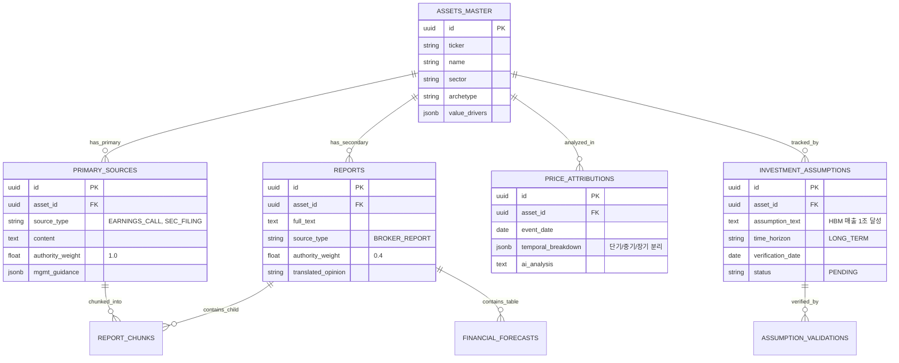

네, 이전 v9.0의 모든 내용을 기반으로, **Claude의 비평과 Gemini의 검토를 반영하여 완성한 진정한 최종 버전인 '투자 인텔리전스 시스템 v10.0 (Strategic Intelligence Upgrade)'**을 작성합니다.

기존 설계의 강력함은 유지하면서, **"코에 걸면 코걸이" 식의 사후적 해석 문제를 해결**하기 위한 핵심 설계 3가지(시간축 분리, 가정 검증, 1차 데이터 우선)를 아키텍처 뼈대에 깊숙이 이식했습니다.

---

# 📊 투자 인텔리전스 시스템: 증권사 리포트 분석 설계서 (Final Strategic Ver. 10.0)

> **문서 목적**: 단순 텍스트 검색(Naive RAG)의 한계를 극복하고, **'시간축 분리(Temporal Decomposition)'**와 **'1차 데이터 신뢰도(Primary Data Weighting)'**, **'가정 검증(Assumption Validation)'**을 통해 시장의 소음(Noise)과 진짜 신호(Signal)를 분리하는 **'Strategic Intelligence Agent'** 구축.

---

## 1. 설계 개요 및 전략적 목표 (Strategic Goals v10)

### 1.1 핵심 설계 원칙 (Design Principles)
본 시스템은 정보의 요약을 넘어, **'투자 논리의 검증 가능성'**과 **'신호의 시간적 독립성'**에 집중합니다.

1.  **Temporal Signal Decomposition (시간축 신호 분리)**: 주가 변동의 원인을 단기(수급/심리), 중기(실적/섹터), 장기(구조/Thesis)로 엄격히 분리하여, 단기 노이즈에 장기 논리가 흔들리지 않게 합니다. (핵심 문제 해결)
2.  **Primary Data Authority (1차 데이터 권위)**: 애널리스트 리포트(2차 가공 정보)보다 실적발표 자료, 컨퍼런스콜 원문, 공시(1차 정보)에 더 높은 신뢰도 가중치를 부여하여 왜곡을 줄입니다.
3.  **Assumption-Based Reasoning (가정 기반 추론)**: "주가가 오를 것"이라는 예측이 아닌, "어떤 가정이 참일 때 가치가 상승한다"는 논리 구조를 생성하고, 이 가정 자체를 추적 검증합니다.
4.  **Dynamic Contextualization (동적 문맥화)**: 업종별 비즈니스 아키타입과 원가 민감도를 이해하여, 텍스트의 수치적 의미를 정확히 해석합니다.
5.  **Parent-Child Retrieval (스마트 인덱싱)**: 검색은 정제된 요약본(Child)으로, 추론은 원문(Parent)으로 수행하여 맥락 단절을 방지합니다.

### 1.2 시스템 아키텍처 (Architecture v10)


---
**[제1부] 완료.**
다음 섹션인 **[제2부: 데이터베이스 설계 (Schema Master) 및 핵심 로직]**을 이어서 작성하겠습니다. `continue`를 입력해 주세요.

## 2. 데이터베이스 설계 (Schema Master v10)

v9의 구체적인 필드와 v10의 전략적 기능(1차 데이터, 가정 검증, 시간축 분리)을 모두 반영한 통합 스키마입니다.

### 2.1 ERD (Entity Relationship Diagram)



### 2.2 SQL DDL (PostgreSQL)

```sql
-- ==========================================
-- 1. 종목 마스터 (Context Enrichment)
-- ==========================================
CREATE TABLE assets_master (
    id UUID PRIMARY KEY DEFAULT uuid_generate_v4(),
    ticker VARCHAR(20) UNIQUE,
    name VARCHAR(100) NOT NULL,
    sector VARCHAR(100),
    archetype VARCHAR(50), -- MANUFACTURING, FINANCE, PLATFORM
    value_drivers JSONB DEFAULT '{}',
    static_bm TEXT,
    updated_at TIMESTAMP DEFAULT NOW()
);

-- ==========================================
-- 2. 데이터 소스 통합 (Primary & Secondary)
-- ==========================================

-- 2-1. 증권사 리포트 (Secondary Source)
CREATE TABLE reports (
    id UUID PRIMARY KEY DEFAULT uuid_generate_v4(),
    asset_id UUID REFERENCES assets_master(id),
    person_id UUID, -- 애널리스트
    
    title TEXT,
    published_at TIMESTAMP NOT NULL,
    full_text TEXT, -- Parent Document
    
    -- v10: 데이터 신뢰도 가중치
    source_type VARCHAR(20) DEFAULT 'BROKER_REPORT',
    authority_weight FLOAT DEFAULT 0.4, -- 낮은 가중치
    
    -- Vision LLM 추출 데이터
    financial_forecasts JSONB,
    
    -- 의견 및 목표가
    raw_opinion VARCHAR(20),
    translated_opinion VARCHAR(20), -- STEALTH_SELL 등
    target_price FLOAT,
    
    created_at TIMESTAMP DEFAULT NOW()
);

-- 2-2. 1차 데이터 소스 (Primary Source: 컨퍼런스콜, 공시)
CREATE TABLE primary_sources (
    id UUID PRIMARY KEY DEFAULT uuid_generate_v4(),
    asset_id UUID REFERENCES assets_master(id),
    
    source_type VARCHAR(50), -- 'EARNINGS_CALL', 'DART_FILING', 'IR_MATERIAL'
    published_at TIMESTAMP,
    
    content TEXT, -- 원문 스크립트/본문
    
    -- v10: 1차 데이터는 높은 가중치
    authority_weight FLOAT DEFAULT 1.0,
    
    -- 구조화된 가이던스 추출
    mgmt_guidance JSONB, -- {"capex": "+20%", "margin_trend": "improving"}
    
    created_at TIMESTAMP DEFAULT NOW()
);

-- ==========================================
-- 3. 리포트 청크 (Parent-Child & Weighting)
-- ==========================================
CREATE TABLE report_chunks (
    id UUID PRIMARY KEY DEFAULT uuid_generate_v4(),
    
    -- 리포트 또는 1차 데이터 소스 참조
    source_id UUID, -- reports.id OR primary_sources.id
    source_type VARCHAR(20), -- 'REPORT' OR 'PRIMARY'
    
    content TEXT NOT NULL,
    embedding vector(1536),
    
    -- v10: 검색 시 신뢰도 가중치 반영을 위한 스냅샷
    authority_weight FLOAT,
    
    chunk_index INTEGER,
    created_at TIMESTAMP DEFAULT NOW()
);

-- 가중치 반영 벡터 인덱스 (Cosine Similarity)
CREATE INDEX idx_chunks_embedding ON report_chunks 
    USING ivfflat (embedding vector_cosine_ops) WITH (lists = 100);

-- ==========================================
-- 4. 시간축 분석 및 가정 검증 (v10 New)
-- ==========================================

-- 4-1. 시간축 신호 분리 결과 저장
CREATE TABLE price_attributions (
    id UUID PRIMARY KEY DEFAULT uuid_generate_v4(),
    asset_id UUID REFERENCES assets_master(id),
    event_date DATE NOT NULL,
    
    price_change_pct FLOAT,
    
    -- JSONB로 시간축별 분석 저장
    temporal_breakdown JSONB,
    /* 예시:
    {
        "short_term": {"factor": "US_RATE_SPIKE", "impact": "Negative", "thesis_intact": true},
        "medium_term": {"factor": "SECTOR_ROTATION", "impact": "Neutral"},
        "long_term": {"factor": "HBM_QUALIFICATION", "impact": "Positive", "confidence": 0.8}
    }
    */
    
    ai_analysis_summary TEXT,
    created_at TIMESTAMP DEFAULT NOW()
);

-- 4-2. 투자 가정 검증 시스템 (Assumption Validation)
CREATE TABLE investment_assumptions (
    id UUID PRIMARY KEY DEFAULT uuid_generate_v4(),
    asset_id UUID REFERENCES assets_master(id),
    
    -- 핵심 가정 내용
    assumption_text TEXT NOT NULL, -- "Q3 HBM 매출 1조 원 달성"
    assumption_category VARCHAR(50), -- "REVENUE", "MARGIN", "MACRO"
    time_horizon VARCHAR(20), -- "SHORT", "MEDIUM", "LONG"
    
    -- 예측 값 및 검증 기준
    predicted_value FLOAT, -- 1.0 (조원)
    metric_name VARCHAR(100), -- "Q3 HBM Revenue"
    verification_date DATE, -- "2024-10-31"
    
    -- 검증 결과 (배치 업데이트)
    actual_value FLOAT,
    is_correct BOOLEAN,
    validation_source TEXT, -- "DART_Q3_REPORT"
    
    -- 메타 학습용
    model_confidence_at_generation FLOAT,
    
    created_at TIMESTAMP DEFAULT NOW()
);

-- ==========================================
-- 5. 마켓 데이터 (기존 유지)
-- ==========================================
CREATE TABLE stock_prices (
    asset_id UUID REFERENCES assets_master(id),
    date DATE NOT NULL,
    close_price FLOAT NOT NULL,
    adjustment_factor FLOAT DEFAULT 1.0,
    PRIMARY KEY (asset_id, date)
);

CREATE TABLE macro_indicators (
    date DATE PRIMARY KEY,
    us_10y_yield FLOAT,
    krw_usd FLOAT,
    regime_tag VARCHAR(50) -- 'HIGH_RATE_STRONG_DOLLAR'
);
```

---

## 3. 핵심 로직 (Core Logic Master v10)

### 3.1 Temporal Signal Decomposer (시간축 신호 분리기)

사용자의 "코에 걸면 코걸이" 문제를 해결하는 핵심 엔진입니다. 주가 변동 이유를 단기/중기/장기로 분리하여, 단기 노이즈가 장기 투자 판단을 오염시키지 않게 막습니다.

```python
from datetime import date
from typing import Dict, List, Optional
from pydantic import BaseModel

class TemporalBreakdown(BaseModel):
    factor: str
    impact: str  # "POSITIVE", "NEGATIVE", "NEUTRAL"
    description: str
    thesis_intact: bool = True  # 해당 시간축 요인이 투자 논리에 영향을 주는가?

class TemporalAnalysisResult(BaseModel):
    short_term: TemporalBreakdown
    medium_term: TemporalBreakdown
    long_term: TemporalBreakdown
    conclusion: str

async def decompose_price_signal(
    asset_id: UUID, 
    event_date: date, 
    price_change_pct: float
) -> TemporalAnalysisResult:
    """
    주가 변동 발생 시, 에이전트가 관련 정보를 수집하여
    단기/중기/장기 요인으로 분리 분석합니다.
    """
    
    # 1. 관련 정보 수집 (Tool Use)
    # - 당일 매크로 데이터 (금리, 환율)
    # - 최근 3일 리포트/뉴스
    # - 최근 1달 공시/실적
    context = await gather_event_context(asset_id, event_date)
    
    # 2. LLM을 통한 시간축 분석 (Claude 3.7 Sonnet)
    prompt = f"""
    <task>
    종목 {asset_id}의 주가가 {event_date}에 {price_change_pct:.1f}% 변동했습니다.
    제공된 컨텍스트(매크로, 리포트, 공시)를 바탕으로, 이 주가 변동의 원인을 
    [단기/중기/장기] 세 가지 시간 지평으로 분리하여 분석하십시오.
    </task>
    
    <rules>
    1. 단기 (Short-Term): 1개월 이내. 수급, 심리, 매크로(금리/환율), 옵션 만기 등. 
       이는 기업 고유의 펀더멘털과 무관할 가능성이 높습니다.
    2. 중기 (Medium-Term): 1~6개월. 실적 리비전, 섹터 로테이션, 컨센서스 변화.
    3. 장기 (Long-Term): 6개월 이상. 구조적 경쟁력, 시장 점유율, 기술 우위.
    
    4. 중요: 단기 요인으로 인한 하락이라면, 장기 투자 논리(Thesis)는 "유효함(Thesis Intact)"으로 표시하십시오.
    </rules>
    
    <context>
    {context}
    </context>
    
    Output format: JSON (TemporalAnalysisResult)
    """
    
    response = await claude_client.messages.create(
        model="claude-3-7-sonnet-20250219",
        messages=[{"role": "user", "content": prompt}],
        tools=[pydantic_to_tool_schema(TemporalAnalysisResult)]
    )
    
    return parse_tool_response(response)
```

### 3.2 Assumption Extractor & Validator (가정 추출 및 검증기)

"주가가 맞았나?" 대신 "근거가 맞았나?"를 추적하여 AI의 추론력을 강화합니다.

```python
class InvestmentAssumption(BaseModel):
    assumption_text: str
    metric_name: str
    predicted_value: float
    verification_date: date
    thesis_dependency: str  # "Core", "Secondary"

async def extract_key_assumptions(
    analysis_context: str, 
    asset_id: UUID
) -> List[InvestmentAssumption]:
    """
    리포트나 분석 내용에서 핵심 가정(Assumption)을 추출하여 DB에 저장합니다.
    이는 6개월 후 메타 학습의 기준점이 됩니다.
    """
    
    prompt = f"""
    다음 투자 분석 내용에서, 향후 주가 상승/하락의 전제가 되는 
    핵심 가정(Key Assumptions) 3가지를 추출하십시오.
    
    이 가정들은 추후 실제 데이터와 비교하여 검증될 것입니다.
    
    분석 내용: {analysis_context}
    
    출력 예시:
    1. "Q3 HBM 매출은 1조 원을 초과할 것이다." (검증일: 2024-10-31)
    2. "원/달러 환율은 1350원 수준에서 안정될 것이다." (검증일: 2024-09-30)
    """
    
    assumptions = await claude_client.invoke_structured(prompt, InvestmentAssumption)
    
    # DB 저장
    for assumption in assumptions:
        await db.execute("""
            INSERT INTO investment_assumptions 
            (asset_id, assumption_text, predicted_value, verification_date, status)
            VALUES ($1, $2, $3, $4, 'PENDING')
        """, asset_id, assumption.assumption_text, assumption.predicted_value, assumption.verification_date)
    
    return assumptions

async def validate_assumptions_batch():
    """
    매월 1회 실행: 검증 기간이 지난 가정들의 실제 결과 확인 및 AI 피드백
    """
    targets = await db.fetch("""
        SELECT * FROM investment_assumptions 
        WHERE verification_date <= NOW() AND status = 'PENDING'
    """)
    
    for target in targets:
        # 1. 실제 데이터 조회 (DART, 주가 DB 등)
        actual_value = await fetch_actual_metric(target['metric_name'], target['verification_date'])
        
        # 2. 정확도 판정
        accuracy = calculate_accuracy(target['predicted_value'], actual_value)
        is_correct = accuracy > 0.8  # 허용 오차 20%
        
        # 3. DB 업데이트
        await db.execute("""
            UPDATE investment_assumptions 
            SET actual_value=$1, is_correct=$2, status='VERIFIED'
            WHERE id=$3
        """, actual_value, is_correct, target['id'])
        
        # 4. 틀린 가정에 대한 원인 분석 (Self-Reflection)
        if not is_correct:
            reflection = await claude_client.analyze_error(target, actual_value)
            # 이 피드백은 추후 Dynamic Context Injector에 반영되어 
            # 유사 상황에서의 판단 보정에 사용됨
```

### 3.3 Authority-Weighted Retrieval (신뢰도 가중 검색)

1차 데이터(컨퍼런스콜)와 2차 데이터(리포트)를 통합 검색하되, 신뢰도에 따라 가중치를 부여합니다.

```python
async def retrieve_hybrid_context(query: str, asset_id: UUID):
    query_vector = await generate_embedding(query)
    
    # PostgreSQL의 벡터 검색 + 사용자 정의 스코어링
    # (1 - cosine_distance) * authority_weight 로 최종 점수 계산
    results = await db.fetch("""
        SELECT 
            content,
            source_type,
            authority_weight,
            1 - (embedding <=> $1) as similarity,
            (1 - (embedding <=> $1)) * authority_weight as final_score
        FROM report_chunks
        WHERE asset_id = $2
        ORDER BY final_score DESC
        LIMIT 10
    """, query_vector, asset_id)
    
    # 결과 해석 예시
    # 1. Earnings Call (authority_weight: 1.0, similarity: 0.8) -> score: 0.8
    # 2. Broker Report (authority_weight: 0.4, similarity: 0.95) -> score: 0.38
    # -> 리포트가 더 유사해도, 1차 데이터의 권위를 반영하여 상위 노출
    
    return results
```

---
**[제2부] 완료.**
다음 섹션인 **[제3부: 딥 리서치 엔진 및 에이전트 런타임]**을 이어서 작성하겠습니다. `continue`를 입력해 주세요.

## 4. 딥 리서치 엔진 및 에이전트 런타임 (Agent Runtime v10)

단순 RAG를 넘어, 에이전트가 능동적으로 데이터를 탐색하고, 시간축을 분리하며, 스스로 검증 가능한 가정을 생성하는 구조입니다.

### 4.1 Tool-Use 정의 (Agent Tools)

v10 에이전트는 다음 4가지 도구를 사용하여 사용자 질문에 대한 심층 분석을 수행합니다.

```python
from anthropic import Anthropic

# Tool Definitions
tools = [
    {
        "name": "retrieve_hybrid_context",
        "description": "1차 데이터(컨퍼런스콜/공시)와 2차 데이터(리포트)를 통합 검색합니다. 신뢰도 가중치가 적용됩니다.",
        "input_schema": {
            "type": "object",
            "properties": {
                "query": {"type": "string", "description": "검색 쿼리"},
                "asset_id": {"type": "string"}
            },
            "required": ["query", "asset_id"]
        }
    },
    {
        "name": "decompose_price_signal",
        "description": "주가 변동의 원인을 단기(수급/심리), 중기(실적), 장기(구조)로 분리 분석합니다.",
        "input_schema": {
            "type": "object",
            "properties": {
                "asset_id": {"type": "string"},
                "event_date": {"type": "string", "format": "date"}
            },
            "required": ["asset_id", "event_date"]
        }
    },
    {
        "name": "extract_key_assumptions",
        "description": "분석 내용에서 향후 검증 가능한 핵심 투자 가정을 추출하여 DB에 저장합니다.",
        "input_schema": {
            "type": "object",
            "properties": {
                "analysis_text": {"type": "string"},
                "asset_id": {"type": "string"}
            },
            "required": ["analysis_text", "asset_id"]
        }
    },
    {
        "name": "check_validation_history",
        "description": "과거 이 종목에 대해 제기된 가정들의 검증 결과(성공/실패)를 조회하여 신뢰도를 판단합니다.",
        "input_schema": {
            "type": "object",
            "properties": {
                "asset_id": {"type": "string"},
                "assumption_type": {"type": "string"}
            },
            "required": ["asset_id"]
        }
    }
]
```

### 4.2 시스템 프롬프트 (System Prompt v10)

에이전트의 사고 과정을 강제하는 강력한 프롬프트입니다.

```text
<system_prompt>
너는 월스트리트 최고 수준의 펀더멘털/퀀트 애널리스트다.
단순한 정보 요약이 아닌, **'검증 가능한 논리'**와 **'시간축 분리'**를 통해 투자 통찰을 제공해야 한다.

<rules>
1. **Source Authority (출처 신뢰도)**:
   - 정보 출처가 'Earnings Call'이나 'Official Filing'인 경우, 'Broker Report'보다 높은 신뢰도를 부여하라.
   - 리포트의 "시장 상승 전망"보다 경영진의 "구체적인 가이던스"를 우선시하라.

2. **Temporal Decomposition (시간축 분리)**:
   - "왜 떨어졌나?"라는 질문에 단일 이유를 대지 말라.
   - 반드시 [단기 요인], [중기 요인], [장기 요인]을 구분하라.
   - 단기 요인(금리, 수급)으로 인한 하락은 "투자 기회(Thesis Intact)"일 수 있음을 명시하라.

3. **Assumption Extraction (가정 추출)**:
   - 긍정적 전망을 제시할 때, 그 전망이 참이 되기 위한 핵심 가정(Key Assumption)을 반드시 명시하라.
   - 예: "목표주가 상향 전망은 HBM 매출이 1조 원을 넘을 것이라는 가정에 기반함."

4. **Stealth Signal Detection (은닉 신호)**:
   - 겉으로 드러나지 않은 '스텔스 하향'이나 '목표가 컷'을 경계하라.
   - 리포트 의견이 'Buy'라도 목표가가 대폭 하향(-10% 이상)된 경우, 이를 강력한 매도 신호로 해석하라.
</rules>

출력 형식은 사용자 질문에 따라 유연하게 조정되나, 핵심 논리는 반드시 위 규칙을 따라야 한다.
</system_prompt>
```

### 4.3 에이전트 실행 흐름 (Workflow)

```python
async def run_agent_loop(user_query: str, asset_id: UUID):
    messages = [{"role": "user", "content": user_query}]
    
    while True:
        response = await client.messages.create(
            model="claude-3-7-sonnet-20250219",
            system=SYSTEM_PROMPT_V10,
            tools=tools,
            messages=messages
        )
        
        if response.stop_reason == "tool_use":
            # 도구 사용 처리
            tool_inputs = [block for block in response.content if block.type == "tool_use"]
            tool_results = []
            
            for tool_input in tool_inputs:
                if tool_input.name == "decompose_price_signal":
                    result = await decompose_price_signal(**tool_input.input)
                    tool_results.append({"type": "tool_result", "tool_use_id": tool_input.id, "content": result.json()})
                
                elif tool_input.name == "retrieve_hybrid_context":
                    result = await retrieve_hybrid_context(**tool_input.input)
                    tool_results.append({"type": "tool_result", "tool_use_id": tool_input.id, "content": str(result)})
            
            # 도구 결과를 컨텍스트에 추가 후 계속 진행
            messages.append({"role": "assistant", "content": response.content})
            messages.append({"role": "user", "content": tool_results})
            
        elif response.stop_reason == "end_turn":
            # 최종 답변 도출
            final_text = "".join([block.text for block in response.content if hasattr(block, 'text')])
            
            # 답변 생성 후, 핵심 가정 자동 추출 시도
            await extract_key_assumptions(final_text, asset_id)
            
            return final_text
```

### 4.4 Prompt Caching (비용 최적화)

긴 시스템 프롬프트와 도구 정의를 캐싱하여 비용을 절감합니다.

```python
client.messages.create(
    model="claude-3-7-sonnet-20250219",
    system=[
        {
            "type": "text",
            "text": SYSTEM_PROMPT_V10, # 약 2000 토큰
            "cache_control": {"type": "ephemeral"}
        },
        {
            "type": "text",
            "text": asset_master_context, # 종목별 Context (약 3000 토큰)
            "cache_control": {"type": "ephemeral"}
        }
    ],
    tools=tools, # 도구 정의도 캐싱 가능
    messages=messages
)
```

---
**[제3부] 완료.**
마지막 섹션인 **[제4부: 최종 유즈케이스 및 결론]**을 이어서 작성하겠습니다. `continue`를 입력해 주세요.

## 5. 최종 유즈케이스 (Ultimate Use Cases v10)

v10 시스템이 완성되었을 때, 사용자가 겪게 될 구체적인 문제 해결 시나리오입니다. 특히 **"뉴스는 없는데 가격만 변함"**이라는 사용자의 고민을 어떻게 해결하는지에 집중합니다.

### Case 1. "뉴스 없는 하락"의 진실 탐지 (Noise Filtering)
*   **상황**: 삼성전자가 특별한 악재 뉴스 없이 -3% 급락. 사용자는 "무슨 일이 있나?" 불안함에 검색.
*   **v10 에이전트 동작**:
    1.  **Tool Use**: `decompose_price_signal` 실행.
    2.  **단기 분석**: 당일 미국 10년물 국채 금리가 4.5%로 급등한 점을 포착. 기관/외국인 수급 데이터 확인 결과 성장주 전반 매도 우려 확인.
    3.  **장기 분석**: 최근 리포트와 공시를 스캔. HBM 인증 진척도나 파운드리 고객사 이슈 등 "펀더멘털 변화"는 없음.
    4.  **결론 도출**:
        ```
        📊 [시간축 분석 결과]
        
        ▶ 단기 요인 (Down): 미국 금리 급등에 따른 전반적인 시장 'Risk-off' 분위기.
           - 영향: 일시적 수급 불균형.
           
        ▶ 장기 Thesis (Intact): HBM 엔비디아 공급망 편입 논리는 변함 없음.
           - 판단: 단기 매도세는 소음(Noise)으로 판단됨.
           
        💡 제안: 장기 투자 논리(Thesis)가 유효하므로, 현재 하락은 '저점 매수 기회'로 해석 가능.
        ```

### Case 2. 경영진의 말 vs 애널리스트의 말 (Authority Weighting)
*   **상황**: 테슬라 실적 발표 직후, 경영진은 "사이버트럭 생산 램프업 순조로움"이라고 했지만, 일부 증권사 리포트는 "마진 압박 우려"를 강조하며 목표가를 하향.
*   **v10 에이전트 동작**:
    1.  **Data Retrieval**: `retrieve_hybrid_context`에서 쿼리.
    2.  **가중치 적용**:
        *   Source A (Earnings Call): `authority_weight: 1.0` (경영진 직접 발언).
        *   Source B (Broker Report): `authority_weight: 0.4` (애널리스트 해석).
    3.  **충돌 분석**:
        ```
        🔍 [정보 신뢰도 비교]
        
        1. 경영진 가이던스 (Primary):
           - "사이버트럭 원가 절감 로드맵 구체화됨" (신뢰도: 높음)
           
        2. 애널리스트 우려 (Secondary):
           - "단기 마진 하락 가능성" (신뢰도: 중간 - 추정치 기반)
           
        ⚖️ [종합 판단]: 애널리스트의 단기 마진 우려는 사실이나, 
           경영진의 원가 절감 계획(Primary)을 고려할 때 
           마진 회복 속도는 시장 우려보다 빠를 가능성이 있음.
           따라서 목표가 하향은 과도한 비관으로 보임.
        ```

### Case 3. "내 예측은 왜 맞았나?" (Assumption Validation)
*   **상황**: 3개월 전, AI가 "이수페타시스는 AI 서버 수요 증가로 실적 쇼크가 없을 것"이라고 예측했고, 실제 주가가 상승함.
*   **v10 메타 학습 (Batch Process)**:
    1.  **가정 확인**: 당시 AI는 `"HBM용 기판 출하량이 Q3에 20% 증가할 것"`이라는 핵심 가정을 세웠음.
    2.  **실제 데이터 비교**: DART 공시를 통해 실제 Q3 출하량이 25% 증가한 것을 확인.
    3.  **검증 결과**: `is_correct: True`.
    4.  **피드백**: 시스템은 "AI 서버 수요와 기판 출하량의 상관관계 분석" 가중치를 높임. 다음 유사 분석 시 더 높은 신뢰도를 제공.

---

## 6. 결론 (Executive Summary)

본 설계서 v10.0은 단순한 정보 검색기를 넘어, **'스스로 생각하고 검증하는 투자 파트너'**로 진화했습니다.

1.  **문제의 본질 해결**: "코에 걸면 코걸이" 식의 사후적 해석 문제를 **시간축 분리(Temporal Decomposition)**로 해결했습니다. 단기 노이즈와 장기 시그널을 분리하여 투자자의 혼란을 막습니다.
2.  **정보의 위계 확립**: 애널리스트 리포트(2차)보다 경영진 발언과 공시(1차)를 우선시하는 **1차 데이터 권위(Primary Data Authority)**를 적용했습니다.
3.  **검증 가능한 논리**: "주가가 오를 것"이라는 예측 대신, "어떤 가정이 참일 때 오른다"는 논리를 제시하고 이를 추적하는 **가정 검증 시스템(Assumption Validation)**을 도입했습니다.
4.  **진화하는 시스템**: 과거 예측의 성패를 학습하여 스스로 가중치를 조정하는 **메타 러닝(Feedback Loop)** 구조를 갖추었습니다.

이 시스템은 개인 투자자에게 기관 이상의 분석 프레임워크를 제공하며, 시장의 소음 속에서 진정한 알파(Alpha)를 발견하는 강력한 도구가 될 것입니다.

---
**[최종 문서 완료]**