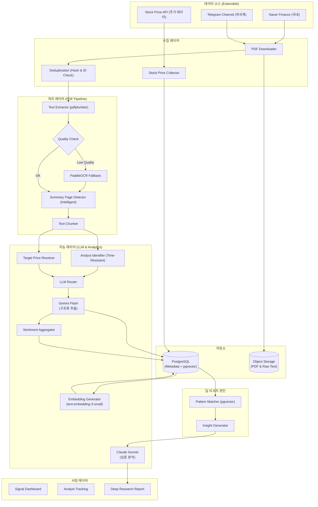
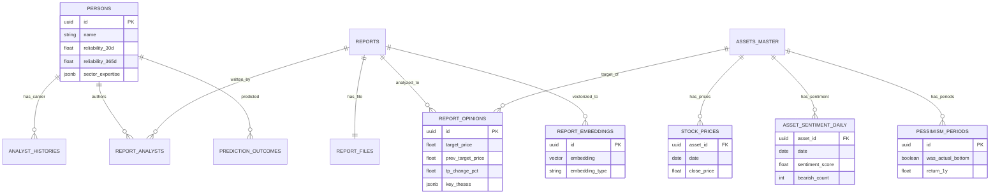
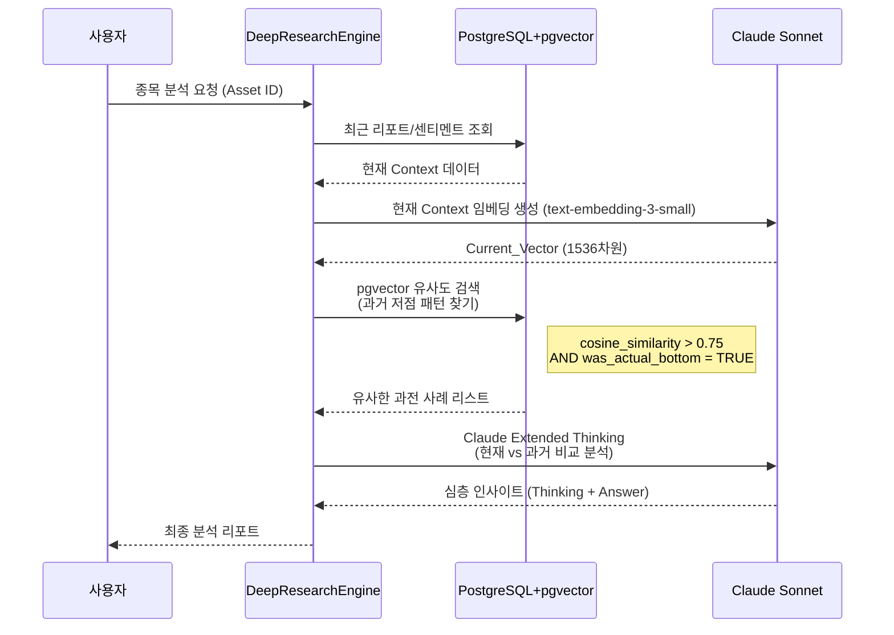

네, 그동안 논의된 모든 내용(초기 설계부터 Claude 검토사항, pgvector 도입, LLM 전략 변경, 딥 리서치 파이프라인 등)을 빠짐없이 통합하여 최종 설계 문서를 작성하겠습니다. 요청하신 대로 분할하여 작성하오니, 완료될 때까지 `continue`를 입력해 주시기 바랍니다.

---

# 📊 투자 인텔리전스 시스템: 증권사 리포트 분석 설계서 (Final Ver.)

> **문서 목적**: 증권사 리포트(PDF)에서 핵심 투자 신호를 추출하고, 애널리스트 이력과 성과를 추적하여 시장의 왜곡된 신호를 교정하며, 나아가 역사적 패턴 분석을 통한 심층 투자 인사이트를 제공하는 시스템 구축.

---

## 1. 설계 개요 및 핵심 원칙

본 시스템은 단순한 텍스트 요약을 넘어, 데이터의 신뢰성을 검증하고 시장의 숨은 신호를 포착하는 것을 목표로 합니다.

### 1.1 핵심 설계 원칙
1.  **신호 해석 중심 (Signal over Opinion)**: 한국 시장의 구조적 특성(매수 의견 과잉)을 고려하여, '목표가 하향 조정'과 같은 실질적 신호를 포착하고 가중치를 부여합니다.
2.  **데이터 정합성 (Data Integrity)**: 시간 역순 수집, 애널리스트 이직, 텍스트 품질 저하 등 실제 데이터 환경의 문제를 기술적으로 해결합니다.
3.  **운영 효율성 (Cost Efficiency)**: LLM 모델 라우팅 전략을 통해 비용을 최적화하고, 스토리지 분리를 통해 DB 부하를 관리합니다.
4.  **심층 분석 (Deep Research)**: pgvector를 활용한 의미론적 검색으로 과거 패턴(예: 비관의 끝)과 현재 상황을 비교 분석합니다.

### 1.2 시스템 아키텍처 (System Architecture)

확장성을 고려한 모듈형 구조로, 데이터 소스 추가 및 분석 엔진 고도화가 용이하도록 설계되었습니다.



---

## 2. PDF 처리 파이프라인 (Advanced Pipeline)

증권사 리포트의 다양한 형식을 대응하고 데이터 추출 정확도를 높이기 위한 전처리 과정입니다.

### 2.1 텍스트 추출 및 품질 검증 (Quality Assurance)
일부 PDF는 이미지 위에 **가짜 텍스트 레이어**(복사 방지 목적)가 존재하여 추출 시 깨진 텍스트가 반환됩니다. 이를 감지하여 OCR로 자동 전환하는 로직을 적용했습니다.

```python
class TextQualityChecker:
    GARBAGE_THRESHOLD = 0.3  # 깨진 문자 허용 비율
    
    def assess(self, text: str) -> tuple[bool, float]:
        if len(text) < 100: 
            return False, 0.0
        
        # 유효 문자(한글/영문/숫자/기호) 비율 계산
        valid_chars = sum(1 for c in text if self._is_valid(c))
        quality_score = valid_chars / len(text)
        
        # 유효 문자 비율이 임계값 미만이면 불량 판정 -> OCR 폴백 필요
        return quality_score >= (1 - self.GARBAGE_THRESHOLD), quality_score

    def _is_valid(self, char: str) -> bool:
        cp = ord(char)
        return (
            0xAC00 <= cp <= 0xD7A3 or  # 한글 완성형
            0x0041 <= cp <= 0x007A or  # 영문
            0x0030 <= cp <= 0x0039 or  # 숫자
            char in ' .,()%\n\t-+'     # 일반 기호
        )

# 파이프라인 적용 예시
def extract_text(pdf_path: str) -> tuple[str, str]:
    # 1차: pdfplumber 시도 (표 구조 보존)
    text = pdfplumber_extract(pdf_path)
    is_ok, score = TextQualityChecker().assess(text)
    
    # 품질 불량 시 OCR로 폴백
    if not is_ok:
        text = paddleocr_extract(pdf_path)
        return text, 'ocr'
        
    return text, 'pdfplumber'
```

### 2.2 지능형 요약 페이지 탐지 (Intelligent Detection)
모든 리포트가 첫 페이지에 요약을 포함하지 않습니다. 키워드 점수 기반 탐지 로직을 적용하여 탐색 범위를 **최대 5페이지**로 확장하고 레이아웃 패턴을 고려합니다.

```python
def detect_summary_page(pages_text: list[str]) -> int:
    """
    키워드 점수가 가장 높은 페이지를 요약 페이지로 간주.
    """
    KEYWORDS = ["투자의견", "목표주가", "Buy", "Hold", "TP", "Rating", 
                "EPS", "PER", "현재주가", "상승여력"]
    
    best_score, best_idx = -1, 0
    search_range = min(5, len(pages_text)) # 효율성을 위해 처음 5페이지만 탐색
    
    for i, text in enumerate(pages_text[:search_range]): 
        score = sum(1 for kw in KEYWORDS if kw in text)
        
        # 표 구조가 감지되면 가중치 부여
        if has_table_structure(text): score += 2 
        
        # 표지 다음 페이지(인덱스 1) 우선도 소폭 부여 (일반적인 리포트 구조)
        if i == 1: score += 0.5
        
        if score > best_score:
            best_score, best_idx = score, i
            
    return best_idx
```

## 3. 데이터베이스 설계 (Database Schema)

데이터 정합성, 확장성, 그리고 pgvector를 활용한 심층 분석을 지원하는 최종 스키마입니다.

### 3.1 ERD (Entity Relationship Diagram)



### 3.2 SQL DDL (PostgreSQL)

pgvector 확장을 포함한 전체 테이블 정의입니다.

```sql
-- ==========================================
-- 0. 확장 기능 및 ENUM (Types)
-- ==========================================
CREATE EXTENSION IF NOT EXISTS "uuid-ossp";
CREATE EXTENSION IF NOT EXISTS "pgvector";
CREATE EXTENSION IF NOT EXISTS "pg_trgm"; -- 텍스트 유사도 검색용

-- 의견 유형
CREATE TYPE opinion_type AS ENUM ('STRONG_BUY', 'BUY', 'HOLD', 'SELL', 'STRONG_SELL');
-- 이전 목표가 출처
CREATE TYPE prev_tp_source AS ENUM ('db_lookup', 'llm_extracted', 'unavailable');

-- 처리 상태 (버그 수정: validation_failed, skipped 추가)
CREATE TYPE processing_status AS ENUM (
    'collected', 'downloaded', 'text_extracted', 
    'llm_processed', 'completed', 
    'failed_download', 'failed_extraction', 'failed_llm',
    'validation_failed', 'skipped'
);

-- ==========================================
-- 1. 마스터 테이블 (Master Tables)
-- ==========================================

-- 종목 (Asset)
CREATE TABLE assets_master (
    id UUID PRIMARY KEY DEFAULT uuid_generate_v4(),
    ticker VARCHAR(20) UNIQUE,
    name VARCHAR(100) NOT NULL,
    market VARCHAR(20),
    sector VARCHAR(100),
    aliases JSONB DEFAULT '[]', -- 별칭 관리 (예: "삼전" -> "삼성전자")
    created_at TIMESTAMP DEFAULT NOW()
);
-- 별칭 검색 최적화
CREATE INDEX idx_assets_aliases ON assets_master USING gin(aliases);

-- 증권사
CREATE TABLE securities_firms (
    id UUID PRIMARY KEY DEFAULT uuid_generate_v4(),
    name VARCHAR(50) UNIQUE NOT NULL
);

-- 리포트 카테고리 (ENUM 대신 테이블로 유연성 확보)
CREATE TABLE report_categories (
    code VARCHAR(30) PRIMARY KEY, -- 'STOCK_ANALYSIS', 'INDUSTRY_ANALYSIS'
    naver_code VARCHAR(30),
    label_ko VARCHAR(50),
    llm_prompt_template TEXT, -- 카테고리별 프롬프트 관리
    is_active BOOLEAN DEFAULT TRUE
);

-- 애널리스트 (Person) - 다차원 신뢰도 반영
CREATE TABLE persons (
    id UUID PRIMARY KEY DEFAULT uuid_generate_v4(),
    name VARCHAR(50) NOT NULL,
    current_firm_id UUID REFERENCES securities_firms(id), -- 캐싱용 (배치 갱신)
    
    -- 다중 Horizon 신뢰도 (단기/장기 전문성 분리)
    reliability_30d FLOAT DEFAULT 50.0,
    reliability_90d FLOAT DEFAULT 50.0,
    reliability_180d FLOAT DEFAULT 50.0,
    reliability_365d FLOAT DEFAULT 50.0,
    
    sample_count INTEGER DEFAULT 0, -- 통계적 유의성 검증용
    sector_expertise JSONB DEFAULT '{}', -- {"반도체": 85.0, "바이오": 42.0}
    
    created_at TIMESTAMP DEFAULT NOW()
);

-- 애널리스트 이력 (이직 및 시간 역순 처리 대응)
CREATE TABLE analyst_histories (
    id UUID PRIMARY KEY DEFAULT uuid_generate_v4(),
    person_id UUID REFERENCES persons(id),
    firm_id UUID REFERENCES securities_firms(id),
    sector VARCHAR(100),
    
    -- 핵심: Valid Period 관리 (시간 역순 수집 대응)
    valid_from DATE NOT NULL, -- 해당 소속 시작일
    valid_to DATE,            -- 해당 소속 종료일 (NULL이면 현재)
    
    created_at TIMESTAMP DEFAULT NOW()
);
-- 이력 범위 쿼리 최적화
CREATE INDEX idx_analyst_histories_range 
    ON analyst_histories(person_id, valid_from, valid_to);

-- ==========================================
-- 2. 리포트 및 원본 관리 (Report & Files)
-- ==========================================

CREATE TABLE reports (
    id UUID PRIMARY KEY DEFAULT uuid_generate_v4(),
    title TEXT NOT NULL,
    published_at DATE NOT NULL,
    category_code VARCHAR(30) REFERENCES report_categories(code),
    
    -- 소스 추적
    source_url TEXT,
    naver_report_id VARCHAR(50) UNIQUE, -- 네이버 중복 수집 방지용 ID
    source_type VARCHAR(20) DEFAULT 'naver', -- 'naver', 'telegram'
    
    -- 처리 상태
    status processing_status DEFAULT 'collected',
    failed_stage VARCHAR(30),
    retry_count INTEGER DEFAULT 0,
    next_retry_at TIMESTAMP,
    
    created_at TIMESTAMP DEFAULT NOW()
);
-- 리포트 날짜 기반 조회
CREATE INDEX idx_reports_published_at ON reports(published_at DESC);

-- PDF 파일 및 추출물 (스토리지 최적화)
CREATE TABLE report_files (
    id UUID PRIMARY KEY DEFAULT uuid_generate_v4(),
    report_id UUID REFERENCES reports(id),
    file_hash VARCHAR(64) UNIQUE, -- 중복 방지 (SHA-256)
    storage_path TEXT,            -- PDF 파일 경로 (S3/Local)
    raw_text_path TEXT,           -- 추출된 전체 텍스트 경로 (DB 부하 방지)
    summary_text TEXT,            -- 탐지된 요약 페이지 텍스트 (분석용)
    extraction_method VARCHAR(20),-- 'pdfplumber', 'ocr'
    created_at TIMESTAMP DEFAULT NOW()
);

-- 리포트-애널리스트 매핑 (다중 작성자 대응 M:N)
CREATE TABLE report_analysts (
    report_id UUID REFERENCES reports(id),
    person_id UUID REFERENCES persons(id),
    role VARCHAR(20) DEFAULT 'author', -- 'author', 'co_author'
    PRIMARY KEY (report_id, person_id)
);

-- ==========================================
-- 3. 분석 결과 (Analysis Results)
-- ==========================================

-- 공통 분석 결과
CREATE TABLE report_opinions (
    id UUID PRIMARY KEY DEFAULT uuid_generate_v4(),
    report_id UUID REFERENCES reports(id),
    asset_id UUID REFERENCES assets_master(id), -- 종목 분석 시에만 유효
    
    -- 목표가 및 의견
    target_price FLOAT,
    prev_target_price FLOAT,       -- 이전 리포트 대비
    prev_tp_source prev_tp_source, -- 출처 명시 ('db_lookup' 우선)
    
    current_stock_price FLOAT,     -- 발행일 종가
    opinion_label opinion_type,
    
    -- 계산 필드 (Generated Columns)
    tp_change_pct FLOAT GENERATED ALWAYS AS (
        CASE 
            WHEN prev_target_price IS NULL OR prev_target_price = 0 THEN NULL
            ELSE ((target_price - prev_target_price) / prev_target_price) * 100 
        END
    ) STORED,
    
    tp_upside_pct FLOAT GENERATED ALWAYS AS (
        CASE 
            WHEN current_stock_price IS NULL OR current_stock_price = 0 THEN NULL
            ELSE ((target_price - current_stock_price) / current_stock_price) * 100 
        END
    ) STORED,
    
    -- LLM 추출 내용
    key_facts JSONB,    -- 객관적 팩트
    key_theses JSONB,   -- 주관적 논리
    risk_factors JSONB, -- 리스크 요인
    
    -- LLM 메타데이터 (버전 관리)
    llm_raw_response JSONB,    -- 원본 보존 (재처리용)
    llm_model VARCHAR(50),     -- 'gemini-2.0-flash', 'claude-3.7-sonnet'
    llm_prompt_version VARCHAR(20), -- 'v2.1'
    extraction_confidence FLOAT,    -- LLM 자신감 점수
    
    created_at TIMESTAMP DEFAULT NOW()
);
-- 자산별 의견 이력 조회
CREATE INDEX idx_report_opinions_asset_date 
    ON report_opinions(asset_id, created_at DESC);
-- 프롬프트 버전별 재처리용
CREATE INDEX idx_opinions_prompt_version 
    ON report_opinions(llm_prompt_version, llm_model);

-- 섹터 분석 상세 (확장성)
CREATE TABLE sector_analysis_details (
    opinion_id UUID PRIMARY KEY REFERENCES report_opinions(id),
    sector_name VARCHAR(100),
    market_outlook VARCHAR(20), -- 'OVERWEIGHT', 'NEUTRAL'
    top_picks JSONB             -- [{"ticker": "...", "reason": "..."}]
);

-- ==========================================
-- 4. 임베딩 및 벡터 검색 (pgvector)
-- ==========================================

CREATE TABLE report_embeddings (
    id UUID PRIMARY KEY DEFAULT uuid_generate_v4(),
    report_id UUID REFERENCES reports(id) ON DELETE CASCADE,
    opinion_id UUID REFERENCES report_opinions(id),
    
    embedding_type VARCHAR(30) NOT NULL, -- 'thesis', 'risk', 'summary', 'combined'
    embedding vector(1536),              -- text-embedding-3-small (1536차원)
    
    model_used VARCHAR(50) DEFAULT 'text-embedding-3-small',
    token_count INTEGER,
    created_at TIMESTAMP DEFAULT NOW()
);

-- IVFFlat 인덱스 (데이터 10만건 이상 시 HNSW로 교체 고려)
CREATE INDEX idx_embeddings_thesis 
    ON report_embeddings USING ivfflat (embedding vector_cosine_ops) 
    WITH (lists = 100)
    WHERE embedding_type = 'thesis';

CREATE INDEX idx_embeddings_risk 
    ON report_embeddings USING ivfflat (embedding vector_cosine_ops) 
    WITH (lists = 100)
    WHERE embedding_type = 'risk';

-- ==========================================
-- 5. 시계열 분석 및 평가 (Time-Series & Evaluation)
-- ==========================================

-- 주가 시계열 (예측 평가 + 패턴 분석 기반)
CREATE TABLE stock_prices (
    asset_id UUID REFERENCES assets_master(id),
    date DATE NOT NULL,
    close_price FLOAT NOT NULL,
    volume BIGINT,
    market_cap BIGINT,
    PRIMARY KEY (asset_id, date)
);
CREATE INDEX idx_stock_prices_date ON stock_prices(date DESC);

-- 종목별 일별 센티멘트 집계
CREATE TABLE asset_sentiment_daily (
    asset_id UUID REFERENCES assets_master(id),
    date DATE NOT NULL,
    
    bullish_count INTEGER DEFAULT 0,   -- BUY + STRONG_BUY
    neutral_count INTEGER DEFAULT 0,   -- HOLD
    bearish_count INTEGER DEFAULT 0,   -- SELL + STRONG_SELL
    
    avg_target_price FLOAT,
    avg_tp_change_pct FLOAT,           -- 평균 목표가 변화율
    consecutive_tp_down INTEGER,       -- 연속 목표가 하향 건수 (비관 심화 지표)
    
    sentiment_score FLOAT,             -- (bullish - bearish) / total
    analyst_consensus_divergence FLOAT,-- 의견 분산도
    
    PRIMARY KEY (asset_id, date)
);

-- 비관 국면 마킹 (학습 데이터)
CREATE TABLE pessimism_periods (
    id UUID PRIMARY KEY DEFAULT uuid_generate_v4(),
    asset_id UUID REFERENCES assets_master(id),
    
    start_date DATE NOT NULL,
    end_date DATE,
    
    min_sentiment_score FLOAT,
    avg_tp_change_pct FLOAT,
    report_count INTEGER,
    
    -- 사후 평가
    was_actual_bottom BOOLEAN,
    price_at_start FLOAT,
    price_1y_after FLOAT,
    return_1y FLOAT GENERATED ALWAYS AS (
        CASE WHEN price_at_start > 0 
        THEN (price_1y_after - price_at_start) / price_at_start * 100 
        ELSE NULL END
    ) STORED,
    
    created_at TIMESTAMP DEFAULT NOW()
);

-- 예측 결과 (다중 Horizon)
CREATE TABLE prediction_outcomes (
    id UUID PRIMARY KEY DEFAULT uuid_generate_v4(),
    opinion_id UUID REFERENCES report_opinions(id),
    person_id UUID REFERENCES persons(id), -- 비정규화
    
    prediction_date DATE NOT NULL,
    predicted_target_price FLOAT NOT NULL,
    
    -- Horizon별 실적 (개별 컬럼 관리)
    actual_price_30d FLOAT, is_correct_30d BOOLEAN, evaluated_30d_at TIMESTAMP,
    actual_price_90d FLOAT, is_correct_90d BOOLEAN, evaluated_90d_at TIMESTAMP,
    actual_price_180d FLOAT, is_correct_180d BOOLEAN, evaluated_180d_at TIMESTAMP,
    actual_price_365d FLOAT, is_correct_365d BOOLEAN, evaluated_365d_at TIMESTAMP,
    
    created_at TIMESTAMP DEFAULT NOW()
);
-- 평가 대기 중인 예측 배치용
CREATE INDEX idx_prediction_unevaluated 
    ON prediction_outcomes(prediction_date) 
    WHERE evaluated_365d_at IS NULL;
```

## 4. 핵심 로직 (Core Logic)

데이터의 정합성을 보장하고 운영 효율을 높이기 위한 핵심 알고리즘입니다.

### 4.1 목표가 출처 해결 (Target Price Resolver)

리포트 본문에 명시된 "기존 목표가"는 수정 과정에서의 오류나 오타 가능성이 있으므로, **DB에 저장된 직전 리포트의 목표가**를 최우선으로 신뢰하여 데이터 정합성을 확보합니다.

```python
class TargetPriceResolver:
    """
    prev_target_price 결정 우선순위:
    1. DB에서 동일 자산의 직전 리포트 조회 (가장 신뢰)
    2. LLM이 본문에서 추출한 값 (보조)
    3. NULL (산출 불가)
    """
    async def resolve(
        self, 
        asset_id: UUID, 
        report_date: date,
        llm_extracted_prev_tp: float | None
    ) -> tuple[float | None, str]:
        
        # 1. DB에서 동일 자산의 직전 리포트 조회 (최우선)
        db_prev = await self.db.fetchrow("""
            SELECT ro.target_price
            FROM report_opinions ro
            JOIN reports r ON r.id = ro.report_id
            WHERE ro.asset_id = $1 
              AND r.published_at < $2
              AND ro.target_price IS NOT NULL
            ORDER BY r.published_at DESC
            LIMIT 1
        """, asset_id, report_date)
        
        if db_prev:
            return db_prev['target_price'], 'db_lookup'
        
        # 2. LLM이 본문에서 추출한 값 (보조)
        if llm_extracted_prev_tp:
            return llm_extracted_prev_tp, 'llm_extracted'
            
        return None, 'unavailable'
```

### 4.2 시간 역순 이력 처리 (Time-Resistant History)

리포트가 발행일 역순으로 수집되더라도 애널리스트의 소속 이력이 꼬이지 않도록, **Valid Period(유효기간)** 개념을 사용하여 미래/과거 이력과의 충돌을 안전하게 처리합니다.

```python
async def upsert_analyst_history(
    person_id: UUID, 
    firm_id: UUID, 
    report_date: date
):
    """
    과거 리포트가 나중에 수집되어도 미래의 이력 데이터와 충돌하지 않도록 처리.
    """
    async with db.transaction():
        # 해당 날짜 이후의 가장 오래된 이력 (Future)
        future_h = await db.fetchrow("""
            SELECT id, firm_id, valid_from FROM analyst_histories
            WHERE person_id = $1 AND valid_from > $2
            ORDER BY valid_from ASC LIMIT 1
        """, person_id, report_date)
        
        # 해당 날짜 이전의 가장 최근 이력 (Past)
        past_h = await db.fetchrow("""
            SELECT id, firm_id FROM analyst_histories
            WHERE person_id = $1 AND valid_from <= $2
            ORDER BY valid_from DESC LIMIT 1
        """, person_id, report_date)
        
        # 케이스 1: 이미 동일 기간/소속 이력이 존재하면 종료
        if past_h and past_h['firm_id'] == firm_id:
            return

        # 케이스 2: 미래 이력과 같은 회사면 valid_from을 과거로 당김 (기간 연장)
        if future_h and future_h['firm_id'] == firm_id:
            await db.execute(
                "UPDATE analyst_histories SET valid_from = $1 WHERE id = $2",
                report_date, future_h['id']
            )
            return

        # 케이스 3: 신규 이력 생성
        # 종료일(valid_to)은 미래 이력의 시작일 하루 전으로 설정
        valid_to = (future_h['valid_from'] - timedelta(days=1)) if future_h else None
        
        await db.execute("""
            INSERT INTO analyst_histories 
            (person_id, firm_id, valid_from, valid_to)
            VALUES ($1, $2, $3, $4)
        """, person_id, firm_id, report_date, valid_to)
```

### 4.3 신뢰도 점수: 시간 감쇠 (Time Decay)

오래된 예측보다 최근 예측의 적중 여부가 점수에 더 큰 영향을 주도록 반영합니다. 또한 샘플 수가 적을 때의 통계적 편향을 보정합니다.

```python
import math

def calculate_reliability_score(outcomes: list[dict]) -> float:
    """
    시간 감쇠 가중 신뢰도 점수
    - 최근 예측일수록 가중치 높음 (반감기: 365일)
    - 샘플 수 보정 유지
    """
    if not outcomes:
        return 50.0
    
    HALF_LIFE_DAYS = 365  # 1년 전 예측은 현재의 50% 가중치
    
    weighted_hits = 0.0
    total_weight = 0.0
    
    for outcome in outcomes:
        days_ago = (date.today() - outcome['prediction_date']).days
        # 시간 감쇠 가중치 계산
        weight = math.exp(-days_ago * math.log(2) / HALF_LIFE_DAYS)
        
        # 365일 적중 여부 기준 (없으면 180d, 90d 순)
        hit = 1 if outcome.get('is_correct_365d') else 0
        
        weighted_hits += weight * hit
        total_weight += weight
    
    if total_weight == 0:
        return 50.0
    
    weighted_rate = weighted_hits / total_weight
    
    # 샘플 수 보정 (최소 10건이어야 Full Credit)
    confidence = min(1.0, len(outcomes) / 10.0)
    
    # 기본 점수 50점 기준 계산
    return 50 + (weighted_rate * 100 - 50) * confidence
```

---

## 5. LLM 분석 전략 (LLM Strategy)

### 5.1 모델 역할 분리 (Model Routing)

비용 효율성과 분석 품질을 모두 잡기 위해 모델 용도를 명확히 분리합니다.

| 작업 유형 | 사용 모델 | 이유 |
| :--- | :--- | :--- |
| **구조화 추출** | **Gemini 2.0 Flash** | 저비용, 고속 처리. 대량의 PDF 텍스트 처리에 적합. Structured Output 지원. |
| **심층 분석** | **Claude 3.7 Sonnet** | 강력한 추론 능력(Extended Thinking). 복잡한 패턴 분석 및 시장 비교에 적합. |
| **임베딩 생성** | **text-embedding-3-small** | 적절한 차원 수(1536)와 한국어 성능의 균형. pgvector 호환. |

### 5.2 LLM Router 구현

```python
from anthropic import Anthropic
import google.generativeai as genai
from openai import OpenAI
from pydantic import BaseModel

class StockAnalysisModel(BaseModel):
    """단일 종목 분석 결과 구조 (Structured Output용)"""
    asset_name: str
    opinion: str
    target_price: float | None
    prev_target_price_in_report: float | None # 리포트에 명시된 기존 목표가
    key_theses: list[str]
    risk_factors: list[str]

class ImprovedLLMRouter:
    
    def __init__(self):
        self.gemini = genai.GenerativeModel("gemini-2.0-flash")
        self.claude = Anthropic()
        self.openai = OpenAI()
        
    async def extract_structured(self, summary_text: str) -> StockAnalysisModel:
        """
        [Gemini Flash] 저비용 구조화 추출
        목표가, 투자의견, 핵심 논거(Thesis) 추출
        """
        response = await self.gemini.generate_content_async(
            contents=f"다음 리포트에서 목표가, 투자의견, 핵심 논거를 추출하세요:\n{summary_text}",
            generation_config=genai.GenerationConfig(
                response_mime_type="application/json",
                response_schema=StockAnalysisModel,
                temperature=0.0 # 사실 추출이므로 창의성 0
            )
        )
        return StockAnalysisModel.model_validate_json(response.text)
    
    async def create_embedding(self, text: str) -> list[float]:
        """
        [text-embedding-3-small] 벡터화
        """
        response = await self.openai.embeddings.create(
            model="text-embedding-3-small",
            input=text[:8000] # 토큰 제한
        )
        return response.data[0].embedding

    async def deep_analyze(
        self, 
        current_context: dict,
        similar_historical: list[dict],
        task: str
    ) -> str:
        """
        [Claude 3.7 Sonnet] Extended Thinking 딥 리서치
        """
        prompt = self._build_deep_research_prompt(current_context, similar_historical, task)
        
        response = await self.claude.messages.create(
            model="claude-3-7-sonnet-20250219", # 최신 모델
            max_tokens=16000,
            thinking={
                "type": "enabled",
                "budget_tokens": 10000 # 추론 깊이 설정
            },
            messages=[{"role": "user", "content": prompt}]
        )
        
        # thinking 블록과 text 블록 분리 반환
        thinking_text = next((b.thinking for b in response.content if b.type == "thinking"), "")
        answer_text = next((b.text for b in response.content if b.type == "text"), "")
        
        return {"thinking": thinking_text, "answer": answer_text}

    def _build_deep_research_prompt(self, current, historical, task):
        # 프롬프트 구성 로직... (이전 답변 참조)
        pass
```

## 6. 딥 리서치 엔진 (Deep Research Engine)

"비관의 끝" 패턴과 같이 단순 텍스트 검색으로는 찾기 힘든 의미론적 유사성을 기반으로 과거 사례를 분석하는 핵심 기능입니다.

### 6.1 분석 프로세스



### 6.2 구현 코드

```python
class DeepResearchEngine:
    """비관의 끝 패턴 분석 및 시장 비교 엔진"""
    
    def __init__(self, db, llm_router: ImprovedLLMRouter):
        self.db = db
        self.llm = llm_router

    async def analyze_pessimism_pattern(self, asset_id: UUID) -> dict:
        
        # Step 1: 현재 상황 임베딩 생성
        current_context = await self._get_current_context(asset_id)
        
        # 핵심 투자 논거(Theses)를 하나의 텍스트로 결합하여 임베딩
        combined_theses = " ".join(current_context["theses"])
        current_embedding = await self.llm.create_embedding(combined_theses)
        
        # Step 2: pgvector로 유사한 과거 비관 국면 검색
        # 임베딩 벡터를 문자열로 변환하여 쿼리
        vector_str = f"[{','.join(map(str, current_embedding))}]"
        
        similar_periods = await self.db.fetch(f"""
            SELECT 
                pp.*,
                asd.sentiment_score,
                asd.consecutive_tp_down,
                sp.close_price as price_at_report_date,
                
                -- 코사인 유사도 (1 - 거리)
                1 - (re.embedding <=> '{vector_str}'::vector) AS similarity
            FROM pessimism_periods pp
            JOIN asset_sentiment_daily asd 
                ON asd.asset_id = pp.asset_id AND asd.date = pp.start_date
            JOIN stock_prices sp 
                ON sp.asset_id = pp.asset_id AND sp.date = pp.start_date
            JOIN report_embeddings re ON re.embedding_type = 'thesis'
            JOIN report_opinions ro ON ro.id = re.opinion_id
            JOIN reports r ON r.id = ro.report_id
                AND r.published_at BETWEEN pp.start_date AND COALESCE(pp.end_date, NOW())
            WHERE pp.asset_id = $1
              AND pp.was_actual_bottom IS TRUE  -- 사후 검증된 저점만 참조
              AND 1 - (re.embedding <=> '{vector_str}'::vector) > 0.70 -- 유사도 임계값
            ORDER BY similarity DESC
            LIMIT 15
        """, asset_id)
        
        # Step 3: Claude Extended Thinking으로 딥 분석
        insight = await self.llm.deep_analyze(
            current_context=current_context,
            similar_historical=similar_periods,
            task_description=f"""
            {current_context['asset_name']}의 현재 애널리스트 비관 국면을 
            과거 실제 저점이었던 유사 패턴들과 비교하여:
            1. 현재가 실제 저점일 가능성 (가격, 센티멘트, 텍스트 유사성 근거)
            2. 반등 시 확인해야 할 선행 지표
            3. 과거 저점 국면과 현재의 결정적 차이점 (리스크 요인)
            를 분석하라.
            """
        )
        
        return {
            "current_context": current_context,
            "similar_historical_periods": similar_periods,
            "claude_insight": insight,
        }

    async def _get_current_context(self, asset_id: UUID) -> dict:
        """최근 3개월 리포트 기반 현재 상황 요약"""
        recent_opinions = await self.db.fetch("""
            SELECT ro.key_theses, ro.risk_factors, ro.target_price, r.published_at
            FROM report_opinions ro
            JOIN reports r ON r.id = ro.report_id
            WHERE ro.asset_id = $1
              AND r.published_at >= NOW() - INTERVAL '90 days'
            ORDER BY r.published_at DESC
        """, asset_id)
        
        sentiment = await self.db.fetchrow("""
            SELECT * FROM asset_sentiment_daily
            WHERE asset_id = $1
            ORDER BY date DESC LIMIT 1
        """, asset_id)
        
        return {
            "asset_id": str(asset_id),
            "recent_opinions": [dict(r) for r in recent_opinions],
            "current_sentiment": dict(sentiment) if sentiment else {},
            "theses": [op["key_theses"] for op in recent_opinions if op.get("key_theses")],
        }
```

---

## 7. 운영 및 배치 작업 (Operations)

시스템의 데이터 최신성과 정확도를 유지하기 위한 정기 작업 스케줄입니다.

| 작업 명칭 | 주기 | 설명 | 대상 테이블 |
| :--- | :--- | :--- | :--- |
| **주가 데이터 수집** | **Daily (장 마감 후)** | 예측 평가 및 수익률 계산을 위한 기반 데이터 확보 | `stock_prices` |
| **센티멘트 집계** | **Daily** | 종목별 일일 애널리스트 의견 집계 및 비관 지표 계산 | `asset_sentiment_daily` |
| **임베딩 생성** | **실시간 (수집 직후)** | 신규 리포트 분석 완료 후 즉시 벡터화하여 저장 | `report_embeddings` |
| **비관 국면 마킹** | **Weekly** | 연속적인 목표가 하향 등 조건 충족 시 비관 국면으로 마킹 | `pessimism_periods` |
| **사후 저점 검증** | **Monthly** | 지난 비관 국면 이후 주가 흐름을 확인하여 실제 저점 여부 판단 | `pessimism_periods` |
| **애널리스트 점수 갱신** | **Weekly** | 새로운 평가 결과 반영 및 시간 감쇠 가중치 적용 점수 재계산 | `persons` |

### 7.1 배치 작업 구현 예시 (센티멘트 집계)

```python
async def aggregate_daily_sentiment(asset_id: UUID, date: date):
    """
    특정 종목의 특정 날짜 센티멘트 집계
    """
    # 해당 날짜 발행된 리포트들의 의견 조회
    opinions = await db.fetch("""
        SELECT opinion_label, target_price, tp_change_pct
        FROM report_opinions ro
        JOIN reports r ON r.id = ro.report_id
        WHERE ro.asset_id = $1 AND r.published_at = $2
    """, asset_id, date)
    
    if not opinions:
        return

    # 집계 로직
    bullish = sum(1 for o in opinions if o['opinion_label'] in ['BUY', 'STRONG_BUY'])
    bearish = sum(1 for o in opinions if o['opinion_label'] in ['SELL', 'STRONG_SELL'])
    neutral = len(opinions) - bullish - bearish
    
    avg_tp_change = sum(o['tp_change_pct'] for o in opinions if o['tp_change_pct']) / len(opinions)
    
    # 센티멘트 점수 계산 (-100 ~ 100)
    total = len(opinions)
    sentiment_score = ((bullish - bearish) / total) * 100 if total > 0 else 0
    
    # 저장
    await db.execute("""
        INSERT INTO asset_sentiment_daily 
        (asset_id, date, bullish_count, bearish_count, neutral_count, avg_tp_change_pct, sentiment_score)
        VALUES ($1, $2, $3, $4, $5, $6, $7)
        ON CONFLICT (asset_id, date) DO UPDATE SET
            bullish_count = EXCLUDED.bullish_count,
            sentiment_score = EXCLUDED.sentiment_score,
            avg_tp_change_pct = EXCLUDED.avg_tp_change_pct
    """, asset_id, date, bullish, bearish, neutral, avg_tp_change, sentiment_score)
```

---

## 8. 유즈케이스 (Use Cases)

### Case 1. 스텔스 매도 신호 탐지
- **상황**: A 애널리스트가 투자의견은 '매수'를 유지했으나, 목표가를 10만원 → 8만원으로 대폭 하향 조정.
- **시스템 동작**:
    1. `Target Price Resolver`가 DB 조회를 통해 이전 목표가 10만원 확인.
    2. `tp_change_pct`를 -20%로 계산.
    3. 의견(Buy)과 목표가 변화(Down)의 괴리를 감지하여 사용자에게 알림.
- **인사이트**: 공식 의견은 긍정적이지만, 은밀한 하향 조정은 강력한 매도 신호임을 포착.

### Case 2. 이직한 애널리스트 추적
- **상황**: 과거 A사에 있던 '김철수' 애널리스트가 B사로 이직 후 첫 리포트 발행.
- **시스템 동작**:
    1. `Time-Resistant History` 로직이 과거 데이터와 현재 데이터를 안전하게 연결.
    2. 신뢰도 점수는 이력이 변경되어도 개인에게 귀속되어 유지됨.
- **인사이트**: "이직 후 첫 리포트. 과거 데이터 기반 신뢰도(85점)가 여전히 유효함. 새로운 소속사에서의 목소리 확인 필요."

### Case 3. "비관의 끝" 딥 리서치 (Deep Research)
- **상황**: 특정 종목이 연속적인 목표가 하향으로 시장 비관 심화 중.
- **시스템 동작**:
    1. `asset_sentiment_daily` 테이블에서 `consecutive_tp_down` 상승 감지.
    2. 사용자 요청 시 `DeepResearchEngine` 작동.
    3. pgvector로 과거 실제 저점이었던 유사 상황(텍스트, 수치 유사성) 검색.
    4. Claude 3.7 Sonnet이 현재 상황과 과거 사례 비교 분석.
- **인사이트**: "과거 반도체 업황 악화 시기(2023년 10월)와 텍스트 패턴이 88% 유사. 당시 저점 이후 6개월간 45% 상승. 현재 리스크는 밸류에이션 저평가로 상쇄될 가능성 제기."

---

## 9. 결론 (Conclusion)

본 설계서는 단순한 리포트 요약 시스템을 넘어, **'시장의 왜곡된 신호를 교정'**하고 **'역사적 패턴 기반의 미래 예측'**을 지원하는 종합 투자 인텔리전스 플랫폼을 정의합니다.

### 9.1 주요 경쟁력
1.  **데이터 정합성**: 시간 역순 수집, 텍스트 품질 저하, 목표가 출처 불명 등 실제 데이터 환경의 문제를 기술적으로 해결했습니다.
2.  **경제적 효율성**: Gemini Flash와 Claude Sonnet의 역할 분리, 스토리지 분리를 통해 운영 비용을 최적화했습니다.
3.  **심층 분석 능력**: pgvector와 Claude Extended Thinking을 결합하여 텍스트 기반 패턴 인식 및 심층 추론을 가능하게 했습니다.

### 9.2 기대 효과
이 시스템은 사용자에게 단순한 정보 제공을 넘어, **"어떤 애널리스트의 어떤 신호를 믿을 것인가"**에 대한 객관적인 판단 근거와, **"과거에는 이런 상황에서 어떻게 했는가"**라는 역사적 통찰을 제공함으로써 투자 의사결정의 질을 획기적으로 높일 것입니다.