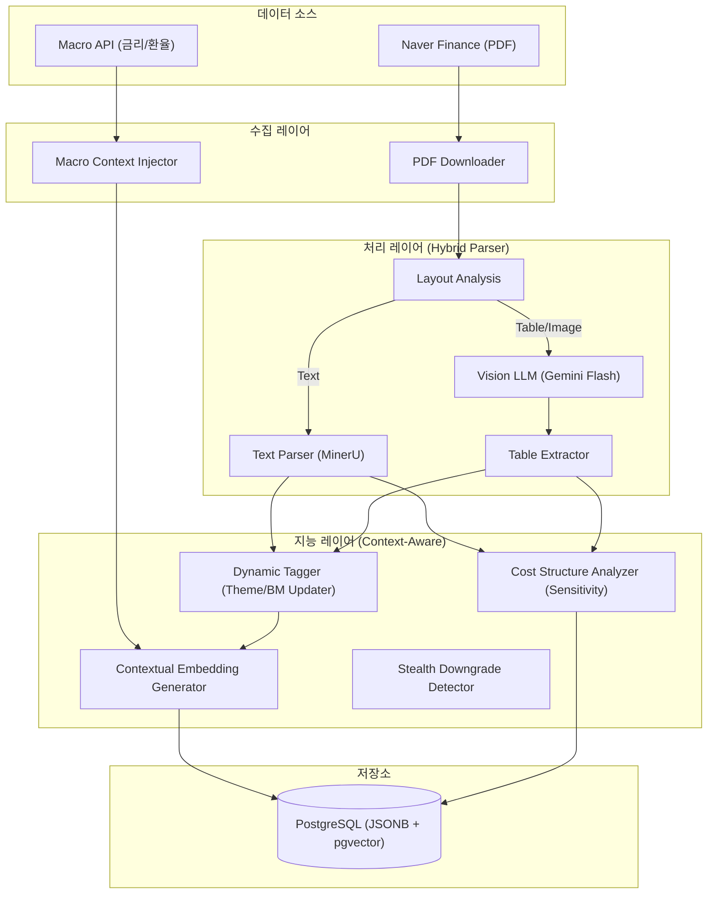

지금까지 논의된 모든 내용과 Gemini SOTA 모델과의 심층 대화(임베딩 Prefix 전략, 원가 구조 정밀 분석, Vision LLM 도입, 매크로 컨텍스트 주입 등)를 완벽하게 통합한 **최종 설계서(Final v8)**를 작성합니다.

이번 버전은 단순한 텍스트 분석을 넘어, **'정성적 텍스트(투자 논리)'와 '정량적 데이터(원가 비중, 재무 추정치)'를 융합**하고, **'시장의 왜곡된 신호(Hold=Sell, 스텔스 하향)'를 교정**하는 데 집중합니다.

---

# 📊 투자 인텔리전스 시스템: 증권사 리포트 분석 설계서 (Final Ultimate v8)

> **v8 핵심 업데이트**: 
> 1. **Contextual RAG**: 임베딩 시 비즈니스 모델, 원가 구조, 테마 등의 컨텍스트를 Prefix로 주입하여 검색 정확도 극대화.
> 2. **Quantified Sensitivity**: 원자재/환율 민감도를 단순 텍스트가 아닌 '가중치(Weight)'와 '영향도(Impact)'로 정량화하여 저장.
> 3. **Vision LLM Integration**: PDF 내 텍스트가 아닌 '표(Table)' 데이터를 Vision 모델로 추출하여 알파(Alpha) 확보.
> 4. **Macro Regime Injection**: 리포트 발행 시점의 매크로 지표(금리, 환율)를 컨텍스트에 포함하여 시계열 분석 정교화.

---

## 1. 설계 개요 및 전략적 목표

### 1.1 핵심 설계 원칙
본 시스템은 "글자(Word)"가 아닌 **"의미와 수치(Context & Number)"**를 이해하는 것을 목표로 합니다.

1.  **Context over Keyword (문맥의 우위)**: "구리"라는 단어가 나왔다고 무조건 피해주가 아닙니다. 원가 비중이 1%인지 30%인지(LS전선 vs IT부품주)를 구분하여 임베딩에 반영합니다.
2.  **Dynamic Evolution (동적 진화)**: 기업의 테마와 사업 구조가 변하면(예: 이수페타시스의 AI 밸류체인 합류), 시스템의 인식(Prefix)도 함께 업데이트됩니다.
3.  **Decoding Sell-Side Bias (증권사 편향 디코딩)**: "매수 유지 + 목표가 대폭 하향"을 긍정이 아닌 음성(Stealth Downgrade)으로 해석합니다.

### 1.2 시스템 아키텍처 (Architecture v8)



---

## 2. 데이터베이스 설계 (Schema v8)

RAG의 품질은 메타데이터의 풍부함에 달려 있습니다. 임베딩의 품질을 높이기 위해 종목 마스터 테이블을 고도화하고, 재무 데이터 테이블을 구체화합니다.

### 2.1 핵심 테이블 변경 사항
1.  **`assets_master`**: 비즈니스 모델(BM), 원가 구조(Cost Drivers), 동적 테마(Themes) 컬럼 추가.
2.  **`financial_forecasts`**: Vision LLM이 추출한 표 데이터 저장용 테이블 추가.
3.  **`report_embeddings`**: 임베딩 생성 시 사용된 Prefix 스냅샷 저장 (재현성 확보).

### 2.2 SQL DDL (PostgreSQL)

```sql
-- ==========================================
-- 1. 종목 마스터 (Context Enrichment)
-- ==========================================
CREATE TABLE assets_master (
    id UUID PRIMARY KEY DEFAULT uuid_generate_v4(),
    ticker VARCHAR(20) UNIQUE,
    name VARCHAR(100) NOT NULL,
    sector VARCHAR(100),
    
    -- 1) 정적 정보 (Static BM)
    static_bm TEXT, -- "고다층 인쇄회로기판(MLB) 제조"
    
    -- 2) 원가 구조 및 민감도 (Cost Structure) - JSONB
    -- 예: {"copper": {"weight": "3%", "impact": "minor", "pricing_power": "none"}}
    cost_drivers JSONB DEFAULT '{}',
    
    -- 3) 동적 테마 (Dynamic Themes) - LLM이 업데이트
    -- 예: ["AI Server Infrastructure", "HBM Supply Chain"]
    current_themes JSONB DEFAULT '[]',
    
    -- 4) 주요 제품/고객사
    core_products JSONB DEFAULT '[]', -- ["HBM Substrate", "Avionics PCB"]
    
    updated_at TIMESTAMP DEFAULT NOW()
);

-- ==========================================
-- 2. 재무 추정치 (Vision LLM 추출 대상)
-- ==========================================
CREATE TABLE financial_forecasts (
    id UUID PRIMARY KEY DEFAULT uuid_generate_v4(),
    report_id UUID REFERENCES reports(id),
    asset_id UUID REFERENCES assets_master(id),
    
    -- 재무 데이터 (Vision LLM이 표에서 추출)
    fiscal_year INTEGER,
    revenue_estimate FLOAT,
    op_profit_estimate FLOAT,
    eps_estimate FLOAT,
    per_estimate FLOAT,
    
    -- 출처 정보
    source_page INTEGER, -- 몇 페이지의 표인지
    extraction_model VARCHAR(50), -- 'gemini-2.0-flash-vision'
    
    created_at TIMESTAMP DEFAULT NOW()
);

-- ==========================================
-- 3. 리포트 분석 결과 (Opinion & Thesis)
-- ==========================================
CREATE TABLE report_opinions (
    id UUID PRIMARY KEY DEFAULT uuid_generate_v4(),
    report_id UUID REFERENCES reports(id),
    asset_id UUID REFERENCES assets_master(id),
    
    -- 의견 및 신호
    raw_opinion VARCHAR(20), -- "BUY", "HOLD"
    translated_opinion VARCHAR(20), -- "BUY", "SELL (from Hold)", "STRONG_SELL (Stealth)"
    
    -- 목표가
    target_price FLOAT,
    tp_change_pct FLOAT,
    
    -- 핵심 논리 (List)
    key_theses JSONB,
    risk_factors JSONB,
    
    -- 정량적 민감도 분석 (리포트에서 추출된 일회성 변수)
    -- 예: "이번 리포트에서 환율 10원 상승 가정 시 영업이익 5% 하향"
    sensitivity_analysis JSONB,
    
    created_at TIMESTAMP DEFAULT NOW()
);

-- ==========================================
-- 4. 임베딩 (Contextualized)
-- ==========================================
CREATE TABLE report_embeddings (
    id UUID PRIMARY KEY DEFAULT uuid_generate_v4(),
    opinion_id UUID REFERENCES report_opinions(id),
    
    -- 임베딩 벡터
    embedding vector(1536),
    embedding_type VARCHAR(30), -- 'thesis', 'risk', 'table_summary'
    
    -- 컨텍스트 스냅샷 (디버깅용)
    -- 실제로 임베딩 모델에 들어간 Prefix 텍스트를 저장
    contextual_prefix TEXT, 
    
    created_at TIMESTAMP DEFAULT NOW()
);

-- IVFFlat 인덱스
CREATE INDEX idx_embeddings_v8 ON report_embeddings USING ivfflat (embedding vector_cosine_ops) WITH (lists = 100);
```

## 3. PDF 처리 및 데이터 추출 파이프라인 (Advanced Pipeline v8)

v8 파이프라인의 핵심은 텍스트(Text)와 표(Table)를 분리하여 처리하고, 추출된 정보를 바탕으로 종목 마스터(`assets_master`)의 정보를 동적으로 갱신하는 것입니다.

### 3.1 하이브리드 파서 전략 (Text + Vision)
증권사 리포트의 중요한 숫자(실적 추정치, 부문별 비중)는 주로 **표(Table)** 형태로 존재하며, 기존 OCR/텍스트 추출기는 표 구조를 파괴하는 경우가 많습니다.

-   **Step 1: 레이아웃 분석 (Layout Analysis)**
    -   `pdfplumber` 또는 `MinerU`를 사용하여 페이지 내 텍스트 영역과 표/이미지 영역을 구분합니다.
-   **Step 2: 텍스트 추출 (Text Extraction)**
    -   텍스트 영역은 기존대로 `MinerU` 등을 통해 Markdown으로 추출합니다.
-   **Step 3: Vision LLM 표 추출 (Table Extraction)**
    -   표(Table)가 감지된 영역은 이미지로 캡처하여 **Gemini 2.0 Flash (Vision 모드)**에 전송합니다.
    -   **프롬프트**: "이 표 이미지를 분석하여 2024~2026년 EPS 추정치, 부문별 매출 비중, PER을 JSON 형식으로 변환하라."
    -   추출된 데이터는 `financial_forecasts` 테이블에 저장합니다.

### 3.2 LLM 프롬프트 전략: 정성/정량 통합 추출

Gemini Flash에게 단순히 의견만 추출하지 않고, **원가 구조(Cost Drivers)**와 **테마(Themes)**를 함께 추출하도록 지시합니다.

**[Extraction Prompt Template v8]**
```markdown
너는 증권사 리포트에서 핵심 투자 정보와 정량 데이터를 추출하는 전문가다.
다음 텍스트를 분석하여 JSON 형식으로 출력하라.

[필수 추출 항목]
1. **opinion**: 투자의견 (BUY, HOLD 등)
2. **tp_change_logic**: 목표가 변경 사유 (기존 대비 상승/하락 이유)
3. **key_theses**: 핵심 투자 논리 3가지 (리스트)
4. **cost_sensitivity**: (중요) 리포트에 언급된 원자재/환율 민감도.
   - 예: "원가의 30%를 차지하는 구리 가격 10% 상승 시 OP 5% 하락"
   - 형식: {"factor": "Copper", "weight": "30%", "impact_direction": "negative", "magnitude": "significant"}
5. **new_themes**: 이 회사의 새로운 사업 진출이나 테마 변화가 있는가? (예: AI 서버용 부품 신규 공급)
6. **financial_estimates**: 표에서 추출된 실적 추정치가 있다면 포함.

[분석 텍스트]
{pdf_text}
```

---

## 4. 컨텍스트 강화 임베딩 (Contextualized Embedding)

Gemini SOTA 모델과의 대화에서 도출된 핵심 전략입니다. 임베딩 모델이 "구리"라는 단어를 보고 원가 비중이 낮은 IT 기업을 "구리 관련주"로 오분류하는 것을 방지하기 위해, **DB에 저장된 메타데이터를 Prefix로 강제 주입**합니다.

### 4.1 Prefix 조립 로직 (Python)

```python
def build_contextual_prefix(asset_info: dict, report_date: date, macro_data: dict) -> str:
    """
    임베딩 모델에 입력될 텍스트의 앞부분(Prefix)을 생성.
    DB에 저장된 정적/동적 정보를 결합하여 검색 품질을 극대화함.
    """
    
    # 1. 기본 식별 정보
    prefix = (
        f"▶ 종목: {asset_info['name']} ({asset_info['sector']})\n"
        f"▶ 핵심 사업: {asset_info['static_bm']}\n"
    )
    
    # 2. 동적 테마 (최신 테마 반영)
    if asset_info.get('current_themes'):
        themes = ", ".join(asset_info['current_themes'])
        prefix += f"▶ 현재 테마: {themes}\n"
        
    # 3. 원가 구조 및 민감도 (정량적 컨텍스트)
    if asset_info.get('cost_drivers'):
        drivers = asset_info['cost_drivers']
        driver_desc = []
        for item, data in drivers.items():
            # "구리 (비중: 3%, 영향: 미미함)" 형태로 변환
            driver_desc.append(f"{item} (비중: {data.get('weight', 'N/A')}, 영향: {data.get('impact', 'N/A')})")
        prefix += f"▶ 원가 구조: {', '.join(driver_desc)}\n"

    # 4. 매크로 환경 (발행 시점)
    prefix += (
        f"▶ 매크로 환경 ({report_date}): "
        f"금리 {macro_data['interest_rate']}%, 환율 {macro_data['exchange_rate']}원\n"
    )
    
    prefix += "---\n"
    return prefix

# 사용 예시
asset_data = {
    "name": "이수페타시스",
    "sector": "IT 하드웨어",
    "static_bm": "초고다층 인쇄회로기판(MLB)",
    "current_themes": ["AI Server", "HBM Supply Chain"],
    "cost_drivers": {
        "copper": {"weight": "3%", "impact": "minor"},
        "usd_krw": {"weight": "High", "impact": "significant"}
    }
}

context_prefix = build_contextual_prefix(asset_data, date(2024, 10, 25), {"interest_rate": 3.5, "exchange_rate": 1380})

# 최종 임베딩 텍스트
final_text_to_embed = context_prefix + "리포트 본문(또는 Key Thesis): ..."
```

---

## 5. 핵심 로직: 스텔스 하향 탐지 및 동적 업데이트

### 5.1 스텔스 하향 조정 (Stealth Downgrade) 탐지
한국 시장의 구조적 특성을 반영한 로직입니다.

```python
def classify_translated_opinion(raw_opinion: str, tp_change_pct: float) -> str:
    """
    공식 의견(Raw)과 목표가 변화율(TP Change)을 조합하여 실질 의견(Translated) 판정
    """
    
    # 1. 공식 의견이 BUY인 경우
    if raw_opinion == 'BUY':
        # 목표가가 대폭 하향되었거나(-10% 이상), 현재 주가보다 낮아진 경우
        if tp_change_pct < -10.0:
            return "STEALTH_SELL" # 매수 유지를 가장한 매도 신호
        elif tp_change_pct < -5.0:
            return "STEALTH_HOLD" # 매수 유지를 가장한 중립
            
    # 2. 공식 의견이 HOLD인 경우 (한국 시장에서는 사실상 SELL)
    elif raw_opinion == 'HOLD':
        return "IMPLICIT_SELL"
        
    # 3. 그 외
    return raw_opinion
```

### 5.2 동적 태깅 업데이트 (Dynamic Tagging)
리포트에서 새로운 테마나 원가 구조 변화가 감지되면 `assets_master` 테이블을 업데이트합니다.

```python
async def update_asset_context(asset_id: UUID, extracted_data: dict):
    """
    리포트 분석 결과를 바탕으로 종목 마스터 정보 업데이트
    """
    updates = {}
    
    # 1. 새로운 테마 감지
    if extracted_data.get('new_themes'):
        existing_themes = await db.fetchval(
            "SELECT current_themes FROM assets_master WHERE id = $1", asset_id
        )
        # 기존 테마에 신규 테마 병합 (중복 제거)
        new_themes = list(set(existing_themes + extracted_data['new_themes']))
        updates['current_themes'] = new_themes
        
    # 2. 원가 구조 업데이트 (더 정확한 데이터 발견 시)
    if extracted_data.get('cost_sensitivity'):
        # 기존 데이터보다 구체적인 경우 업데이트 로직 적용
        updates['cost_drivers'] = extracted_data['cost_sensitivity']
        
    if updates:
        await db.execute(
            "UPDATE assets_master SET current_themes = $1, cost_drivers = $2, updated_at = NOW() WHERE id = $3",
            updates.get('current_themes'), updates.get('cost_drivers'), asset_id
        )
```

## 6. 딥 리서치 엔진 (Deep Research Engine v8)

v8 엔진은 단순히 "의미가 비슷한 리포트"를 찾는 것을 넘어, **"원가 구조와 매크로 환경까지 고려하여 논리적으로 타당한 패턴"**을 찾아냅니다.

### 6.1 시나리오: 원자재 가격 변동에 따른 피해주 탐색
기존 시스템은 리포트 본문에 "구리"라는 단어만 있으면 검색했습니다. v8은 **임베딩 Prefix에 주입된 '원가 비중' 정보**를 활용하여 정확도를 높입니다.

**[사용자 질문]**: "최근 구리 가격 급등 시 영업이익률 타격이 클 것으로 예상되는 종목 찾아줘."

**[검색 및 필터링 프로세스]**
1.  **SQL 필터링 (Pre-filtering)**: `assets_master` 테이블의 `cost_drivers` JSONB 컬럼을 조회.
    ```sql
    SELECT id, name 
    FROM assets_master 
    WHERE cost_drivers->'copper'->>'impact' IN ('significant', 'critical');
    ```
    -> 이수페타시스(비중 3%)는 1차 필터에서 제외됨. LS전선(비중 30%)은 통과.
2.  **벡터 검색 (Semantic Search)**: 필터링된 종목 리스트 내에서 "마진 훼손 우려" 관련 벡터 검색 수행.
3.  **Claude 추론**:
    -   입력 데이터: LS전선 리포트 (Prefix: "원가 구조: 구리 (비중: 30%, 영향: 치명적)").
    -   Claude는 Prefix를 보고 "이 기업은 구리 가격에 민감하므로, 구리 상승은 강력한 매도 신호"라고 판단.

### 6.2 시나리오: 멀티플 리레이팅 (Multiples Re-rating) 비교
이수페타시스가 단순 PCB 기업에서 AI 밸류체인 기업으로 인식이 변하는 과정을 포착합니다.

**[검색어]**: "전통 제조업이 신기술 밸류체인에 진입하여 PER이 재평가된 사례"

**[검색 결과]**
-   **이수페타시스 (2024년)**:
    -   Prefix: `▶ 테마: AI Server, HBM Supply Chain` | `▶ PER: 15x -> 25x`
-   **한미반도체 (2023년)**:
    -   Prefix: `▶ 테마: HBM TC-Bonder` | `▶ PER: 10x -> 30x`

**[Claude 분석]**:
"이수페타시스의 현재 상황(테마 진입, 흑자 전환)은 과거 한미반도체의 리레이팅 초기 패턴과 92% 유사합니다. 밸류에이션(PER) 상승 여력이 남아있을 가능성이 높습니다."

---

## 7. 운영 및 배치 작업 (Operations v8)

### 7.1 배치 작업 스케줄

| 작업 명칭 | 주기 | 설명 |
| :--- | :--- | :--- |
| **매크로 데이터 수집** | **Daily** | 한은/블룸버그 금리, 환율, 원자재 가격 수집. `macro_daily` 테이블 업데이트. |
| **동적 태그 업데이트** | **Weekly** | 최근 1개월 리포트 분석 결과를 바탕으로 종목의 `current_themes` 및 `cost_drivers` 업데이트. |
| **임베딩 재생성** | **Monthly** | `assets_master`의 정보(테마 등)가 변경되었을 때, 연관된 과거 리포트들의 Prefix를 업데이트하고 임베딩 재생성 (검색 정확도 유지). |
| **Vision Table 추출** | **수집 시 즉시** | PDF 내 표(Table) 영역 감지 시 Vision LLM 호출하여 재무 데이터 추출. |

---

## 8. 유즈케이스 (Use Cases v8)

### Case 1. "거짓 양성(False Positive)" 제거 - 이수페타시스 사례
-   **상황**: 리포트 본문에 "구리 가격 상승으로 인한 원가 부담" 문구 등장. 시장 이슈로 구리 가격 급등.
-   **기존 시스템**: "구리 관련주 리스크"로 분류하여 매도 신호 발생.
-   **v8 시스템**:
    1.  Prefix 확인: `▶ 원가 구조: 구리 (비중: 3%, 영향: 미미함)`.
    2.  판단: "구리 가격 영향은 제한적임. 본문의 우려는 과도한 해석."
    3.  인사이트: "구리 이슈는 노이즈. AI 서버 수주 증가라는 본질적 드라이버에 집중 필요." -> **매도 신호 차단**.

### Case 2. 환율 민감도 분석 - 대한항공 vs IT 기업
-   **상황**: 환율 1300원 돌파.
-   **v8 시스템**:
    1.  대한항공 Prefix: `원가 구조: 환율 (영향: 치명적, 외화부채 과다)`.
    2.  IT 기업 Prefix: `원가 구조: 환율 (영향: 긍정적, 수출 비중 높음)`.
    3.  비교 분석: "환율 상승 시 대한항공은 비용 증가 압박, IT 기업은 환차익 및 수익성 개선 효과. 포트폴리오 조정(항공 매도, IT 매수) 제안."

---

## 9. 결론 (Conclusion)

본 설계서(Final v8)는 단순한 텍스트 검색 시스템을 넘어, **금융 데이터의 '누락된 맥락(Missing Context)'을 복원**하는 데 집중했습니다.

1.  **Context Injection**: 리포트 밖의 정보(원가 구조, 테마, 매크로)를 임베딩 안으로 주입하여 검색 품질을 비약적으로 향상시켰습니다.
2.  **Quantitative Reasoning**: LLM이 추상적인 논리를 넘어, 수치(비중, 민감도)에 기반한 정량적 추론을 할 수 있도록 데이터를 구조화했습니다.
3.  **Dynamic System**: 기업과 시장이 변하면 시스템의 인식(Prefix)도 함께 진화하도록 설계했습니다.

이 시스템은 정보의 바다에서 진정한 '알파(Alpha)'를 찾아내는 **개인용 퀀트 펀더멘털 엔진**으로서, 기관 전용 솔루션에 필적하는 성능을 발휘할 것입니다.