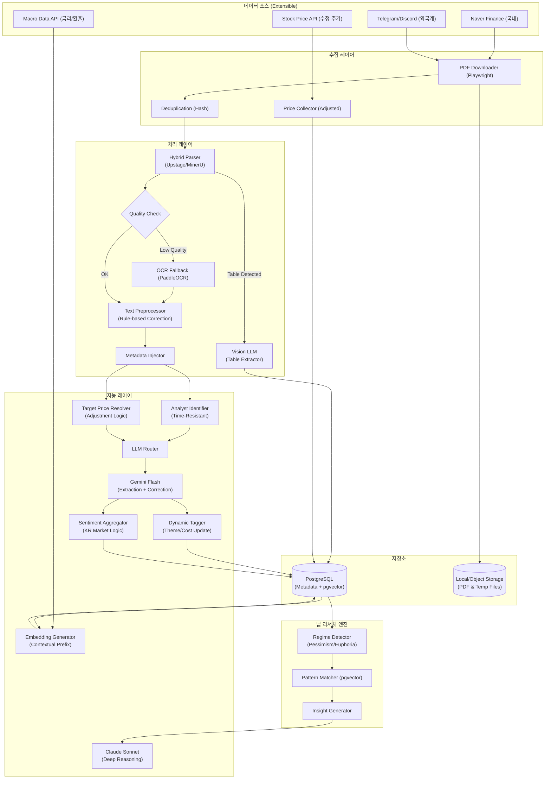

죄송합니다. 말씀하신 대로 v8을 작성하는 과정에서 새로운 기능(Vision LLM, Context 전략)에 지나치게 집중하다 보니, 이전 버전(v7)에서 상세하게 다루었던 **아키텍처의 구체적인 노드 표현**이나 **기존 핵심 로직(수정 주가 등)의 설명 깊이**가 일부 희생된 면이 있습니다.

사용자님의 지적이 정확합니다. v7의 **풍부한 구조**와 v8의 **정교한 전략(임베딩, 원가 구조)**을 모두 통합하여, **'최종 결정본 (Master Version)'**을 다시 작성하겠습니다.

이번 버전은 이전에 논의된 모든 내용을 빠짐없이 포함합니다.

---

# 📊 투자 인텔리전스 시스템: 증권사 리포트 분석 설계서 (Final Master Ver.)

> **문서 목적**: 증권사 리포트(PDF) 및 유튜브 데이터를 기반으로 시장의 왜곡된 신호를 교정하고, 정성적 텍스트와 정량적 데이터를 융합하여 심층 투자 인사이트를 제공하는 개인용 알파(Alpha) 생성 시스템 구축.

---

## 1. 설계 개요 및 전략적 목표

### 1.1 핵심 설계 원칙
1.  **Signal over Opinion**: "매수" 의견 과잉 시장에서 '목표가 하향' 등 실질적 신호 포착.
2.  **Data Integrity**: 액면분할/증자 대응(수정 주가) 및 시간 역순 수집 대응(Valid Period).
3.  **Contextual Intelligence**: 임베딩에 원가 구조, 테마 등 문맥(Context)을 주입하여 검색 정확도 극대화.
4.  **Quantitative Reasoning**: Vision LLM을 통한 표(Table) 데이터 추출 및 원가 민감도 정량화.

### 1.2 시스템 아키텍처 (Architecture)
v7의 상세 구조에 v8의 기능(Vision, Macro, Context)을 완벽히 통합했습니다.



---

## 2. PDF 처리 및 데이터 추출 파이프라인 (Hybrid Parser)

### 2.1 문서 구조 인식 파서 (Structure-Aware Parser)
-   **1순위 (API)**: **Upstage Document Parse** (한국어 서류 특화).
-   **2순위 (Local)**: **MinerU (Magic-PDF)** (오픈소스, PDF to Markdown).
-   **3순위 (Fallback)**: `pdfplumber` + `PaddleOCR`.

### 2.2 Vision LLM을 활용한 표(Table) 데이터 추출
증권사 리포트의 핵심인 실적 추정치, 부문별 비중 등은 표로 제공됩니다. 텍스트 추출 시 깨지는 것을 방지하기 위해 **Vision 기능**을 사용합니다.
-   **Process**: PDF에서 표 영역 감지 -> 이미지 캡처 -> **Gemini 2.0 Flash (Vision)** -> JSON 변환 -> `financial_forecasts` 테이블 저장.

### 2.3 텍스트 교정 전략
1.  **Rule-based**: 정규식 사전 교정 ("에치비엠" -> "HBM").
2.  **LLM Integrated**: 추출 프롬프트 내 교정 지시 ("문맥상 오타로 보이는 단어 교정").

---

## 3. 데이터베이스 설계 (Schema Master)

v7의 스키마에 v8의 컨텍스트 필드를 모두 포함했습니다.

```sql
-- ==========================================
-- 1. 종목 마스터 (Context Enrichment)
-- ==========================================
CREATE TABLE assets_master (
    id UUID PRIMARY KEY DEFAULT uuid_generate_v4(),
    ticker VARCHAR(20) UNIQUE,
    name VARCHAR(100) NOT NULL,
    sector VARCHAR(100),
    
    -- v8: 정적/동적 컨텍스트
    static_bm TEXT, -- "고다층 인쇄회로기판(MLB) 제조"
    cost_drivers JSONB DEFAULT '{}', -- {"copper": {"weight": "3%", "impact": "minor"}}
    current_themes JSONB DEFAULT '[]', -- ["AI Server", "HBM Supply Chain"]
    
    updated_at TIMESTAMP DEFAULT NOW()
);

-- ==========================================
-- 2. 재무 추정치 (Vision LLM 추출)
-- ==========================================
CREATE TABLE financial_forecasts (
    id UUID PRIMARY KEY DEFAULT uuid_generate_v4(),
    report_id UUID REFERENCES reports(id),
    asset_id UUID REFERENCES assets_master(id),
    fiscal_year INTEGER,
    revenue_estimate FLOAT,
    op_profit_estimate FLOAT,
    eps_estimate FLOAT,
    source_page INTEGER,
    created_at TIMESTAMP DEFAULT NOW()
);

-- ==========================================
-- 3. 리포트 분석 결과 (Opinion)
-- ==========================================
CREATE TABLE report_opinions (
    id UUID PRIMARY KEY DEFAULT uuid_generate_v4(),
    report_id UUID REFERENCES reports(id),
    asset_id UUID REFERENCES assets_master(id),
    
    -- 의견 (Hidden Signal)
    raw_opinion VARCHAR(20), -- "BUY"
    translated_opinion VARCHAR(20), -- "STEALTH_SELL" (v8 로직 적용)
    
    -- 목표가 (Adjustment Factor 반영)
    target_price FLOAT,
    prev_target_price FLOAT,
    tp_change_pct FLOAT, -- 수정 주가 로직으로 계산됨
    
    -- v8: 정량적 민감도
    sensitivity_analysis JSONB, -- {"factor": "USD", "impact": "OP 5% decrease per 10won"}
    
    key_theses JSONB,
    created_at TIMESTAMP DEFAULT NOW()
);

-- ==========================================
-- 4. 임베딩 (Contextualized)
-- ==========================================
CREATE TABLE report_embeddings (
    id UUID PRIMARY KEY DEFAULT uuid_generate_v4(),
    opinion_id UUID REFERENCES report_opinions(id),
    embedding vector(1536),
    embedding_type VARCHAR(30),
    contextual_prefix TEXT, -- 디버깅용 스냅샷
    created_at TIMESTAMP DEFAULT NOW()
);

-- ==========================================
-- 5. 시계열 데이터 (수정 주가 및 감성)
-- ==========================================
CREATE TABLE stock_prices (
    asset_id UUID REFERENCES assets_master(id),
    date DATE NOT NULL,
    close_price FLOAT NOT NULL,
    adjustment_factor FLOAT DEFAULT 1.0, -- 액면분할 보정
    PRIMARY KEY (asset_id, date)
);

CREATE TABLE asset_sentiment_daily (
    asset_id UUID REFERENCES assets_master(id),
    date DATE NOT NULL,
    bullish_count INTEGER DEFAULT 0,
    bearish_count INTEGER DEFAULT 0,
    tp_up_velocity FLOAT, -- 모멘텀 가속도
    min_upside_pct FLOAT,  -- 상승 여력
    sentiment_score FLOAT, -- Hold=Sell 반영 점수
    PRIMARY KEY (asset_id, date)
);

CREATE TABLE pessimism_periods (...); -- 비관 국면
CREATE TABLE euphoria_periods (...);  -- 과열 국면
```

## 4. 핵심 로직 (Core Logic Master)

v7의 데이터 신뢰성 확보 로직과 v8의 컨텍스트 강화 로직을 결합합니다.

### 4.1 목표가 보정 및 은닉 신호 탐지 (Adjusted Price & Stealth Signal)

```python
def calculate_adjusted_tp_change(
    current_tp: float, prev_tp: float, prev_date: date, asset_id: UUID, db_conn
) -> tuple[float, str]:
    """
    액면분할/감자 반영 및 실질 의견 판단
    """
    # 1. 수정 주가 반영 (v7)
    adj_factor = await get_adjustment_factor(db_conn, asset_id, prev_date)
    adjusted_prev_tp = prev_tp / adj_factor if adj_factor > 0 else prev_tp
    
    # 2. 변화율 계산
    change_pct = ((current_tp - adjusted_prev_tp) / adjusted_prev_tp) * 100 if adjusted_prev_tp else 0.0
    
    # 3. 실질 의견 판단 (v8 Stealth Downgrade)
    # 예: 의견은 BUY인데 목표가가 대폭 하향(-10%)된 경우
    translated_opinion = "BUY"
    if change_pct < -10.0:
        translated_opinion = "STEALTH_SELL" # 매수 유지를 가장한 매도
        
    return change_pct, translated_opinion
```

### 4.2 컨텍스트 강화 임베딩 (Contextual Prefix Generation)

```python
def build_contextual_prefix(asset_info: dict, macro_data: dict) -> str:
    """
    임베딩 품질 극대화를 위한 메타데이터 Prefix 생성 (v8)
    """
    # 1. 기본 정보
    prefix = f"종목: {asset_info['name']} ({asset_info['sector']})\n"
    
    # 2. 원가 구조 (민감도 표기)
    if asset_info.get('cost_drivers'):
        drivers_desc = []
        for item, data in asset_info['cost_drivers'].items():
            # "구리 (비중: 3%, 영향: 미미)" 형태로 변환
            drivers_desc.append(f"{item} (비중: {data['weight']}, 영향: {data['impact']})")
        prefix += f"원가구조: {', '.join(drivers_desc)}\n"

    # 3. 동적 테마
    if asset_info.get('current_themes'):
        prefix += f"현재테마: {', '.join(asset_info['current_themes'])}\n"
        
    # 4. 매크로 환경
    prefix += f"매크로: 금리 {macro_data['rate']}%, 환율 {macro_data['fx']}원\n"
    
    return prefix

# 최종 임베딩 텍스트: "{Prefix}\n---\n{Key_Thesis_Text}"
```

### 4.3 애널리스트 이력 관리 (Time-Resistant Logic)
시간 역순 수집 시에도 데이터가 꼬이지 않도록 Valid Period를 관리합니다. (v7 내용 유지)

```python
async def upsert_analyst_history(person_id, firm_id, report_date):
    # 미래/과거 이력 조회 후 충돌 처리
    # Case 1: 동일 소속이면 유지
    # Case 2: 미래 이력과 같은 회사면 기간 연장 (valid_from 당김)
    # Case 3: 신규 이력 생성 (valid_to 설정)
    pass
```

---

## 5. 딥 리서치 엔진 (Deep Research Engine Master)

### 5.1 시장 국면 탐지 (Regime Detector)

```python
async def detect_regime(asset_id: UUID):
    latest = await get_latest_sentiment(asset_id)
    
    # 1. 과열 국면 (Euphoria)
    if latest['sentiment_score'] > 90 and latest['min_upside_pct'] < 5:
        return "EUPHORIA" # 매도 타이밍
        
    # 2. 비관 국면 (Pessimism)
    if latest['sentiment_score'] < -50 and latest['consecutive_tp_down'] >= 3:
        return "PESSIMISM" # 매수 타이밍
        
    # 3. 모멘텀 가속 (Momentum)
    if latest['tp_up_velocity'] > 5.0:
        return "MOMENTUM"
```

### 5.2 패턴 매칭 시나리오 (Value Trap & False Positive 방지)

**시나리오: 원자재 가격 폭등 시 리스크 탐지**
1.  **Query**: "구리 가격 급등 시 마진 훼손 리스크 큰 종목"
2.  **SQL Pre-filtering**: `assets_master`에서 `cost_drivers->>'impact' == 'critical'`인 종목만 추출. (이수페타시스는 'minor'이므로 제외됨).
3.  **Vector Search**: 추출된 종목군 내에서 유사 리포트 검색.
4.  **Claude Reasoning**: "이 회사는 구리 비중이 30%로 치명적이므로 강력 매도 신호."

**시나리오: 테마 변경에 따른 멀티플 리레이팅**
1.  **Query**: "전통 제조업에서 신기술 밸류체인으로 편입된 사례"
2.  **Vector Search**: Prefix의 `현재테마`와 `과거테마`가 다른 데이터 검색.
3.  **Insight**: "이수페타시스(통신장비 -> AI 서버) 과거 한미반도체 패턴과 유사."

---

## 6. LLM 전략 (Model Routing)

| 모델 | 역할 | 비고 |
| :--- | :--- | :--- |
| **Gemini 2.0 Flash** | **Extraction & Correction** | PDF 텍스트/이미지 입력 -> 정형 JSON 추출, 오타 교정. |
| **Claude 3.7 Sonnet** | **Deep Reasoning** | 과거 패턴 vs 현재 비교, 다이버전스 분석, 최종 투자 판단. |
| **text-embedding-3** | **Contextual Embedding** | Prefix가 포함된 텍스트 -> 1536차원 벡터 변환. |

---

## 7. 운영 및 배치 작업 (Operations Master)

### 7.1 배치 스케줄 (Local Mac Environment)
-   **Daily (저녁)**: 리포트 수집, 텍스트 추출, Vision 테이블 추출.
-   **Daily (심야)**: 임베딩 생성(Context Prefix 적용), 애널리스트 점수 갱신.
-   **Weekly**: 종목 테마/원가구조 업데이트(Dynamic Tagging), 과열/비만 국면 마킹.
-   **Monthly**: Claude 추론 결과 피드백(정답 여부 확인), 시스템 프롬프트 튜닝.

### 7.2 리소스 관리
-   **Storage**: PDF 및 임시 파일(`temp/`) 처리 후 즉시 삭제.
-   **Throttling**: 네이버/증권사 크롤링 시 Jitter(불규칙 대기) 적용.

---

## 8. 유즈케이스 (Use Cases Master)

### Case 1. 가치 함정 회피 및 실질적 리스크 판단
-   **상황**: 리포트 본문에 "구리 가격 상승 우려" 언급.
-   **시스템 동작**:
    1.  Prefix 확인: `원가구조: 구리 (비중: 3%, 영향: 미미)`.
    2.  판단: "리스크 제한적. 노이즈로 판단."
-   **인사이트**: 단순 텍스트 기반 매도 판단 방지.

### Case 2. 스텔스 하향 탐지 (Stealth Downgrade)
-   **상황**: A종목, 의견 "BUY" 유지, 목표가 10만원 -> 8만원 (-20%).
-   **시스템 동작**:
    1.  `tp_change_pct` -20% 감지.
    2.  `translated_opinion` = "STEALTH_SELL"로 재분류.
-   **인사이트**: "애널리스트가 직접 매도라고 말하지 않지만, 목표가 대폭 하향은 강력한 매도 신호."

### Case 3. 비관의 끝과 과열 꼭지 탐지
-   **상황**: 센티멘트 스코어 역대 최저(Pessimism) 또는 역대 최고(Euphoria).
-   **시스템 동작**:
    1.  `DeepResearchEngine`이 과거 유사 국면 검색 (pgvector).
    2.  Claude가 "과거 이 시점에 매수/매도했다면 +XX% 수익" 시뮬레이션.
-   **인사이트**: "현재 비관론이 2018년 4분기와 유사. 당시 1년 뒤 +50% 상승. 매수 기회."

---

## 9. 결론 (Conclusion)

본 설계서는 단순한 리포트 요약 시스템을 넘어, **'데이터의 왜곡을 교정'**하고 **'숨겨진 맥락을 복원'**하는 종합 투자 플랫폼입니다.

1.  **데이터 신뢰성**: 수정 주가, 시간 역순 이력, 스텔스 하향 탐지를 통해 데이터의 본질을 꿰뚫습니다.
2.  **컨텍스트 지능**: 원가 구조, 동적 테마, 매크로 데이터를 임베딩에 주입하여 기존 RAG의 한계를 극복했습니다.
3.  **실전 투자**: 비관/과열 국면 탐지, 모멘텀 추적, 가치 함정 회피 등 실제 수익률로 연결되는 전략을 구현합니다.

이 시스템은 개인 투자자에게 기관급의 정보 분석 능력을 제공하며, 시장의 소음에서 벗어나 진정한 알파(Alpha)를 찾는 강력한 도구가 될 것입니다.